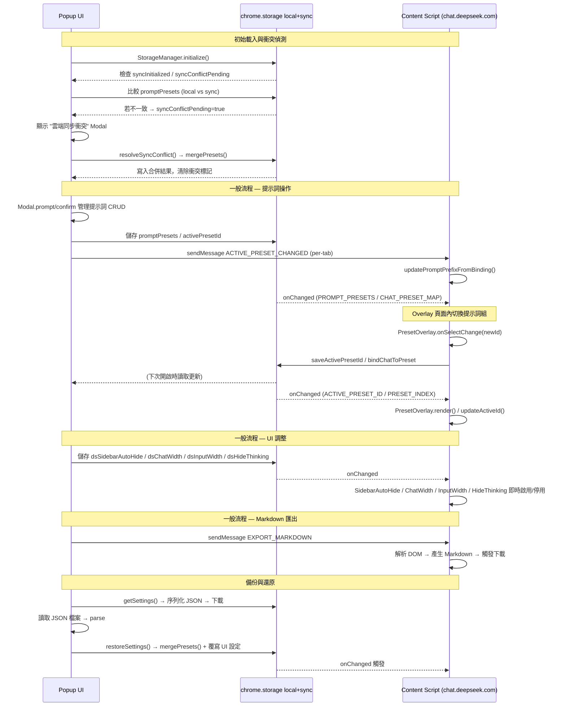

# Architecture

DS studio follows a standard Manifest V3 Chrome Extension architecture, focused on DOM interaction and content injection. The extension operates via content scripts injected into `chat.deepseek.com`, a popup UI, and a background service worker that handles periodic background tasks such as retrying failed temporary-chat deletions and cloud-sync scheduling.

## Directory Structure

```
ds-studio/
├── assets/icons/            ─  Extension icons (16px, 48px, 128px)
├── content/                 ─  Content scripts & web-accessible resources
│   ├── content-script.js    ─  Entry: event interception, init, prefix injection (v4.0.0 split)
│   ├── content-script.export.js   ─  Markdown export pipeline (HTML→MD, download)
│   ├── edit-message-cleanup.js    ─  Strip injected wrapper from edit textarea (v3.2.1)
│   ├── preset-overlay.controller.js ─  PresetOverlay lifecycle, mount/unmount, observer setup, settle loop
│   ├── preset-overlay.resolvers.js  ─  Semantic DOM resolvers for title & new-chat button
│   ├── preset-overlay.styles.js     ─  Overlay CSS inject/remove
│   ├── preset-dropdown.component.js ─  Custom `<select>`-like dropdown component
│   ├── preset-dropdown.position.js  ─  Pure computePlacement(input) — no DOM access
│   ├── preset-settle.scheduler.js   ─  Bounded settle retry loop (mobile position race condition)
│   ├── sidebar-auto-hide.js ─  Sidebar idle collapse / hover expand
│   ├── temporary-chat-constants.js  ─  Shared constants for temporary-chat feature (v4.5.0)
│   ├── temporary-chat-toggle.js     ─  Homepage toggle UI for temporary chat (v4.5.0)
│   ├── temporary-chat-toggle.css    ─  Temporary chat toggle styles
│   ├── temporary-chat-delete.js     ─  Delete logic for temporary conversations (v4.5.0)
│   ├── temporary-chat-delete-api.js ─  Delete API fetch wrapper for temporary chat
│   ├── temporary-chat-pending-store.js  ─  Pending-delete queue for cross-device remediation
│   ├── temporary-chat-history-hook.js * ─  MAIN-world history navigation interception (v4.9.0)
│   ├── temporary-chat-fiber-delete.js   ─  React Fiber-based conversation deletion integration
│   ├── chat-width.js        ─  Conversation area width via CSS injection
│   ├── input-width.js       ─  Input box width (independent toggle & clamping)
│   ├── hide-thinking.js     ─  Auto-collapse thinking blocks via MutationObserver
│   ├── quote-reply.js       ─  Floating "引用回覆" button on text selection
│   ├── censor-reply-restore.js  ─  Entry: SSE intercept, observer, detection (v4.0.0 split)
│   ├── censor-reply-restore.markdown.js  ─  Markdown → HTML renderer bundle
│   ├── censor-reply-restore.dom.js       ─  Fragment extraction & DOM injection bundle
│   ├── censor-reply-restore.storage.js   ─  Restored-message persistence bundle
│   ├── censor-reply-restore.css ─  Restored-content display styles
│   ├── harvest.js           ─  Scroll-and-harvest full-conversation Markdown export
│   ├── go-top.js            ─  Entry: "回到頂部" button lifecycle & observers (v4.0.0 split)
│   ├── go-top.locate.js     ─  DOM query / locator / visibility bundle
│   ├── go-top.render.js     ─  Button render / inject / mode-transition bundle
│   ├── go-top.scroll.js     ─  scrollToTopAndWait animation engine bundle
│   ├── mobile-sidebar-swipe.js ─  Mobile right-swipe gesture for sidebar toggle
│   ├── mobile-homepage-cleanup.js ─  Mobile homepage DOM cleanup (v4.1.0)
│   ├── go-top.css           ─  GoToTop & export-toast styles
│   ├── prevent-auto-scroll-bridge.js  ─  Isolated-world bridge for auto-scroll suppression
│   ├── preset-dropdown.css  ─  Overlay dropdown component styles
│   ├── sse-parser.js *      ─  SSE stream parser (web accessible)
│   ├── censor-xhr-hook.js * ─  XHR monkey-patch for SSE interception (web accessible)
│   └── prevent-auto-scroll.js *       ─  Main-world auto-scroll patch (web accessible)
├── background/                 ─  Service worker
│   └── service-worker.js       ─  Background service worker: startup remediation, alarm-based retry, sync scheduling (v4.9.0)
├── popup/                   ─  Extension action UI
│   ├── popup.html           ─  Two-column config UI (v3.0.0: header, presets, editor, etc.)
│   ├── popup.css            ─  Theme vars, layout grid, typography/inputs base (v4.0.0 split)
│   ├── popup-controls.css   ─  Switch, button, icon-button, range slider, toast styles
│   ├── popup.js             ─  Entry: UI init & inline event wiring (v4.0.0 split)
│   ├── popup.modal.js       ─  Modal + Toast components
│   ├── popup.preset-manager.js  ─  Preset CRUD helpers (createPresetManager ctx factory)
│   ├── popup.backup-manager.js  ─  Backup / restore / sync UI (createBackupManager ctx factory)
│   ├── popup.live-sync.js   ─  chrome.storage.onChanged reactivity for the open popup (createLiveSyncListener ctx factory, v4.8.0)
│   ├── custom-select.js        ─  Custom ARIA combobox component for preset selection (v1.9.0)
│   ├── popup-utils.js          ─  ES module: debounce, fuzzyMatch utilities
│   ├── popup.locale.js         ─  Language switcher UI (v4.3.3)
│   ├── popup-modal.css         ─  Modal overlay styles
│   ├── popup-select.css        ─  Custom select component styles
│   └── editor/              ─  Standalone 1280×720 prompt editor (v3.0.0)
│       ├── editor.html / editor.css
│       └── editor.js        ─  Query-string target, auto-save, dirty-flag broadcast
├── utils/                   ─  Shared utilities loaded by both popup and content scripts
│   ├── storage-manager.js   ─  Entry: storage API, getSettings (v4.0.0 split; initialize() moved out in v4.7.3)
│   ├── storage-manager.chunking.js  ─  ChatPresetMap chunked read/write bundle
│   ├── storage-manager.lock.js      ─  Cross-context advisory lock bundle
│   ├── storage-manager.sync.js      ─  Cloud sync / conflict / restore bundle
│   ├── storage-manager.presets.js   ─  Preset CRUD & chat-binding bundle
│   ├── storage-manager.chatmap.js   ─  ChatPresetMap chunk operations bundle (v4.6.2 split)
│   ├── storage-manager.tombstones.js ─  Preset deletion-tombstone merge/prune bundle (v4.8.3)
│   ├── storage-manager.local.js     ─  Local-only device settings bundle: isEnabled, globalPromptEnabled, restored_messages (v4.7.3 split)
│   ├── storage-manager.init.js      ─  initialize() & chunk-cache-invalidator bundle (v4.7.3 split)
│   ├── storage-manager.syncnow.js   ─  Unified syncNow() entry point (v4.7.0)
│   ├── i18n.js                 ─  Internationalization system: locale switching, data-i18n attribute processing (v4.3.3)
│   ├── logger.js               ─  Diagnostic logger, .warn() only after v4.8.4 cleanup
│   └── messaging.js         ─  Tab-broadcast ACTIVE_PRESET_CHANGED (v3.0.0)
├── samples/                 ─  DOM reference HTML samples
└── test/                    ─  Unit tests (Vitest only; integration tests removed v2.8.2)
    ├── TEST_CASES.md        ─  Manual test plan
    └── bug_list.md          ─  Known issues
```

> `*` = 標記者為 web_accessible_resources，注入至頁面 MAIN world，不受 content script 的 isolated world CSP 限制。

### Modular Load Order (v4.0.0)

Several large files were split into smaller modules using a **dual-load pattern** that works for both classic-script production loading and the Vitest test runner:

- **Bundle files** define a method group / helper and attach it to a global key (e.g., `globalThis.__DS_GoToTop_render`), guarded by `if (typeof module !== 'undefined' && module.exports)` for the test runner.
- **Entry files** (keeping the original filename) declare the state-bearing singleton, then run `Object.assign(Singleton, globalThis.__DS_* )` to merge the bundles before attaching to `window` / `module.exports`. Helpers that close over mutable state (`popup.preset-manager.js`, `popup.backup-manager.js`, and the overlay modules via `preset-overlay.controller.js`) use a `createX(ctx)` factory with live getter/setter callbacks instead.
- **Load order is mandatory**: every bundle MUST load before its entry file. This is enforced in `manifest.json` (`content_scripts[0].js`), `popup/popup.html`, and `popup/editor/editor.html`, and replicated for tests via preload imports in `test/setup/vitest.setup.js`.
- Runtime behavior and public APIs are **unchanged**; the split is purely structural.

## Key Mechanisms

### Event Interception Strategy
DeepSeek's chat interface relies on a frontend framework (likely React) which tracks state internally rather than just reading from the DOM. To inject text, the content script must not only alter `textarea.value` but also dispatch a bubbling `input` event so the framework recognizes the change before it processes the final `Enter` keystroke or mouse click.

- **Keyboard interception**: Listens for `keydown` at capture phase. When `Enter` (without Shift) is detected on a textarea, the prefix is injected via the native HTMLTextAreaElement value setter (bypassing React's overridden setter), then an `input` event is dispatched. The original event is suppressed, and a programmatic `Enter` is re-dispatched inside a `requestAnimationFrame` callback to allow React state to commit.
- **Send button interception**: Listens for `pointerdown`, `mousedown`, and `click` at capture phase. The send button is identified by CSS class `div.ds-icon-button[role="button"]` (desktop) or `div.ds-button[role="button"]` (mobile), or by specific parent class selectors. After injection, the user's intended click is programmatically re-triggered via `requestAnimationFrame`.

### Master Switch (`isEnabled`)

The `isEnabled` key acts as a master switch for all extension features:

- **Popup UI**: When the master toggle is turned off, `applyMasterSwitchUI()` disables all sub-controls (sidebar auto-hide checkbox, hide-thinking checkbox, system time toggle, chat width toggle + slider, input width toggle + slider) via `el.disabled = true`.
- **Content modules**: All modules (SidebarAutoHide, ChatWidth, InputWidth, HideThinking, GoToTop, MobileSidebarSwipe) listen for `isEnabled` changes. When set to false, each module calls its `disable()` method. When set back to true, each module re-reads its own toggle from storage and enables if true.
- **System time injection**: When `isEnabled` is false, `showSystemTime` is ignored and no timestamp is prepended (`injectPrefix()` returns false before reaching the system-time logic).
- **Overlay preset selector**: The `PresetOverlay` module hides its wrapper (`display: none`) and removes injected CSS (`removeOverlayStyles()`) when `isEnabled` is false. When re-enabled, CSS is re-injected and the overlay is shown.
- **Prompt injection**: When `isEnabled` is false, `injectPrefix()` returns false immediately — no injection occurs.
- **Global prompt toggle subordination** (v3.0.0): The dedicated `globalPromptEnabled` toggle only takes effect when the master switch is on. With the master off, the global prompt is never injected regardless of the toggle; with the master on, `buildInjectionPrefix()` includes the global prompt only when `isGlobalPromptEnabled` is true.

### Overlay Settlement Mechanism (v4.2.2)

On mobile viewports (< 768 px), the preset-overlay dropdown is positioned in "gap mode" — centered between the chat title and the new-chat/share buttons. However, these buttons are rendered asynchronously by DeepSeek's framework during page load: their `getBoundingClientRect().left` starts at ~160 px (before sibling elements finish layout) and shifts right to ~189 px once settled. Since the button's border-box width (84 px) never changes, neither `ResizeObserver` (watching the container) nor `MutationObserver` fires when the button moves — the button's *position* changes without its *size* changing.

**Solution — bounded settle loop**: The `preset-settle.scheduler.js` module implements a generic settlement detection loop:

```
per-frame: apply(reposition) → measure(buttonRect.left) → compare(epsilon) → stop | schedule next
```

- **Triggered once at mount time** in `preset-overlay.controller.js` (`startSettle('initial-settle')`), called from `mountTo()` after all observers are set up.
- **Convergence**: When the measured metric stays within `epsilon` (0.5 px) for `stableK` (3) consecutive frames, the loop stops with reason `'converged'`.
- **Safety valve**: A `maxFrames` (30) hard limit prevents infinite loops. Stops with `'maxFrames'`.
- **Detach detection**: If `measure()` returns `null` after having returned a non-null value, the target element was removed mid-settle — stops with `'detached'`.
- **Cancellation**: `unmount()` calls `cancel()` on the handle; the `_cancelled` guard prevents any already-scheduled frames from executing.
- **Design**: Pure control logic — no DOM access. All interaction is injected via callbacks (`measure`, `apply`, `schedule`), keeping the module testable with a controlled frame queue.

### Temporary Chat Deletion Architecture (v4.9.0)

Temporary conversation deletion uses a two-layer architecture for reliability:

- **Layer 1 (real-time, content script)**: `beforeunload` calls `fetch(..., { keepalive: true })` directly. SPA navigation uses Fiber/API deletion.
- **Layer 2 (remediation, Service Worker)**: `chrome.runtime.onStartup` reads the shared pending-delete queue from `chrome.storage.sync` and retries each entry with the device's own locally-cached auth token.
- **Cross-device source of truth**: The pending-delete queue (`dss-pending-deletes-sync`, containing `{ chatUuid, attemptCount }`) lives only in `chrome.storage.sync`. Any device signed into the same Chrome account can remediate any queue entry.
- **Privacy**: `authToken` (`dss-last-auth-token`) is stored in `chrome.storage.local` only — never synced.

### Data Flow



## Module Reference Index

| 模組 | 涵蓋內容 | 詳細架構文件 |
|-|-|-|
| **儲存與狀態管理** | Storage schema, dual-storage, ChatPresetMap chunking, concurrency control, sync conflict | [→ architecture/STORAGE.md](architecture/STORAGE.md) |
| **內容腳本模組** | Sidebar auto-hide, chat/input width, SPA navigation, GoToTop, mobile sidebar swipe, quote reply, hide thinking, censor restore, etc. | [→ architecture/CONTENT_SCRIPTS.md](architecture/CONTENT_SCRIPTS.md) |
| **Popup 與編輯器** | Popup UI, custom dropdown component, modal system, standalone editor window | [→ architecture/POPUP.md](architecture/POPUP.md) |
| **匯出架構** | Markdown export strategy, JSON backup & restore, harvest module | [→ architecture/EXPORT.md](architecture/EXPORT.md) |

## 相關文件

- 📋 功能規格：[SPEC.md](SPEC.md)
- 📝 版本記錄：[CHANGELOG.md](CHANGELOG.md)
