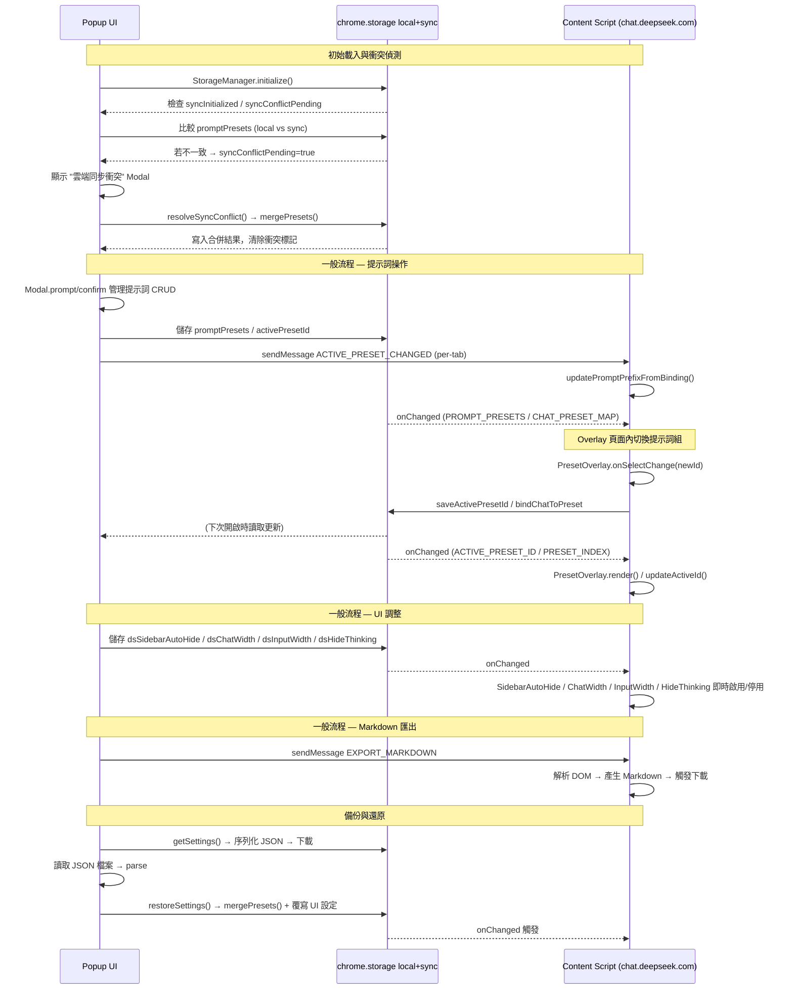

# Architecture

DS studio follows a standard Manifest V3 Chrome Extension architecture, focused on DOM interaction and content injection. The extension operates exclusively via content scripts injected into `chat.deepseek.com` and a popup UI — there is no background service worker.

## Directory Structure

```
ds-studio/
├── assets/icons/            ─  Extension icons (16px, 48px, 128px)
├── content/                 ─  Content scripts & web-accessible resources
│   ├── content-script.js    ─  DOM event interception, PresetOverlay, export dispatch
│   ├── sidebar-auto-hide.js ─  Sidebar idle collapse / hover expand
│   ├── chat-width.js        ─  Conversation area width via CSS injection
│   ├── input-width.js       ─  Input box width (independent toggle & clamping)
│   ├── hide-thinking.js     ─  Auto-collapse thinking blocks via MutationObserver
│   ├── quote-reply.js       ─  Floating "引用回覆" button on text selection
│   ├── censor-reply-restore.js  ─  SSE intercept & restore censored replies
│   ├── censor-reply-restore.css ─  Restored-content display styles
│   ├── harvest.js           ─  Scroll-and-harvest full-conversation Markdown export
│   ├── go-top.js            ─  "回到頂部" floating button w/ scroll-to-top API
│   ├── mobile-sidebar-swipe.js ─  Mobile right-swipe gesture for sidebar toggle
│   ├── go-top.css           ─  GoToTop & export-toast styles
│   ├── prevent-auto-scroll-bridge.js  ─  Isolated-world bridge for auto-scroll suppression
│   ├── sse-parser.js *      ─  SSE stream parser (web accessible)
│   ├── censor-xhr-hook.js * ─  XHR monkey-patch for SSE interception (web accessible)
│   └── prevent-auto-scroll.js *       ─  Main-world auto-scroll patch (web accessible)
├── popup/                   ─  Extension action UI
│   ├── popup.html           ─  Two-column config UI (v3.0.0: header, presets, editor, etc.)
│   ├── popup.css            ─  Layout, cards, modal, toast, slider, toggle styles
│   ├── popup.js             ─  UI logic: Modal, preset CRUD, editor window, export dispatch
│   └── editor/              ─  Standalone 1280×720 prompt editor (v3.0.0)
│       ├── editor.html / editor.css
│       └── editor.js        ─  Query-string target, auto-save, dirty-flag broadcast
├── utils/                   ─  Shared utilities loaded by both popup and content scripts
│   ├── storage-manager.js   ─  Multi-key storage, migration, sync conflict, preset merge
│   └── messaging.js         ─  Tab-broadcast ACTIVE_PRESET_CHANGED (v3.0.0)
├── samples/                 ─  DOM reference HTML samples
└── test/                    ─  Unit tests (Vitest only; integration tests removed v2.8.2)
    ├── TEST_CASES.md        ─  Manual test plan
    └── bug_list.md          ─  Known issues
```

> `*` = 標記者為 web_accessible_resources，注入至頁面 MAIN world，不受 content script 的 isolated world CSP 限制。

## Key Mechanisms

### Event Interception Strategy
DeepSeek's chat interface relies on a frontend framework (likely React) which tracks state internally rather than just reading from the DOM. To inject text, the content script must not only alter `textarea.value` but also dispatch a bubbling `input` event so the framework recognizes the change before it processes the final `Enter` keystroke or mouse click.

- **Keyboard interception**: Listens for `keydown` at capture phase. When `Enter` (without Shift) is detected on a textarea, the prefix is injected via the native HTMLTextAreaElement value setter (bypassing React's overridden setter), then an `input` event is dispatched. The original event is suppressed, and a programmatic `Enter` is re-dispatched inside a `requestAnimationFrame` callback to allow React state to commit.
- **Send button interception**: Listens for `pointerdown`, `mousedown`, and `click` at capture phase. The send button is identified by CSS class `div.ds-icon-button[role="button"]` (desktop) or `div.ds-button[role="button"]` (mobile), or by specific parent class selectors. After injection, the user's intended click is programmatically re-triggered via `requestAnimationFrame`.

### Master Switch (`isEnabled`)

The `isEnabled` key acts as a master switch for all extension features:

- **Popup UI**: When the master toggle is turned off, `applyMasterSwitchUI()` disables all sub-controls (sidebar auto-hide checkbox, hide-thinking checkbox, system time toggle, chat width toggle + slider, input width toggle + slider) via `el.disabled = true`.
- **Content modules**: All modules (SidebarAutoHide, ChatWidth, InputWidth, HideThinking, GoToTop, MobileSidebarSwipe) listen for `isEnabled` changes. When set to false, each module calls its `disable()` method. When set back to true, each module re-reads its own toggle from storage and enables if true.
- **System time injection**: When `isEnabled` is false, `showSystemTime` is ignored and no timestamp is prepended (`injectPrefix()` returns false before reaching the system-time logic).
- **Overlay preset selector**: The `PresetOverlay` module hides its wrapper (`display: none`) and removes injected CSS (`removeOverlayStyles()`) when `isEnabled` is false. When re-enabled, CSS is re-injected and the overlay is shown.
- **Prompt injection**: When `isEnabled` is false, `injectPrefix()` returns false immediately — no injection occurs.
- **Global prompt toggle subordination** (v3.0.0): The dedicated `globalPromptEnabled` toggle only takes effect when the master switch is on. With the master off, the global prompt is never injected regardless of the toggle; with the master on, `buildInjectionPrefix()` includes the global prompt only when `isGlobalPromptEnabled` is true.

### Data Flow



## Module Reference Index

| 模組 | 涵蓋內容 | 詳細架構文件 |
|-|-|-|
| **儲存與狀態管理** | Storage schema, dual-storage, ChatPresetMap chunking, concurrency control, sync conflict | [→ architecture/STORAGE.md](architecture/STORAGE.md) |
| **內容腳本模組** | Sidebar auto-hide, chat/input width, SPA navigation, GoToTop, mobile sidebar swipe, quote reply, hide thinking, censor restore, etc. | [→ architecture/CONTENT_SCRIPTS.md](architecture/CONTENT_SCRIPTS.md) |
| **Popup 與編輯器** | Popup UI, custom dropdown component, modal system, standalone editor window | [→ architecture/POPUP.md](architecture/POPUP.md) |
| **匯出架構** | Markdown export strategy, JSON backup & restore, harvest module | [→ architecture/EXPORT.md](architecture/EXPORT.md) |

## 相關文件

- 📋 功能規格：[SPEC.md](SPEC.md)
- 📝 版本記錄：[CHANGELOG.md](CHANGELOG.md)
