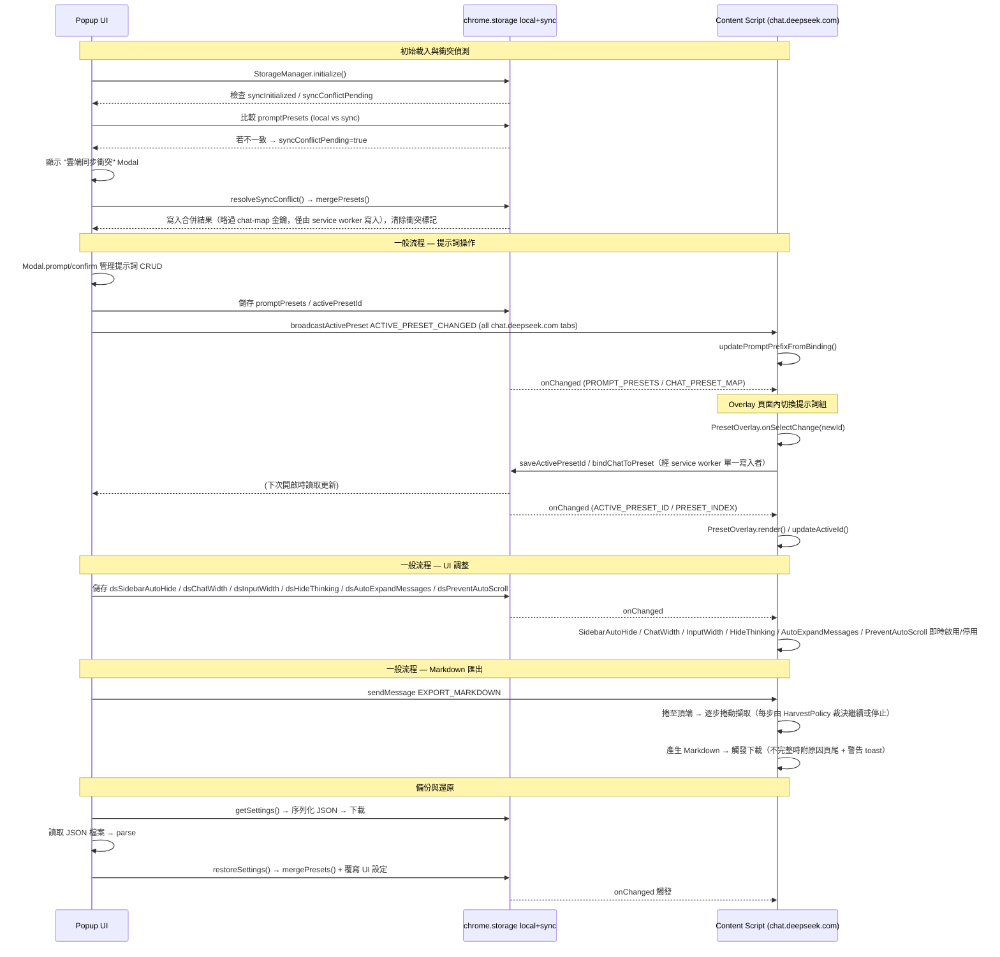

# 架構

DS studio 採用標準 Manifest V3 Chrome 擴充功能架構，著重於 DOM 互動與內容注入。擴充功能由三部分運作：注入 `chat.deepseek.com` 的內容腳本、popup 介面，以及處理週期性背景工作（如重試失敗的臨時對話刪除、排程雲端同步）的背景 service worker。

## 目錄結構

```
ds-studio/
├── assets/icons/            ─  擴充功能圖示（16px、48px、128px）
├── content/                 ─  內容腳本與 web-accessible 資源
│   ├── content-script.js    ─  入口：事件攔截、初始化、前綴注入（v4.0.0 拆分）
│   ├── content-script.export.js       ─  Markdown 匯出管線（HTML→MD、下載）
│   ├── content-script.export.markdown.js ─  匯出 Markdown 格式化方法包
│   ├── content-script.export.time.js  ─  匯出時間戳記格式化方法包
│   ├── ds-selectors.js      ─  DeepSeek 混淆 class 名稱的共用 DOM 選擇器常數
│   ├── feature-toggle.js    ─  共用主開關＋個別功能開關管線（registerFeatureToggle）
│   ├── retry-until.js       ─  輪詢至就緒工具（固定間隔重試，設有上限）
│   ├── mobile-device.js     ─  行動裝置偵測共用工具
│   ├── width-feature.js     ─  vw 百分比 CSS 注入寬度功能的共用工廠
│   ├── main-world-injector.js ─  自 isolated world 一次注入所有 MAIN-world 腳本
│   ├── prompt-injector.controller.js ─  前綴組裝、textarea 注入、Enter 與送出按鈕攔截
│   ├── prompt-injector.send-button.js ─  送出按鈕辨識、啟用狀態檢查、textarea 解析
│   ├── chat-binding-controller.js ─  目前對話 ↔ 提示詞組綁定狀態機、SPA 導航偵測
│   ├── edit-message-cleanup.pure.js   ─  移除編輯訊息包裝的純邏輯
│   ├── edit-message-cleanup.js        ─  從編輯 textarea 移除注入的包裝（v3.2.1）
│   ├── preset-overlay.controller.js ─  PresetOverlay 生命週期、掛載／卸載、observer 設定、定位寫入
│   ├── preset-overlay.resolvers.js  ─  標題與新對話按鈕的語意 DOM 解析器
│   ├── preset-overlay.styles.js     ─  Overlay CSS 注入／移除
│   ├── preset-viewport-sync.js      ─  ResizeObserver／視窗縮放／settle 迴圈接線（v4.18.1）
│   ├── preset-id.resolver.js        ─  純函式 resolveOverlayPresetId(input)——決定要顯示的提示詞組 id（v4.18.1）
│   ├── preset-dropdown.component.js ─  仿 `<select>` 的自訂下拉元件
│   ├── preset-dropdown.position.js  ─  純函式 computePlacement／pickNaturalWidth——不存取 DOM
│   ├── preset-dropdown.menu-position.js ─  展開選單定位（v4.18.1）
│   ├── preset-dropdown.width.js     ─  各實例的自然寬度量測器，含快取（v4.18.1）
│   ├── preset-dropdown.options.js   ─  選項渲染、標籤與 aria-selected 同步（v4.18.1）
│   ├── preset-dropdown.keyboard.js  ─  下拉選單鍵盤導覽（v4.18.1）
│   ├── preset-settle.scheduler.js   ─  有上限的 settle 重試迴圈（行動裝置定位競態）
│   ├── sidebar-auto-hide.js         ─  入口：側邊欄閒置收合／hover 展開
│   ├── sidebar-auto-hide.observers.js ─  側邊欄自動隱藏的 MutationObserver／ResizeObserver 接線
│   ├── sidebar-auto-hide.styles.js  ─  側邊欄自動隱藏的 CSS 注入／移除
│   ├── temporary-chat-toggle.js     ─  首頁臨時對話開關 UI（v4.5.0）
│   ├── temporary-chat-toggle.css    ─  臨時對話開關樣式
│   ├── temporary-chat-toggle.ui.js  ─  臨時對話 toggle-row UI 建立與視覺狀態
│   ├── temporary-chat-delete.js     ─  入口：臨時對話刪除邏輯（v4.5.0）
│   ├── temporary-chat-delete.tracking.js   ─  共用狀態、UUID sessionStorage 持久化、建立＋完成同時出現偵測
│   ├── temporary-chat-delete.coordinator.js ─  刪除協調（Fiber → API 重試 → SW alarm 降級）
│   ├── temporary-chat-delete.handlers.js    ─  臨時對話刪除的事件處理器
│   ├── temporary-chat-delete-api.js ─  臨時對話刪除 API 的 fetch 包裝
│   ├── temporary-chat-enabled-flag.js ─  經設定管線存取、獨立於主開關的臨時對話啟用旗標
│   ├── temporary-chat-history-hook.js * ─  MAIN-world history 導航攔截（v4.9.0）
│   ├── temporary-chat-fiber-delete.js * ─  以 React Fiber 刪除對話的整合（web accessible）
│   ├── invalidation-toast.js    ─  擴充功能 context 失效提示 toast，附重新整理按鈕（v4.33.16）
│   ├── invalidation-watcher.js  ─  定期檢查擴充功能 context 是否有效，首次失效時顯示一次重新整理 toast（v4.34.0）
│   ├── temporary-chat-heartbeat.js      ─  追蹤中臨時對話的租約心跳（v4.31.1）
│   ├── temporary-chat-sidebar-hide.js   ─  在 DeepSeek 側欄隱藏佇列中的臨時對話（v4.31.1）
│   ├── chat-width.js        ─  以 CSS 注入調整對話區域寬度
│   ├── input-width.js       ─  輸入框寬度（獨立開關與範圍限制）
│   ├── hide-thinking.js     ─  以 MutationObserver 自動收合思考區塊
│   ├── websearch-toggle.js  ─  連網搜索按鈕每次啟用時套用一次預設值（v4.13.0；v4.20.1 起採語言無關的兩層定位）
│   ├── quote-reply.js       ─  入口：選取文字時浮現「引用回覆」按鈕
│   ├── quote-reply.geometry.js ─  選取範圍幾何計算方法包
│   ├── quote-reply.button.js   ─  引用回覆按鈕渲染方法包
│   ├── quote-reply.css      ─  引用回覆按鈕樣式
│   ├── censor-reply-restore.js  ─  入口：SSE 攔截、observer、偵測（v4.0.0 拆分）
│   ├── censor-reply-restore.keymap.js    ─  censor-reply-restore 的鍵對照
│   ├── censor-reply-restore.markdown.js  ─  Markdown → HTML 渲染方法包
│   ├── censor-reply-restore.dom.js       ─  DOM 協調入口方法包（stub，已合併至 censor-reply-restore.js）
│   ├── censor-reply-restore.dom.extract.js ─  從 DOM 擷取片段（stub，已合併至 censor-reply-restore.dom.resolve.js）
│   ├── censor-reply-restore.dom.resolve.js ─  還原內容的 DOM 元素解析
│   ├── censor-reply-restore.dom.inject.js  ─  還原內容的 DOM 注入
│   ├── censor-reply-restore.dom.scan.js    ─  審查事件的 DOM 掃描
│   ├── censor-reply-restore.thinkblock.js  ─  還原內容的思考區塊處理
│   ├── censor-reply-restore.detection.js   ─  審查事件偵測邏輯
│   ├── censor-reply-restore.observer.js    ─  審查偵測的 MutationObserver 接線
│   ├── censor-reply-restore.storage.js     ─  還原訊息持久化方法包
│   ├── censor-reply-restore.css ─  還原內容顯示樣式
│   ├── harvest.js           ─  入口：捲動擷取完整對話的 Markdown 匯出
│   ├── harvest.toast.js     ─  匯出進度／取消／不完整警告 toast UI（v4.11.9 拆分）
│   ├── harvest.policy.js    ─  迴圈終止與捲動步幅的純決策，不含 DOM（v4.19.0 拆分）
│   ├── harvest.dom.js       ─  DOM 探測：容器查找、訊息擷取、穩定度 observer、掛載量測（v4.19.1 拆分）
│   ├── go-top.js            ─  入口：「回到頂部」按鈕生命週期（v4.0.0 拆分）
│   ├── go-top.locate.js     ─  DOM 查詢／定位／可見性協調方法包
│   ├── go-top.render.button.js  ─  按鈕元素建立方法包（stub，已合併至 go-top.render.combined.js）
│   ├── go-top.render.combined.js ─  go-top 按鈕 render 合併模組（button、inject、observer）
│   ├── go-top.render.inject.js  ─  按鈕 DOM 注入方法包（stub，已合併至 go-top.render.combined.js）
│   ├── go-top.render.observer.js ─  render 相關 observer 方法包（stub，已合併至 go-top.render.combined.js）
│   ├── go-top.scroll.js     ─  scrollToTopAndWait 動畫引擎方法包
│   ├── go-top.observers.js  ─  GoToTop observer 設定方法包
│   ├── go-top.lifecycle.js  ─  GoToTop 啟用／停用生命週期方法包
│   ├── mobile-sidebar-swipe.js ─  入口：行動裝置右滑手勢切換側邊欄
│   ├── mobile-sidebar-swipe.button.js    ─  滑動觸發按鈕渲染
│   ├── mobile-sidebar-swipe.gesture.js   ─  觸控手勢辨識
│   ├── mobile-sidebar-swipe.bind.js      ─  滑動手勢事件綁定
│   ├── mobile-sidebar-swipe.lifecycle.js ─  行動裝置滑動的啟用／停用生命週期
│   ├── auto-expand-messages.js ─  以 MutationObserver 自動點擊收合的展開按鈕（v4.32.0）
│   ├── auto-retry.js          ─  每 1 秒自動點擊重試按鈕（v4.11.0）
│   ├── editor-window-autoclose.js ─  window focus → 送出 DSS_CLOSE_EDITOR_WINDOWS 訊息，關閉所有開啟中的編輯視窗（v4.29.0）
│   ├── go-top.css           ─  GoToTop 與匯出 toast 樣式
│   ├── prevent-auto-scroll-bridge.js  ─  抑制自動捲動的 isolated-world 橋接（含持續模式，v4.12.0）
│   ├── preset-dropdown.css  ─  Overlay 下拉元件樣式
│   ├── sse-parser.js *      ─  SSE 串流解析器（web accessible）
│   ├── censor-xhr-hook.js * ─  攔截 SSE 的 XHR monkey-patch（web accessible）
│   └── prevent-auto-scroll.js *       ─  MAIN-world 自動捲動修補（web accessible）
├── background/                 ─  背景 service worker
│   ├── service-worker.js       ─  背景 service worker：啟動補救、alarm 重試、同步排程（v4.9.0）
│   ├── service-worker-constants.js ─  service worker 共用常數
│   ├── pending-store.js        ─  待刪佇列儲存層（僅由 importScripts 載入，不屬於內容腳本）
│   ├── settings-routes.js      ─  DSS_GET_SETTINGS / DSS_SET_SETTINGS 路由＋向 DeepSeek 分頁廣播 DSS_SETTINGS_CHANGED
│   ├── pending-store-routes.js ─  DSS_TRACK_FOR_DELETION / DSS_REMOVE_PENDING_DELETE / DSS_REMOVE_OPEN_UUID / DSS_SET_LAST_AUTH_TOKEN 路由
│   ├── chat-map-routes.js      ─  DSS_CHAT_MAP_MSG 路由：將 service worker 的 StorageManager 切換為 chat-map 寫入者模式，逐一驗證 op 並於單一 FIFO 佇列中套用
│   └── editor-window-routes.js ─  DSS_CLOSE_EDITOR_WINDOWS 路由：關閉追蹤中的編輯視窗並清除其 session 鍵（v4.29.0）
├── popup/                   ─  擴充功能 action UI
│   ├── popup.html           ─  雙欄設定介面（v3.0.0：標頭、提示詞組、編輯器等）
│   ├── popup-button.css     ─  按鈕元件樣式
│   ├── popup-card.css       ─  卡片元件樣式
│   ├── popup-form.css       ─  表單元素樣式
│   ├── popup-layout.css     ─  頁面版面樣式
│   ├── popup-locale.css     ─  語系切換器樣式
│   ├── popup-modal.css      ─  對話框遮罩樣式
│   ├── popup-preset-controls.css ─  提示詞組控制項樣式
│   ├── popup-select.css     ─  自訂選單元件樣式
│   ├── popup-slider.css     ─  滑桿元件樣式
│   ├── popup-status.css     ─  狀態指示樣式
│   ├── popup-switch.css     ─  切換開關樣式
│   ├── popup-theme.css      ─  主題變數定義
│   ├── popup-toast.css      ─  Toast 通知樣式
│   ├── popup.js             ─  入口：UI 初始化與行內事件接線（v4.0.0 拆分）
│   ├── popup.modal.js       ─  Modal＋Toast 元件
│   ├── popup.toast.js       ─  Toast 通知元件
│   ├── popup.preset-manager.js  ─  提示詞組 CRUD 輔助函式（createPresetManager ctx 工廠）
│   ├── popup.pin-manager.js ─  釘選預設提示詞組的切換／刪除時清除（createPinManager ctx 工廠，v4.18.0）
│   ├── popup.backup-manager.js  ─  備份／還原／同步 UI（createBackupManager ctx 工廠）
│   ├── popup.live-sync.js   ─  開啟中的 popup 即時回應 chrome.storage.onChanged（createLiveSyncListener ctx 工廠，v4.8.0）
│   ├── popup.toggles.js     ─  九個功能開關的變更監聽器（createToggleManager ctx 工廠）
│   ├── popup.settings-view.js  ─  applySettingsToDom：設定 → 控制項的單向對應，不存取 storage
│   ├── popup.preset-domain.js  ─  提示詞組純規則：createPreset / validatePresetName（與編輯視窗共用）
│   ├── popup.i18n-apply.js     ─  data-i18n DOM 套用器（與編輯視窗共用）
│   ├── popup.editor-window.js  ─  編輯視窗生命週期管理
│   ├── popup.markdown-export.js ─  從 popup 觸發 Markdown 匯出
│   ├── popup.width-sliders.js  ─  寬度滑桿 UI 控制項
│   ├── popup.locale.js         ─  語言切換器 UI（v4.3.3）
│   ├── custom-select.js        ─  選擇提示詞組的自訂 ARIA combobox 元件（v1.9.0）
│   ├── custom-select.drag.js   ─  Pointer Events 拖曳排序子系統：createDragReorder / reorderPresets
│   ├── preset-item-renderer.js ─  提示詞組清單項目渲染
│   └── editor/              ─  獨立 1280×720 提示詞編輯器（v3.0.0）
│       ├── editor.html      ─  編輯器頁面標記
│       ├── editor.css       ─  編輯器頁面樣式
│       ├── editor.js        ─  查詢字串目標、自動儲存、dirty 旗標廣播
│       ├── editor.parse.js  ─  提示詞文字解析方法包
│       ├── editor.render.js ─  編輯器 UI 渲染方法包
│       └── editor.storage.js ─  編輯器儲存讀寫方法包
├── utils/                   ─  popup 與內容腳本共同載入的共用工具
│   ├── storage-manager.js   ─  入口：StorageManager 物件、chat-map 寫入者旗標、各 context 的 FIFO 寫入佇列、方法包混入
│   ├── storage-manager.keys.js          ─  儲存鍵名、預設值、ChatMapDispatchError、_buildNextMeta
│   ├── storage-manager.rw.js            ─  安全包裝、sync/local 雙層讀寫、遠端優先寫回 local
│   ├── storage-manager.sync.js          ─  同步衝突偵測／resolveSyncConflict（略過 chat-map 鍵）、同步狀態、syncNow() 進入點
│   ├── storage-manager.sync.retry.js    ─  retrySync()：逐鍵防護地重新推送 dsLocalAuth；停駐的 chat-map 鍵以單一 REPUBLISH_PARKED op 交給 service worker
│   ├── storage-manager.restore.js       ─  備份還原邏輯（從 sync.js 抽出）
│   ├── storage-manager.tombstone.js     ─  刪除墓碑管理方法包
│   ├── storage-manager.preset-merge.js  ─  雙端提示詞組陣列合併邏輯方法包
│   ├── storage-manager.preset-recency.js ─  提示詞組新舊判定、推送防護、全域提示詞啟用狀態解析方法包
│   ├── storage-manager.presets.js       ─  提示詞組 CRUD 方法包：savePromptPresets / saveOnePromptPreset
│   ├── storage-manager.chatmap.diff.js  ─  ChatPresetMap 純差異計算與分塊配置方法包
│   ├── storage-manager.chatmap.ops.js   ─  DSSChatMapOps：DSS_CHAT_MAP_MSG op 的純驗證／套用
│   ├── storage-manager.chatmap.js       ─  單一寫入者引擎（僅限 service worker）：applyChatMapOp、mutateChatPresetMap、分塊提交；getChatPresetMap 供所有 context 使用
│   ├── storage-manager.chatmap.client.js ─  公開綁定 API＋分派：service worker 內直接呼叫引擎，其他 context 以 chrome.runtime.sendMessage 送往 service worker
│   ├── storage-manager.local.js         ─  僅存本機的裝置設定方法包：isEnabled、舊版 globalPromptEnabled 備援、restored_messages（v4.7.3 拆分）
│   ├── storage-manager.init.js          ─  initialize()：預設值、遷移、首次同步衝突偵測；分派舊版 chat-map 遷移＋孤兒清理
│   ├── storage-manager.setters.js       ─  單鍵 save<X> 寫入方法包：自入口檔拆出的 15 個單行 setter
│   ├── storage-manager.settings-read.js ─  設定讀取方法包：以允許清單驅動的 getSettings()＋getActivePromptContent()
│   ├── message-constants.js          ─  跨層訊息類型與 URL 常數合併檔
│   ├── temporary-chat-constants.js ─  臨時對話功能的共用常數，由內容腳本與 service worker 載入（v4.29.2 自 content/ 移入）
│   ├── deepseek-api.js         ─  DSSDeepSeekApi.performDeleteFetch：唯一的 chat_session/delete fetch，由 service worker 與內容端刪除流程共用（v4.29.2 合併）
│   ├── debounce.js             ─  唯一的 trailing-edge 防抖實作（globalThis.DSSDebounce）
│   ├── tab-control.js          ─  DeepSeek 分頁查詢／傳送輔助函式，含 ACTIVE_PRESET_CHANGED 廣播（DSSTabControl）
│   ├── window-control.js       ─  openSingletonWindow：以 chrome.storage.session 保證單一視窗（DSSWindowControl）
│   ├── chat-session-id.js      ─  對話 session ID 擷取共用工具
│   ├── i18n.js                 ─  國際化引擎：setLocale / t / onLocaleChanged，不含 DOM（v4.3.3）
│   ├── i18n.locales.zhTW.js    ─  zh_TW 字串字典，純資料
│   ├── i18n.locales.en.js      ─  en 字串字典，純資料
│   ├── i18n.locales.js         ─  語系彙整器：匯入並註冊各語言字典（v4.11.14 拆分）
│   └── logger.js               ─  診斷記錄器，v4.8.4 清理後僅保留 .warn()
└── test/                    ─  單元測試（僅 Vitest）
    ├── vitest.config.js     ─  Vitest 設定
    ├── setup/               ─  測試設定與預載
    ├── unit/                ─  單元測試規格
    ├── fixtures/            ─  測試資料 fixture
    └── helpers/             ─  測試輔助工具
```

> `*` = 標記者為 web_accessible_resources，注入至頁面 MAIN world，不受 content script 的 isolated world CSP 限制。
>
> `†` = 檔案**不在** `manifest.json` 的 `content_scripts` 清單中；僅由 `background/service-worker.js` 以 `importScripts` 載入，執行情境為 service worker。

### 模組化載入順序（v4.0.0）

數個大型檔案以**雙重載入模式**拆分為較小的模組，同時適用於正式環境的 classic script 載入與 Vitest 測試執行器：

- **Bundle 檔**定義一組方法／輔助函式並掛到全域鍵（例如 `globalThis.__DS_GoToTop_render`），並以 `if (typeof module !== 'undefined' && module.exports)` 守衛供測試執行器取用。
- **入口檔**（保留原檔名）宣告持有狀態的單例，再執行 `Object.assign(Singleton, globalThis.__DS_* )` 合併各 bundle，之後才掛到 `window` / `module.exports`。閉包持有可變狀態的輔助模組（`popup.preset-manager.js`、`popup.backup-manager.js`，以及經由 `preset-overlay.controller.js` 的 overlay 模組）改用 `createX(ctx)` 工廠搭配即時 getter/setter 回呼。
- **載入順序為強制規定**：每個 bundle **必須**在其入口檔之前載入。五個載入點必須保持一致：`manifest.json`（`content_scripts[0].js`）、`popup/popup.html`、`popup/editor/editor.html`、`background/service-worker.js`（`importScripts`），以及以 preload import 為測試複製同一順序的 `test/setup/vitest.setup.js`。`test/unit/storage-manager.loader-contract.spec.js` 自動對 storage-manager bundle 組強制檢查此順序。
- 執行期行為與公開 API **維持原樣**；此拆分純屬結構調整。

## 關鍵機制

### 事件攔截策略
DeepSeek 的對話介面依賴前端框架（推測為 React），框架在內部追蹤狀態，而非單純讀取 DOM。要注入文字，內容腳本除了修改 `textarea.value`，還須派發會冒泡的 `input` 事件，讓框架在處理最後的 `Enter` 按鍵或滑鼠點擊前辨識到變更。

- **鍵盤攔截**：於 capture 階段監聽 `keydown`。在 textarea 上偵測到 `Enter`（未按 Shift）時，透過原生 HTMLTextAreaElement value setter（繞過 React 覆寫的 setter）注入前綴，再派發 `input` 事件。原事件被攔下，並在 `requestAnimationFrame` 回呼中以程式重新派發 `Enter`，讓 React 狀態有時間提交。
- **送出按鈕攔截**：於 capture 階段監聽 `pointerdown`、`mousedown` 與 `click`。`isSendButtonCandidate` 以三層策略辨識送出按鈕：
  1. **主要 — SVG path 前綴**：`svg path[d^="M8.3125"]`（常數 `SEND_BUTTON_ICON_SELECTOR`）— 最快且最精確，涵蓋桌面與行動版版面。
  2. **結構性降級**：按鈕內含 `svg` 元素，**且**同時帶有 `ds-button--primary` + `ds-button--filled` 兩個 variant class（沿用 `EDIT_SEND_BUTTON_VARIANT_CLASSES`）— 涵蓋 DeepSeek 更換圖示 SVG path 的情況，並以 `console.warn` 記錄以便觀察。
  3. **編輯視窗**：`isEditWindowSendButton` — 以 variant class + 文字標籤對編輯視窗送出按鈕（無 SVG）做結構檢查。
  附件按鈕在三層中都會被排除：它的 class 是 `ds-button--iconLabelPrimary` + `ds-button--capsule`，而非 `--primary`/`--filled`。注入後，以 `requestAnimationFrame` 用程式重新觸發使用者原本的點擊。
- **純附件送出（v4.21.1）**：`injectPrefix(textarea, isSendableWithoutText = false)` 接受第二個參數，讓 textarea 為空或僅含空白、但訊息仍可送出（僅附件或圖片、無文字）時也能注入。`isSendableWithoutText` 為 true 時，輸出包含時間戳記行（若系統時間開關為開）以及提示詞組／全域提示詞前綴，並刻意省略 `<user-input>` 包裝 — 沒有使用者文字需要包裝。textarea 為空且旗標為 false 或省略時仍回傳 false，擴充功能停用時的提早回傳仍具最高優先。
  - **送出按鈕狀態訊號**：「空白仍可送出」由 DeepSeek 自己的送出按鈕狀態判定，而非任何文字啟發式。`content/prompt-injector.controller.js` 的新輔助函式：`SEND_BUTTON_SELECTOR`、`isSendButtonCandidate`、`isSendButtonEnabled(button)`（按鈕帶有 `ds-button--disabled`、`aria-disabled="true"` 或 truthy 的 `disabled` 屬性時視為停用），以及 `findSendButtonForTextarea(textarea)`。`ds-button--disabled` 是語意化 BEM class，而非建置雜湊的 CSS-module class 名稱，因此優先用作定位依據。
  - **點擊路徑**：只要被點擊的送出按鈕未停用就注入，即使解析到的 textarea 為空，並沿用既有的 `preventDefault` / `stopPropagation` / `requestAnimationFrame` 合成重點擊流程。`isInjecting` 重入守衛在注入後立即同步設定（在 `redispatchClick` 之前），使同一次實體點擊的後續事件階段（`mousedown` / `click`）不必等待 `requestAnimationFrame` 回呼即被攔下。
  - **textarea 解析優先序（點擊路徑，v4.21.1 後續修正時修訂）**：解析採嚴格三層順序，而非單純的空 textarea 降級：
    1. 從被點擊的送出按鈕沿 DOM 向上走訪時找到的**非空** textarea 優先。
    2. 否則，若全域 `document.querySelector('textarea')` 降級結果為**非空**則採用 — 這是此功能加入前的原始行為，維持原樣。
    3. 只有在任何地方都沒有非空 textarea 時才選用**空的** textarea：向上走訪時找到的最近者優先，否則採用全域查詢結果。此層負責純附件送出的情境。
  - **Enter 按鍵路徑**：透過 `findSendButtonForTextarea` 找出目前 textarea 對應的送出按鈕，並將所得旗標傳入 `injectPrefix()`；找不到按鈕 → 旗標為 false，與 v4.21.1 之前的行為相同。
  - 實際完成注入的純附件送出同樣會觸發 `markChatCreationAttempt()`。

### 主開關（`isEnabled`）

`isEnabled` 鍵是所有擴充功能的主開關：

- **Popup 介面**：主開關關閉時，`applyMasterSwitchUI()` 以 `el.disabled = true` 停用所有子控制項（側欄自動隱藏核取方塊、隱藏思考過程核取方塊、系統時間開關、對話寬度開關 + 滑桿、輸入框寬度開關 + 滑桿）。
- **內容模組**：所有模組（SidebarAutoHide、ChatWidth、InputWidth、HideThinking、AutoExpandMessages、WebSearchToggle、GoToTop、MobileSidebarSwipe）監聽 `isEnabled` 變更。設為 false 時，各模組呼叫自身的 `disable()`；重新設為 true 時，各模組從儲存區重新讀取自己的開關，為 true 才啟用。**例外 — WebSearchToggle（v4.17.0，v4.17.1 修訂）**：它的設定是每個啟動事件的預設值，而非強制狀態。主開關重新開啟**屬於**啟動事件，會重新套用預設值恰好一次；`dsWebSearchToggle` 本身變更也同樣算作啟動事件。每次套用後，模組透過 `_isSpent` 旗標放手，因此在下一個啟動事件之前，使用者手動切換頁面按鈕的結果都會保留。
- **系統時間注入**：`isEnabled` 為 false 時忽略 `isShowSystemTime`，不加上時間戳記（`injectPrefix()` 在進入系統時間邏輯前即回傳 false）。
- **Overlay 提示詞組選單**：`isEnabled` 為 false 時，`PresetOverlay` 模組隱藏其外層容器（`display: none`）並移除注入的 CSS（`removeOverlayStyles()`）。重新啟用時重新注入 CSS 並顯示 overlay。
- **提示詞注入**：`isEnabled` 為 false 時，`injectPrefix()` 立即回傳 false — 不進行任何注入。
- **全域提示詞開關從屬於主開關**（v3.0.0）：專用的 `globalPromptEnabled` 開關只在主開關為開時生效。主開關關閉時，無論此開關為何都不注入全域提示詞；主開關開啟時，`buildInjectionPrefix()` 只在 `isGlobalPromptEnabled` 為 true 時納入全域提示詞。（v4.20.0；顯示中提示詞組規則 v4.34.3）`isGlobalPromptEnabled` 跟隨浮動 overlay 所顯示的提示詞組：`ChatBinding.resolveDisplayedGlobalPromptEnabled(settings)` 以 `resolveActivePresetIdFrom()`（`chatPresetMap` 中的對話綁定 → `pendingPresetId` → `pinnedPresetId`）解析該提示詞組，並讀取其自身的 `globalPromptEnabled` 欄位；沒有顯示中的提示詞組時，由舊版裝置層級的 `globalPromptEnabled` 鍵決定。導航、提示詞組、`activePresetId`、chat-map chunk 或舊版鍵的儲存變更，以及 `ACTIVE_PRESET_CHANGED`，都會觸發重新計算，使顯示與實際注入結果一致。此開關仍從屬於主開關。

### 連網搜索開關定位（v4.20.1）

`content/websearch-toggle.js` 以兩層、語言無關的定位方式找出連網搜索按鈕 — 刻意不參考標籤文字，因為擴充功能必須在 DeepSeek 的每種介面語言下運作：

- **第 1 層 — 圖示幾何**：第一個子孫 `path[d]` 去除空白後以 `M7.9995999336`（具名常數 `SEARCH_ICON_PATH_PREFIX`）開頭的候選元素。已驗證在 zh-CN / zh-TW / en DOM 快照與各開關狀態下皆相同。候選元素來自 `.ds-toggle-button[aria-pressed]` 加上通用的 `[aria-pressed="true"], [aria-pressed="false"]` 選擇器，合併後去重 — 單靠圖示檢查就能與深度思考開關區分，因此此處使用通用選擇器是安全的。
- **第 2 層 — 位置降級**：第二個 `.ds-toggle-button[aria-pressed]` 候選元素（索引 1；開關群組內搜索位於深度思考之後）。僅限開關群組 — 禁止在通用候選元素中依位置猜測。
- **全部失敗**：回傳 `null` 並恰好輸出一次 `console.warn('[DSS] websearch-toggle: failed to locate the web-search button')`，讓日後 DeepSeek 改版時可從使用者貼上的主控台內容診斷。成功時不輸出警告。

兩層的失效模式互斥（圖示改版 vs. 工具列重新排序）；必須在同一次改版中兩者同時變動，功能才會失效。復原程序：從更新後的 DeepSeek 版本擷取新的 `input-bar-*.html` DOM 快照，並據此更新圖示 path 常數。

**已否決的訊號 — 禁止重新引入：** 標籤文字（`智能搜索` / `智慧搜尋` / `Search`）— 原始錯誤的根源，且多語言關鍵字清單沒有上限；雜湊 class（`f79352dc`、`_58b31c9`、`_46d2264`、`_6dbc175`、`ec4f5d61`）— 每次 DeepSeek 重新部署都會輪替的 CSS-module 建置雜湊；`clipPath id="__lottie_element_*"` — 由 lottie-web 執行期在解析時依序指派，只要有其他動畫先渲染就會位移。

### 浮層定位穩定機制 (Overlay Positioning Stability, v4.2.2)

在行動版視口（< 768 px）中，preset-overlay 下拉選單以「間隙模式」定位 — 置中於對話標題與新對話／分享按鈕之間。然而這些按鈕在頁面載入期間由 DeepSeek 的框架非同步渲染：其 `getBoundingClientRect().left` 起始約為 160 px（兄弟元素完成版面配置前），穩定後右移至約 189 px。由於按鈕的 border-box 寬度（84 px）始終不變，按鈕移動時 `ResizeObserver`（監看容器）與 `MutationObserver` 都不會觸發 — 按鈕的*位置*改變，*尺寸*卻沒有變。

**解法 — 有上限的 settle 迴圈**：`preset-settle.scheduler.js` 模組實作通用的定位穩定偵測迴圈：

```
per-frame: apply(reposition) → measure(buttonRect.left) → compare(epsilon) → stop | schedule next
```

- **掛載時觸發一次**：於 `preset-overlay.controller.js`（`startSettle('initial-settle')`），由 `mountTo()` 在所有 observer 設定完成後呼叫。
- **收斂**：量測值連續 `stableK`（3）個影格維持在 `epsilon`（0.5 px）範圍內時，迴圈以原因 `'converged'` 停止。
- **安全閥**：`maxFrames`（30）硬上限防止無窮迴圈，以 `'maxFrames'` 停止。
- **脫離偵測**：`measure()` 曾回傳非 null 值後又回傳 `null`，表示目標元素在 settle 途中被移除 — 以 `'detached'` 停止。
- **取消**：`unmount()` 呼叫 handle 的 `cancel()`；`_cancelled` 守衛阻止已排程的影格執行。
- **設計**：純控制邏輯，不存取 DOM。所有互動皆以回呼（`measure`、`apply`、`schedule`）注入，使模組可用受控的影格佇列測試。

### 臨時對話刪除架構（v4.9.0）

臨時對話刪除採用兩層架構以確保可靠性：

- **第 1 層（即時，內容腳本）**：`beforeunload` 直接呼叫 `fetch(..., { keepalive: true })`。SPA 導航使用 Fiber／API 刪除。
- **第 2 層（補救，Service Worker）**：`chrome.runtime.onStartup`、`chrome.runtime.onInstalled`、`dss-delete-retry` alarm，以及 sync 區的 `chrome.storage.onChanged` 監聽器，各自呼叫 `remediatePendingDeletes()`；該函式從 `chrome.storage.sync` 讀取共用的待刪除佇列，並以本裝置在本機快取的 auth token 重試每個租約已過期的項目。此函式不接受參數，四條路徑套用相同的租約閘控。
- **跨裝置單一事實來源**：待刪除佇列（`dss-pending-deletes-sync`，內容為 `{ chatUuid, attemptCount, lastActiveAt, ownerDeviceId }`）只存在於 `chrome.storage.sync`。登入同一 Chrome 帳號的任何裝置都能補救任何已過期的佇列項目。
- **擁有者裝置**：`ownerDeviceId` 是存於 `chrome.storage.local` 鍵 `dss-device-id` 的 id，永不同步。`addPendingDelete()` 在 store mutex 內以 `crypto.randomUUID()` 為每台裝置建立一次；該本機寫入失敗時，項目以 `null` 擁有者儲存，因此每台裝置都視其為他人擁有。
- **隱私**：`authToken`（`dss-last-auth-token`）只存於 `chrome.storage.local` — 永不同步。
- **儲存擁有權位於 service worker**：`background/pending-store.js` 位於 `manifest.json` 的 `content_scripts` 清單之外，僅由 `background/service-worker.js` 以 `importScripts` 載入，因此 `TemporaryChatPendingStore` — 以及它發出的每個 `chrome.storage.*` 呼叫 — 只存在於 worker 中。內容模組改以訊息請求寫入。四種請求類型宣告於 `utils/temporary-chat-constants.js`（同時在 `DSS_TEMP_CHAT_CONSTANTS` 上重新匯出並指派到 `globalThis`）：

| 訊息類型 | Payload | 在 service worker 中的效果 |
|-|-|-|
| `DSS_TRACK_FOR_DELETION` | `{ uuid }` | `trackForDeletion(uuid)` — 排入刪除佇列並加入本機 open-UUID 集合 |
| `DSS_REMOVE_PENDING_DELETE` | `{ uuid }` | `removePendingDelete(uuid)` — 從跨裝置佇列移除 |
| `DSS_REMOVE_OPEN_UUID` | `{ uuid }` | `removeOpenUuid(uuid)` — 從本機 open-UUID 集合移除 |
| `DSS_SET_LAST_AUTH_TOKEN` | `{ token }` | `setLastAuthToken(token)` — 更新本機 bearer-token 快取 |
| `DSS_HEARTBEAT` | `{ uuid }` | `refreshLease(uuid)` — 以目前 epoch ms 標記 `lastActiveAt` |
| `DSS_RELEASE_LEASE` | `{ uuid }` | `releaseLease(uuid)` — 將 `lastActiveAt` 歸零，任何裝置都可立即接手該項目 |
| `DSS_GET_PENDING_UUIDS` | 無 | 回覆 sync 佇列中目前的 uuid，用於初始化分頁的側欄隱藏集合 |
| `DSS_PENDING_UUIDS_CHANGED` | `{ uuids }` | 每次 sync 佇列變更時推送*至*分頁，使其側欄隱藏集合保持最新 |

  `background/pending-store-routes.js` 負責這一端。其 `install()` — 於 service worker 頂層呼叫，因此 worker 重啟後仍存在 — 註冊一個 `chrome.runtime.onMessage` 監聽器，內含 `type` → store 操作對照表。未知類型回傳 `false` 且不回應，交由 worker 的其他 `onMessage` 監聽器處理；已知類型回傳 `true`，並在等待的操作完成後回覆 `{ ok: true }` 或 `{ ok: false, error }`。發送端：`temporary-chat-delete.tracking.js`（追蹤）、`temporary-chat-delete.coordinator.js`（兩種移除）、`temporary-chat-delete.handlers.js`（token）。

#### 刪除租約與心跳（v4.31.1）

佇列中對話的擁有權以租約表示，租約本身就存在於同步佇列中，因此每台裝置都看得到。`lastActiveAt` 是項目上的 epoch-ms 時間戳記，`utils/temporary-chat-constants.js` 公開三個參數：`LEASE_TTL_MS = 600000`（10 分鐘）、`FOREIGN_LEASE_TTL_MS`（24 小時）與 `HEARTBEAT_INTERVAL_MS = 60000`（1 分鐘）。TTL 刻意設得寬鬆 — 必須同時吸收 `chrome.storage.sync` 傳播延遲、背景分頁計時器節流，以及跨裝置時鐘偏差。

- **`background/pending-store.js`** 公開 `refreshLease(chatUuid)`、`releaseLease(chatUuid)`（將 `lastActiveAt` 歸零），以及純判斷函式 `resolveLeaseTtl(entry, localDeviceId)` 與 `isLeaseExpired(entry, now, lastSeenChange, ttlMs)`。項目的 `ownerDeviceId` 等於本裝置的 `dss-device-id` 時，`resolveLeaseTtl` 回傳 `LEASE_TTL_MS`（10 分鐘）；由其他裝置擁有或無擁有者的項目則回傳 `FOREIGN_LEASE_TTL_MS`（24 小時）。以下情況視為過期：`lastActiveAt` 為 `0`（已明確釋放）、本機觀察到的變更時間 `lastSeenChange` 不是有限數值，或 `now - lastSeenChange > ttlMs`；恰好等於 TTL 時仍屬有效。因此擁有者裝置在 10 分鐘未續約後即補救自己的項目，其他裝置則等待明確釋放或 24 小時。
- **掃描結果寫回**：`remediatePendingDeletes()` 收集每個項目的結果並交給 `applySweepResult({ deletedUuids, failedUuids })`，後者在 store mutex 內重新讀取最新佇列，移除已確認刪除的項目、遞增失敗項目的 `attemptCount`，其餘項目 — 包括掃描期間新增或續約的項目 — 保持原樣。sync 佇列上的每次讀取—修改—寫入都經由 promise-chain mutex 執行，因此多個分頁同時送達的訊息無法交錯其 `get`/`set` 配對而遺失更新。
- **`content/temporary-chat-heartbeat.js`** 公開 `{ start, stop }`。分頁追蹤臨時對話期間，會立即送出一次 `{ type: 'DSS_HEARTBEAT', uuid }`，之後每隔 `HEARTBEAT_INTERVAL_MS` 送出一次。心跳由 `trackUuid()` 與從 `sessionStorage` 還原的路徑啟動，在追蹤結束或監聽器解除時停止。綁定於內容腳本／分頁生命週期正是整個設計的核心：當機或被強制結束的分頁自然停止續約，租約自行到期 — 在排入佇列的裝置上經過 `LEASE_TTL_MS`，在其他每台裝置上經過 `FOREIGN_LEASE_TTL_MS`。
- **快速重啟復原**：`chrome.runtime.onStartup` 時，worker 先釋放每個本機開啟中且同時在佇列中的 uuid 的租約，接著清空本機開啟集合，再執行補救。因此本裝置在關閉時仍開啟的對話會在下次啟動時立即刪除，不必等待 TTL 到期。
- **明確釋放**：離開流程的立即刪除完全失敗時 — Fiber 刪除失敗*且* API 降級用盡重試次數 — coordinator 送出 `DSS_RELEASE_LEASE` 將租約歸零，讓其他裝置能立即接手。
- **持久化觀察記錄（v4.33.2）**：`recordLeaseObservation` 將每個 UUID 的觀察以 `{ lastActiveAt, observedAt }` 寫入 `chrome.storage.local`（鍵 `dss-last-seen-change:<uuid>`），補救掃描時比較已儲存的 `lastActiveAt` 與佇列項目的現值，決定是否沿用已儲存的 `observedAt`，使租約到期判定在 service worker 冷啟動後仍正確。`lastActiveAt` 為 0 立即視為過期。項目刪除成功即移除其觀察鍵；寫回佇列（`applySweepResult`）後，再移除 UUID 已不在佇列中的孤兒 `dss-last-seen-change:` 鍵。
- **無 token 交接（v4.33.2）**：Chrome 還原的分頁離開追蹤中的臨時對話時，若本次 session 未擷取到 auth token，content script 以 `handOffToServiceWorker` 停止心跳、送出 `DSS_REMOVE_OPEN_UUID` / `DSS_SCHEDULE_DELETE_RETRY` / `DSS_RELEASE_LEASE`，由 service worker 在下一次 alarm 補救掃描時刪除。
- **佇列非空即建立重試 alarm（v4.33.3）**：`remediatePendingDeletes()` 在佇列非空確認後、auth-token 閘控之前即呼叫 `scheduleRetryAlarm(pending)`，無 token 路徑與 `onInstalled`（Chrome 重載／更新清除所有 alarm）皆保持 `dss-delete-retry` alarm 活躍。`onInstalled` 為第四條補救路徑。

#### 側欄隱藏佇列中的對話（v4.31.1）

位於待刪除佇列中的對話會在每台裝置的 DeepSeek 側欄中隱藏，包括將其排入佇列且仍開著它的那台裝置。最後這點是刻意的產品決策：在進行中的對話裡，讓側欄導航到正被拆除的對話沒有意義。

- `background/service-worker.js` 在每次 sync 佇列變更時，將佇列中的 uuid 廣播給所有 DeepSeek 分頁。`content/temporary-chat-sidebar-hide.js` 公開 `{ init, stop }`，由 `content/content-script.js` 啟動；它在記憶體中持有一個 uuid 集合，以 `DSS_GET_PENDING_UUIDS` 初始化，並由 `DSS_PENDING_UUIDS_CHANGED` 推送更新。
- **群組收合規則**：側欄將對話連結巢狀放在日期群組容器內，每個容器含一個日期標籤與一或多個列連結。判定以容器為單位 — 若容器內*每個*連結都在佇列中，就隱藏容器本身，日期標籤隨之消失；若至少有一個連結不在佇列中，只隱藏個別佇列中的連結。只含一個連結且該連結在佇列中的群組，視為全部在佇列中。
- **隱藏機制**：`ds-` 前綴的 class `ds-temp-chat-hidden` 加上注入的 `display: none !important` 規則。節點保留在頁面中。每次套用都會先清除所有位置的 class，再依目前集合重新推導，因此項目一離開佇列，群組就重新出現 — 個別連結也隨之取消隱藏。
- 側欄外層容器上的 `MutationObserver` 將突發變動合併為每個動畫影格套用一次。
- **選擇器**位於 `content/ds-selectors.js`：`SIDEBAR_DATE_GROUP_SELECTOR`（混淆過的日期群組容器 class）與 `SIDEBAR_CHAT_LINK_SELECTOR`（以 `/a/chat/s/` href 比對的連結）。若 DeepSeek 標記變更使群組選擇器失效，功能會降級為個別連結隱藏；此方式以 href 定位連結，與混淆 class 名稱無關。

### 內容腳本設定存取（content → background）

多數內容模組透過傳訊給 background/ 取得設定。三個檔案 — `chat-binding-controller.js`、`content-script.js`、`preset-overlay.controller.js` — 保留直接存取 `StorageManager`，因為 manifest 將 storage-manager bundle 載入它們所在的 content_scripts 群組（由 `test/unit/storage-manager.loader-contract.spec.js` 守護）。`utils/message-constants.js` 公開 `globalThis.DSS_SETTINGS_MSG`，含三種類型 — `DSS_GET_SETTINGS`、`DSS_SET_SETTINGS`、`DSS_SETTINGS_CHANGED` — 內容腳本與 service worker 都載入同一個檔案，因此兩端都不必寫死字串。

- **`background/settings-routes.js`** 在 worker 頂層安裝對應的處理端。`DSS_GET_SETTINGS` 接受 `{ keys: string[] }`，從 `chrome.storage.local` 讀取，以 `StorageManager.DEFAULTS` 補齊缺漏，將 `dsWebSearchToggle` 交由共用的 `normalizeWebsearchToggle()` 處理，並回覆 `{ ok: true, values }`。`DSS_SET_SETTINGS` 接受 `{ values: object }` 並寫入 `chrome.storage.local`。兩者都以 `{ ok: false, error }` 拒絕空白或格式錯誤的 payload。
- **變更廣播**：同一個 `install()` 註冊 `chrome.storage.onChanged`，將受監看的變更以 `{ type: DSS_SETTINGS_CHANGED, area, changes }` 轉送到每個 `*://chat.deepseek.com/*` 分頁，保留原始 `changes` 結構。受監看範圍 = `local` 區中任何 `StorageManager.KEYS` 值，加上額外的本機鍵 `dss-temporary-chat-enabled`，再加上任一區中 `dsPreset_` / `chatPresetMap_` 前綴下的所有鍵。個別分頁的傳送失敗會被吞掉，避免一個未載入的分頁拖累其他分頁。
- **`content/feature-toggle.js`** 是共用的接收端。`registerFeatureToggle({ ownKey, onEnable, onDisable })` 登記一個功能，向 background 請求 `isEnabled` 與該功能自身的鍵，並以「主開關不為 `false` **且**自身鍵不為 `false`」計算有效狀態 — 未設定的鍵視為開啟。所有已登記的功能共用**一個** `chrome.runtime.onMessage` 監聽器，於第一次登記時掛上。回呼只在狀態實際轉換時觸發，拋出例外的回呼會被捕捉，不會阻擋其他功能。初始讀取失敗時將 `masterValue` 固定為 `false`，讓功能保持休眠，而非在設定未知時啟用。回傳的 `unregister()` 具冪等性。目前以 `ownKey: null`（僅受主開關控制）登記的包括 `content/go-top.js` 與 `content/quote-reply.js`。
- **`content/temporary-chat-enabled-flag.js`** 直接使用同一管線，而非透過 `registerFeatureToggle`，因為它的旗標獨立於主開關：`initFromStorage()` 經 `DSS_GET_SETTINGS` 取得 `dss-temporary-chat-enabled`，`write()` 經 `DSS_SET_SETTINGS` 寫入（先更新記憶體快取，呼叫端在 await 完成前即可讀到新值），`startSync()` 則依 `DSS_SETTINGS_CHANGED` 收斂。只有布林值 `true` 視為啟用；`'true'` 等 truthy 字串一律視為停用。

### 編輯視窗自動關閉 (Editor Window Auto-Close, v4.29.0)

獨立提示詞編輯視窗以自己的 OS 視窗開啟，因此可能被使用者剛切回的 DeepSeek 分頁蓋住。焦點回到 `chat.deepseek.com` 即視為「編輯完成」，並關閉編輯視窗。

| 訊息類型 | Payload | 在 service worker 中的效果 |
|-|-|-|
| `DSS_CLOSE_EDITOR_WINDOWS` | 無 | 從 `chrome.storage.session` 讀取兩個編輯視窗 id，對存在的每一個呼叫 `chrome.windows.remove()`，移除對應的鍵，並回覆 `{ ok: true }` |

- **`utils/message-constants.js`** 公開 `globalThis.DSS_EDITOR_WINDOW`，含 `CLOSE_MESSAGE_TYPE`（`'DSS_CLOSE_EDITOR_WINDOWS'`）與 `STORAGE_KEYS`（`global: 'dss-editor-window-id-global'`、`preset: 'dss-editor-window-id-preset'`）。它採用單純的 `globalThis` 指派而非頂層 `const`，因為頂層 `const` 不會成為 `globalThis` 的屬性。三個使用端 — `content/editor-window-autoclose.js`、`background/editor-window-routes.js`、`popup/popup.editor-window.js` — 讀取同一個檔案，因此儲存鍵只有一處定義；常數檔缺席時，各使用端都會拋出具名的載入順序錯誤。
- **`content/editor-window-autoclose.js`** 是發送端：`window` 上的 `focus` 監聽器送出 `{ type: CLOSE_MESSAGE_TYPE }` 並吞掉 rejection，因為休眠中且沒有接收端的 service worker 屬於預期情況而非例外。它只轉送事件 — 移除視窗與存取 session storage 都屬於 background 層。
- **`background/editor-window-routes.js`** 負責接收端。`DSSEditorWindowRoutes.install()` — 於 service worker 頂層呼叫，因此 worker 重啟後仍存在 — 註冊一個 `chrome.runtime.onMessage` 監聽器；未知類型回傳 `false` 且不回應，交由 worker 的其他監聽器處理。每個 id 各自獨立處理：`chrome.windows.remove()` 被拒絕（使用者已自行關閉該視窗）時以 `console.error` 記錄，儲存鍵則一律在 `finally` 中移除，因此單一過時的 id 不會讓另一個追蹤中的視窗維持開啟或遺留其鍵。
- **資料零遺失**：編輯視窗自身的自動儲存管線 — `input` 時 500 ms debounce、`blur` / `visibilitychange` / `pagehide` 時立即寫入 — 會在視窗關閉前寫入未儲存的內容，與 `Esc` 快捷鍵既有的保證相同。

### 資料流


```mermaid
sequenceDiagram
    participant Popup as Popup UI
    participant Storage as chrome.storage local+sync
    participant Content as Content Script (chat.deepseek.com)

    Note over Popup,Content: 初始載入與衝突偵測
    Popup->>Storage: StorageManager.initialize()
    Storage-->>Popup: 檢查 syncInitialized / syncConflictPending
    Popup->>Storage: 比較 promptPresets (local vs sync)
    Storage-->>Popup: 若不一致 → syncConflictPending=true
    Popup->>Popup: 顯示 "雲端同步衝突" Modal
    Popup->>Storage: resolveSyncConflict() → mergePresets()
    Storage-->>Popup: 寫入合併結果（略過 chat-map 金鑰，僅由 service worker 寫入），清除衝突標記

    Note over Popup,Content: 一般流程 — 提示詞操作
    Popup->>Popup: Modal.prompt/confirm 管理提示詞 CRUD
    Popup->>Storage: 儲存 promptPresets / activePresetId
    Popup->>Content: broadcastActivePreset ACTIVE_PRESET_CHANGED (all chat.deepseek.com tabs)
    Content->>Content: updatePromptPrefixFromBinding()
    Storage-->>Content: onChanged (PROMPT_PRESETS / CHAT_PRESET_MAP)

    Note over Content: Overlay 頁面內切換提示詞組
    Content->>Content: PresetOverlay.onSelectChange(newId)
    Content->>Storage: saveActivePresetId / bindChatToPreset（經 service worker 單一寫入者）
    Storage-->>Popup: (下次開啟時讀取更新)
    Storage-->>Content: onChanged (ACTIVE_PRESET_ID / PRESET_INDEX)
    Content->>Content: PresetOverlay.render() / updateActiveId()

    Note over Popup,Content: 一般流程 — UI 調整
    Popup->>Storage: 儲存 dsSidebarAutoHide / dsChatWidth / dsInputWidth / dsHideThinking / dsAutoExpandMessages / dsPreventAutoScroll
    Storage-->>Content: onChanged
    Content->>Content: SidebarAutoHide / ChatWidth / InputWidth / HideThinking / AutoExpandMessages / PreventAutoScroll 即時啟用/停用

    Note over Popup,Content: 一般流程 — Markdown 匯出
    Popup->>Content: sendMessage EXPORT_MARKDOWN
    Content->>Content: 捲至頂端 → 逐步捲動擷取（每步由 HarvestPolicy 裁決繼續或停止）
    Content->>Content: 產生 Markdown → 觸發下載（不完整時附原因頁尾 + 警告 toast）

    Note over Popup,Content: 備份與還原
    Popup->>Storage: getSettings() → 序列化 JSON → 下載
    Popup->>Popup: 讀取 JSON 檔案 → parse
    Popup->>Storage: restoreSettings() → mergePresets() + 覆寫 UI 設定
    Storage-->>Content: onChanged 觸發
```

## 模組參考索引

| 模組 | 涵蓋內容 | 詳細架構文件 |
|-|-|-|
| **儲存與狀態管理** | 儲存結構、雙層儲存、ChatPresetMap 分塊、並行控制、同步衝突 | [→ architecture/STORAGE.md](architecture/STORAGE.md) |
| **內容腳本模組** | 側欄自動隱藏、對話／輸入框寬度、SPA 導航、回到頂部、行動裝置側欄滑動手勢、引用回覆、隱藏思考過程、恢復被審查的回覆等 | [→ architecture/CONTENT_SCRIPTS.md](architecture/CONTENT_SCRIPTS.md) |
| **Popup 與編輯器** | Popup 介面、自訂下拉選單元件、Modal 系統、獨立編輯視窗 | [→ architecture/POPUP.md](architecture/POPUP.md) |
| **匯出架構** | Markdown 匯出策略、JSON 備份與還原、harvest 模組 | [→ architecture/EXPORT.md](architecture/EXPORT.md) |

## 相關文件

- 📋 功能規格：[SPEC.md](SPEC.md)
- 📝 版本記錄：[CHANGELOG.md](CHANGELOG.md)
