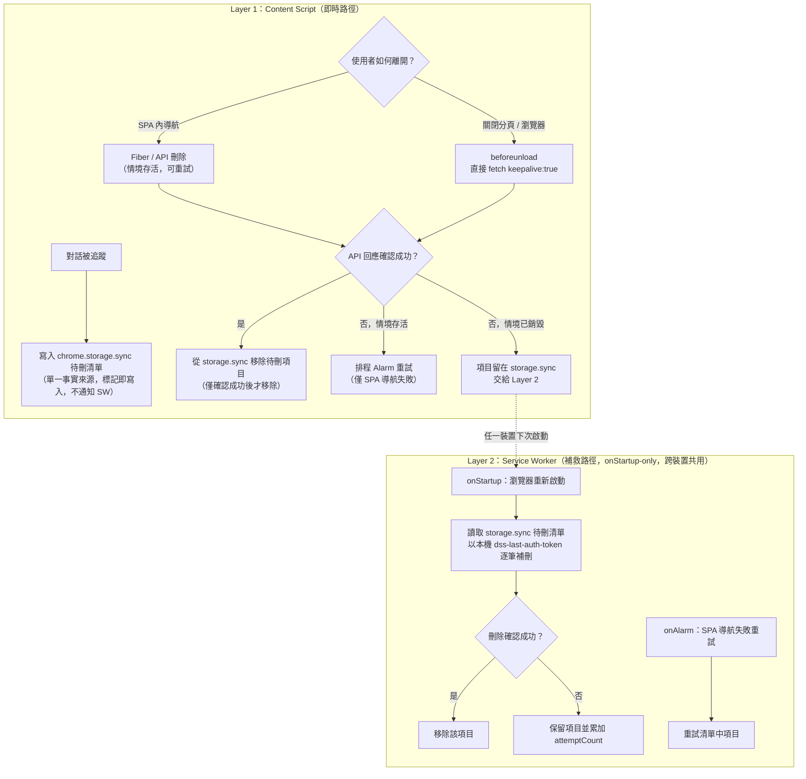
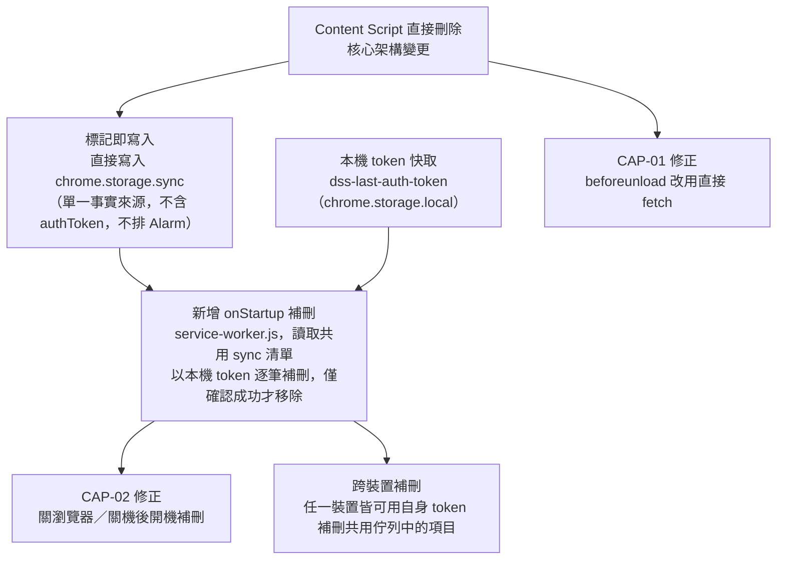

# Temporary Conversation Deletion Mechanism: Corrective Action Plan

> This document records the problem analysis and remediation approach for the Temporary Conversation feature, along with known behavioral boundaries that must be explicitly documented due to browser extension technical limitations.
>
> **Core objective of this iteration**: Fix the issue where, with the toggle enabled, temporary conversations are **not deleted (left dangling)** in certain departure scenarios — specifically the three scenarios of **directly closing the tab, directly closing the browser, and directly shutting down the machine**.
>
> **Cross-device sync of the pending-delete list**: The pending-delete list lives exclusively in `chrome.storage.sync` as a single cross-device source of truth (no separate per-device local copy), so that if the same DeepSeek account is closed abruptly on computer A, restarting the extension on computer B (signed into the same Chrome account) can still remediate the dangling entries — with no local/sync reconciliation needed.
>
> **Confirmed-deletion invariant**: An entry is removed from the pending-delete queue **only after the delete API call returns confirmed success** — never speculatively, and never before. This applies uniformly whether the removal happens on the originating device (real-time path) or a remediating device (`onStartup` path).

---

## Issue List

| ID | Description | Nature | Direction | Priority |
|-|-|-|-|-|
| CAP-01 | When directly closing a tab, the delete request is relayed to the SW via `sendMessage`, which is unreliable due to IPC race conditions during tab teardown | Design flaw | Deletion fails (dangling) | High |
| CAP-02 | When directly closing the browser / forced shutdown, deletion cannot complete in real time, and there is no post-startup remediation mechanism | Design flaw + technical limitation | Deletion fails (dangling) | High |

> CAP-01/CAP-02 are the main line of this iteration (the dangling issue).

---

## Core Architectural Fix: Separation of Responsibilities

This is the shared root-cause fix for both CAP-01 and CAP-02. The key to the fix is not making the SW faster, but **clarifying who should do what**.

### Design Principle

> **The content script is responsible for all real-time deletion** (SPA navigation, tab/browser closing — calling the API directly).
> **The Service Worker is responsible only for remediation after a crash/shutdown**, and **is triggered only on browser restart (`onStartup`)**.
> The two paths are completely independent and do not depend on each other.

The fundamental problem with the existing architecture is that it places the SW in the middle of the `beforeunload` path, introducing an unnecessary asynchronous hop (`chrome.runtime.sendMessage`). The SW isn't slow — it simply shouldn't be on this real-time path at all, since that IPC call cannot be guaranteed to arrive during tab teardown.

### New Architecture: Two-Layer Separation



### Write-on-Mark: Written at Tracking Time, Not at Deletion Time

The write to `chrome.storage.sync` must happen immediately when a conversation is tracked — it cannot wait until `beforeunload`. Because the queue lives in `chrome.storage.sync` from the moment of tracking, it is simultaneously the local record and the cross-device record: no matter when the tab/browser is closed, or even if the OS forces a shutdown, the pending-delete entry is already persisted and visible to every device signed into the same Chrome account, and remediation can happen on the next startup of **any** of them — not just the originating device.

| Timing | Content Script Action | Service Worker Action |
|-|-|-|
| Conversation UUID tracked for the first time | Write directly to the `chrome.storage.sync` pending-delete queue (single source of truth — no separate local copy) | **Not involved** (no notification, no alarm scheduled) |
| SPA navigation deletion succeeds (API confirms success) | Remove directly from `chrome.storage.sync` | Not involved |
| SPA navigation deletion fails (execution context alive) | `sendMessage` asks SW to schedule a retry alarm | Schedules alarm (context alive, IPC reliable) |
| beforeunload (closing tab/browser) | `fetch(keepalive:true)` calls the API directly; entry is removed from `chrome.storage.sync` **only if the response is confirmed successful** | Not involved |
| Browser restart (any device signed into the account) | Not involved | `onStartup` reads the shared queue and retroactively deletes each entry using this device's own `dss-last-auth-token`; an entry is removed **only on confirmed API success** |

> **Removal invariant**: Never remove an entry from the queue speculatively (e.g., "assume the keepalive fetch probably worked" or "assume another device already handled it"). Removal happens strictly after an explicit success confirmation from the delete API — on any other outcome (network failure, non-2xx response, no response received), the entry stays in the queue with `attemptCount` incremented, ready for the next remediation attempt by whichever device starts up next.

> ⚠️ **Critical safety fix (relative to the previous plan)**: The previous plan had the SW schedule an alarm **at the moment a conversation was tracked**. Since `chrome.alarms` fires at the earliest after about 1 minute, and the user is **very likely still in that conversation** at that point, the retroactive deletion would **delete a conversation the user is actively having**.
>
> Therefore, this version mandates: **at tracking time, only write to the pending-delete list — never schedule an alarm at tracking time**. For entries that are "tracked but not yet left," remediation is handled **solely by `onStartup`** — a browser restart means the conversation has genuinely been abandoned, and deletion is safe at that point. Alarms are reserved only for SPA navigation retries where deletion has been confirmed to have failed **and the execution context is still alive**.

---

## Correct Positioning of the Service Worker

The SW is not a persistent process — it terminates automatically after about 30 seconds of idleness and wakes on demand when an event arrives. After the fix, **the SW is completely removed from the real-time deletion path** and handles only scenarios the content script has no opportunity to execute.

> ⚠️ **Current state reminder**: `background/service-worker.js` **already has an `onStartup` listener** (currently used for cloud-preset sync remediation), alongside `onMessage` and `onAlarm`. Layer 2's crash/shutdown recovery **depends on `onStartup`**, so this iteration must **extend the existing `onStartup` listener** with pending-delete remediation logic — it must not assume the listener is absent, nor register a duplicate that clobbers the existing cloud-preset behavior.

### Wake Trigger Conditions

| Trigger Event | Reliability | Role in This Iteration |
|-|-|-|
| `chrome.runtime.onStartup` | High | **(Extended — listener already exists for cloud-preset sync)** Fires on a normal browser startup, covering shutdown/crash/browser-close followed by restart — the primary remediation mechanism for this iteration. |
| `chrome.storage.onChanged` (sync area) | High | **(Optional safeguard)** Fires when the synced pending-delete queue changes (e.g., another device wrote a new entry after the cloud hydrates). Triggers a remediation sweep to mitigate the `onStartup` cold-start hydration race — deleting queued entries **except the conversation currently open in this browser** (see "Sync-Change Safeguard" below). |
| `chrome.alarms.onAlarm` | Extremely high | Persisted in the Chrome profile. Used only for retrying "SPA navigation deletion failure," **not scheduled at tracking time**. |
| Content script `sendMessage` | Medium | Used only when SPA navigation deletion fails and the context is still alive, to ask the SW to schedule a retry alarm. |

### Clarifying the Role of Alarms

`chrome.alarms` has a minimum trigger interval of about 1 minute (per the Chrome MV3 spec); setting a shorter value is automatically clamped up. Therefore, alarms are **not suitable as a real-time deletion mechanism**, and **must not be scheduled at tracking time** (doing so would risk deleting an in-progress conversation) — they are only suitable as a remediation retry trigger for "confirmed departure but deletion failed."

Content scripts calling `fetch(keepalive:true)` directly is the real-time deletion mechanism for tab/browser closure, and is not subject to the 1-minute limit.

### Sync-Change Safeguard (mitigating the `onStartup` hydration race)

`chrome.runtime.onStartup` may fire before `chrome.storage.sync` has finished hydrating from the cloud on a cold start, so a freshly-started device could read a stale (empty or incomplete) queue and miss entries another device just wrote. This is considered a rare, extreme case; as a lightweight mitigation (not a full solution), the remediation sweep is **also** triggered whenever the synced queue changes — i.e., on a `chrome.storage.onChanged` event for the `sync` area, which fires when cloud data arrives after hydration or when any device writes a new marker.

> ⚠️ **Required guard**: A sync-change sweep must **never** delete the conversation currently open in this browser. Because write-on-mark writes to `chrome.storage.sync`, the `onChanged` event also fires **locally on the originating device** — without this guard, the device would immediately delete the very conversation the user just started (a guaranteed break, not an edge case). The sweep therefore deletes every queued entry **except** the UUID currently tracked/open in a live tab on this device (`_trackedTemporaryUuid` / the current URL's UUID). Leaving the currently-open conversation remains the job of the real-time path (SPA navigation / `beforeunload`).

This narrows but does not fully close the hydration-race window, and it does not change the accepted cross-device "in-use" limitation documented under "Known Limitations."

### Remediation Timing Windows

| Scenario | Timing of Remediation |
|-|-|
| Normal SPA navigation away | Immediate (content script Fiber/API deletion) |
| Closing a tab (browser still open) | Immediate (`keepalive` fetch); on failure, remains dangling until the next browser startup, when `onStartup` performs remediation |
| Closing the entire browser | Attempts immediate `keepalive` fetch; regardless of success or failure, `onStartup` on the next startup ensures no dangling entries remain |
| Forced shutdown / browser crash | `onStartup` performs remediation immediately on next startup (the pending-delete list was already persisted at tracking time) |
| Browser not opened for a long time | Delayed until the browser is next opened |

---

## CAP-01: Delete Request Unreliable on Tab Close

### Root Cause

The existing chain of `beforeunload` → `chrome.runtime.sendMessage` → SW → `fetch(keepalive:true)` has a race condition at the "SW receives the message" step. During tab teardown, the content script cannot guarantee that the asynchronous IPC call reaches the SW (the SW may be waking up just as the message channel is torn down). **This is the most common source of dangling conversations when closing a tab.**

### Fix

Remove the `beforeunload` path's dependency on the SW; have the content script send the `keepalive` request directly instead. A keepalive fetch is handed off to the browser's network process and can survive page teardown (the same principle as `navigator.sendBeacon`):

```javascript
// handleBeforeUnload 修改後（content/temporary-chat-delete.js）
function handleBeforeUnload() {
    if (_suppressNextUnloadDelete) return;
    if (_isKeyboardRefresh) return;

    const currentUuid = extractUuidFromUrl();
    if (!currentUuid || currentUuid !== _trackedTemporaryUuid) return;
    if (!_capturedAuthToken) return;

    const uuidToDelete = _trackedTemporaryUuid;
    _trackedTemporaryUuid = null;
    saveTrackedUuid(null);

    // 直接發送，不經過 SW
    fetch('https://chat.deepseek.com/api/v0/chat_session/delete', {
        method: 'POST',
        keepalive: true,
        headers: { 'authorization': _capturedAuthToken, 'content-type': 'application/json' },
        body: JSON.stringify({ chat_session_id: uuidToDelete }),
    }).then(r => {
        // 僅在 API 明確回傳成功時才移除待刪項目；teardown 期間 .then 可能不執行，殘留項目交給 onStartup 清理
        if (r.ok) removeFromPendingStorage(uuidToDelete);
    }).catch(() => {});
}
```

> **Idempotency (verified)**: When a tab closes, the `.then` callback above may not execute because the execution context has already been destroyed, leaving the pending-delete entry in the queue. `onStartup` re-invokes the delete API for such entries. Repeated deletion of an already-deleted conversation has been **verified to be a safe no-op**: the DeepSeek delete API returns **HTTP 200** with body `{ "code": 0, "msg": "", "data": { "biz_code": 0, "biz_msg": "", "biz_data": null } }` even for an already-deleted session. A re-deletion is therefore treated as confirmed success (the entry is safely removed), never as a failure — so there is no risk of a still-pending entry being wrongly retried/dropped on this account.

> **To verify during implementation (CSP / same-origin)**: The `beforeunload` `fetch` runs in the content script's context against `https://chat.deepseek.com/...`. Because the request targets the **same origin** as the page the content script is injected into, it is expected not to be blocked by the page's `connect-src` CSP — but this assumption must be **verified in a real browser** before relying on it; the exact CSP the DeepSeek page ships has not been confirmed within this plan.

**Specific changes:**

1. **`content/temporary-chat-delete.js`**: Change `deleteTrackedAndClear({ keepalive: true })` to a direct `fetch(keepalive: true)`, removing the `chrome.runtime.sendMessage` call.
2. **`content/temporary-chat-delete.js`**: Add `writeToPendingStorage` and `removeFromPendingStorage` utility functions, operating directly on `chrome.storage.sync` (the single cross-device pending-delete queue; the content script needs the `storage` permission but not a full round-trip through the SW to read/write it). `removeFromPendingStorage` must only be called after a confirmed-success response.
3. **`content/temporary-chat-delete.js`**: Call `writeToPendingStorage` when "marking a conversation as temporary" (in the `checkCoOccurrence` and `handleNavigationEvent` marking branches), implementing "write-on-mark."
4. **`background/service-worker.js`**: Remove the real-time deletion logic for `DSS_DELETE_TEMP_CHAT` in `onMessage` (the real-time path no longer goes through the SW); keep the alarm retry logic.

---

## CAP-02: Conversations Dangling on Browser Close / Forced Shutdown

### Root Cause

- **Closing the entire browser**: Each tab's `beforeunload` does fire, but suffers from the same IPC race condition as CAP-01, and the SW itself is also being shut down, making real-time deletion even less reliable.
- **Forced shutdown / crash**: The OS terminates the browser process directly, `beforeunload` never fires at all, and any cleanup that relies on "executing at the moment of leaving" is ineffective.

The common gap in both cases: **the lack of a remediation mechanism that runs after the browser restarts**.

### Fix

1. **Write-on-mark, directly to `chrome.storage.sync`**: When a conversation is tracked, immediately write `{ chatUuid, attemptCount: 0 }` to the shared `dss-pending-deletes-sync` queue, ensuring the data is persisted — and already visible to every device signed into the same Chrome account — before any shutdown/crash.
2. **Add `onStartup` remediation**: On browser restart (on **any** device, not just the one that tracked the conversation), the SW reads the shared queue and calls the delete API for each entry using this device's own locally captured token. At this point these conversations **must have already been abandoned** (the browser is a brand-new session), so deletion is safe.

```javascript
// background/service-worker.js：擴充現有的 onStartup listener（目前用於 cloud-preset sync），
// 於同一個 listener 內追加待刪佇列補救；切勿另註冊第二個 onStartup 而覆蓋既有邏輯。
chrome.runtime.onStartup.addListener(() => {
    (async () => {
        const pending = await getPendingDeletesSync(); // chrome.storage.sync — single cross-device queue
        if (pending.length === 0) return;

        const token = await getLastKnownAuthToken(); // chrome.storage.local — this device's own captured token
        if (!token) return; // this device has never captured a token for this account — leave for another device

        const stillPending = [];
        for (const item of pending) {
            const ok = await performDeleteFetch(item.chatUuid, token);
            if (ok) continue; // confirmed success — drop from queue
            if ((item.attemptCount ?? 0) < MAX_ATTEMPTS) {
                stillPending.push({ ...item, attemptCount: (item.attemptCount ?? 0) + 1 });
            }
        }
        await savePendingDeletesSync(stillPending);
        if (stillPending.length > 0) await scheduleRetryAlarm();
    })();
});
```

Because the queue is a single shared list from the moment of tracking, there is no separate "local list" to reconcile against a "sync mirror" — whichever device wakes up first simply works through the same queue with its own token, and only removes an entry once the delete API confirms success.

> **Degraded behavior**: Between the shutdown/crash and the next browser launch (on any device), the conversation will remain dangling. This is an inherent boundary that a browser extension cannot eliminate (see "Known Limitations"), and is an acceptable degradation.

**Affected files:**

- `background/service-worker.js`: Extend the **existing** `chrome.runtime.onStartup` listener (currently handles cloud-preset sync) with pending-delete remediation; optionally add a `chrome.storage.onChanged` (sync area) handler for the hydration-race safeguard.
- `content/temporary-chat-delete.js`: Write-on-mark (shared with the CAP-01 change).

---

## Layer 3: Cross-Device Synchronization of the Pending-Delete List

> **Goal**: If computer A is force-closed or crashes while a temporary conversation is still tracked, computer B — signed into the same Chrome account with sync enabled — must be able to remediate (delete) that dangling conversation the next time it starts up. Achieved by making `chrome.storage.sync` the **only** place the pending-delete queue is stored (see CAP-02's `Fix` above) — there is no local-only duplicate to keep in sync.

### Design Principle

> **`authToken` must never leave local storage.** `chrome.storage.sync` data is transmitted through Google's sync infrastructure; `PRIVACY.md` explicitly promises that session/sensitive data stays local-only. Therefore the shared queue carries only the non-sensitive `chatUuid` (plus `attemptCount` for bookkeeping) — never the bearer token.
> **Remediation always uses the *local* device's own captured token.** Since the delete API only requires `{ chatUuid, authToken }` and any valid session token for the same DeepSeek account can delete any of that account's conversations, any device can remediate any entry in the shared queue — including one it never tracked itself — as long as it has *its own* recently captured `authToken` for that account (i.e., the user has opened `chat.deepseek.com` logged in on that device at least once). This applies uniformly; there is no special-casing of "entries I tracked" vs. "entries another device tracked."

### Data Model

| Storage | Key | Shape | Contains `authToken`? | Purpose |
|-|-|-|-|-|
| `chrome.storage.sync` | `dss-pending-deletes-sync` | `{ chatUuid, attemptCount }` | **No** | The single, cross-device pending-delete queue — the only copy, written directly at tracking time |
| `chrome.storage.local` | `dss-last-auth-token` | `string` (raw bearer token) | Yes | **(New)** The most recently captured valid token on *this* device, used to remediate any queue entry on `onStartup`, whether tracked locally or on another device |

### Write / Remove Flow

| Event | `chrome.storage.sync` queue (`dss-pending-deletes-sync`) | `chrome.storage.local` token cache (`dss-last-auth-token`) |
|-|-|-|
| Conversation tracked for the first time (write-on-mark) | Write `{ chatUuid, attemptCount: 0 }` directly — this is the only write, no local duplicate | Not applicable |
| Deletion succeeds (SPA nav, `beforeunload` keepalive, or `onStartup` remediation, on any device) | Remove entry — **only after the delete API confirms success** | Not applicable |
| Valid token captured/refreshed on this device | Not applicable | Overwrite with the newly captured token |

> **Race tolerance**: `chrome.storage.sync` propagation across devices is not instantaneous and has no delivery guarantee at a fixed time. Two devices may attempt to remediate the same entry near-simultaneously; the second attempt must be treated as an idempotent no-op (consistent with the existing CAP-01 idempotency note), not an error.

### Quota Considerations

`chrome.storage.sync` enforces both a size quota and a write-rate quota. Since write-on-mark now writes directly to `chrome.storage.sync` (rather than to unlimited `chrome.storage.local`), the write-rate quota is worth noting, but analysis shows it is **not a practical constraint** for this feature:

| Quota | Limit | Impact |
|-|-|-|
| `QUOTA_BYTES_PER_ITEM` | 8,192 bytes | Each queue entry is only tens of bytes (`chatUuid` ~36 chars + `attemptCount`), far below the cap — not a practical concern |
| `QUOTA_BYTES` (total) | ~100KB | Bounds how many conversations can be pending at once; not a practical concern at expected scale |
| `MAX_WRITE_OPERATIONS_PER_MINUTE` | 120 | Not a practical concern: reaching it requires sustaining ~2 tracking writes per second, which manual operation cannot realistically produce (creating and abandoning a conversation is a deliberate, multi-second user action) |
| `MAX_WRITE_OPERATIONS_PER_HOUR` | 1,800 | Same category; also not reachable through normal manual operation |

**No debounce is needed.** An earlier draft proposed debouncing/coalescing write-on-mark calls to protect the write-rate quota; this is unnecessary because manual conversation creation/abandonment cannot approach ~2 writes/second, so immediate write-on-mark is retained (which also preserves the "persist at tracking time" guarantee — debouncing would delay persistence and reintroduce the CAP-02 dangling window on a sudden shutdown). As a purely defensive measure, a throttled `chrome.storage.sync.set` (should one ever occur) is treated as a retryable failure — logged, not silently dropped — rather than assuming every write succeeds.

Reuse the existing quota-checked write path in `utils/storage-manager.js` (the same guard used by `utils/storage-manager.sync.js` for preset sync) rather than calling `chrome.storage.sync.set` directly, so oversized-item handling stays consistent project-wide. **Note:** that path currently guards item **size** only (`QUOTA_BYTES_PER_ITEM`, oversized-item interception, sync→local fallback); it does **not** implement write-rate throttling — which, per the analysis above, is not a practical concern here.

**Affected files:**

- `content/temporary-chat-delete.js`: Write-on-mark / removal write directly to `dss-pending-deletes-sync`; persist `dss-last-auth-token` whenever a token is captured.
- `background/service-worker.js`: `onStartup` reads the shared queue and remediates every entry using `dss-last-auth-token` (see CAP-02's `Fix` above — this is the same code path, not a separate extension).
- `PRIVACY.md`: Document that `chatUuid` and `attemptCount` (non-sensitive) may sync via `chrome.storage.sync` for cross-device cleanup, while `authToken` never leaves local storage.

---

## Known Limitations and Documentation Recommendations

> This extension is a browser extension, not a native web application. In the face of OS-level process management, an extension cannot obtain the same lifecycle control as a native application. The following limitations are inherent boundaries at the technical architecture level and cannot be fully eliminated no matter how much optimization is applied.

### Limitations That Cannot Be Fully Resolved

| Scenario | Behavior | Reason |
|-|-|-|
| Forced shutdown (power button, power loss) | Conversation remains dangling until the browser is next opened | The OS kills the process; `beforeunload` does not fire; relies on `onStartup` for remediation |
| Browser crash (abnormal close) | Conversation remains dangling until the browser is next opened | Same as above |
| Browser not opened for a long time | Conversation remains dangling until opened | SW is not woken; `onStartup` remediation does not run |
| Auth token expires before remediation | Remediation fails, conversation dangles permanently | Token validity is determined by the DeepSeek server; the extension has no control over it |
| Computer B has never logged into the same DeepSeek account | Cross-device remediation cannot occur on computer B; the entry stays in the shared queue until a device with a valid token for that account starts up | Remediation requires the local device's own captured `authToken`; the token itself is never synced |
| Chrome sync is disabled, or computers are not signed into the same Chrome account | Cross-device remediation does not occur at all; each device only remediates what it tracked itself | `chrome.storage.sync` requires Chrome sync to be enabled and signed into the same account — this is a user/browser-level prerequisite outside the extension's control |
| The same DeepSeek account is **actively in use** on device A (conversation still open, not yet left) while device B — signed into the same Chrome account — restarts or receives a sync change | Device B's remediation may delete a conversation that is still open and in use on device A | The heuristic "a fresh browser session / new sync entry means the conversation was abandoned" holds per-device but not across devices; B cannot know A is still using the conversation. **Accepted as an extreme, rare case** for personal single-user usage — deliberately not mitigated. The sync-change guard only protects the conversation open on the *same* device, not one open on another device |
| A queue entry fails remediation `MAX_ATTEMPTS` times (persistent network failure or server error) | The entry is dropped from the queue and the conversation dangles permanently, with no user-visible notice | Bounded retry is a deliberate trade-off to avoid an ever-growing queue; surfacing a notification is out of scope for this iteration |
| Browsing in Incognito / a non-syncing profile | `chrome.storage.sync` may be unavailable or isolated in that context, so cross-device remediation — and even same-profile persistence — may not behave as in a normal profile | Incognito storage semantics differ by design; not specially handled |
| Many temporary conversations tracked/untracked within a very short window (theoretical: ~2+ per second, sustained) | Some write-on-mark calls could in principle be throttled by the write-rate quota | `MAX_WRITE_OPERATIONS_PER_MINUTE` (120) — not reachable through normal manual operation; listed for completeness only, no debounce implemented |

### Recommended User-Facing Documentation

The following content should be added to `docs/FEATURES.md` or `docs/spec/04-features.md`:

---

**Scope of the Privacy Guarantee for Temporary Conversations**

The Temporary Conversation feature automatically deletes the conversation record from the DeepSeek server after you leave the conversation. This feature is **guaranteed to work** in the following scenarios:

- Normal in-browser navigation to another page or conversation
- Normally closing a browser tab or window (including closing the entire browser)

In the following scenarios, deletion will be **delayed** until the next time the browser is opened:

- The computer is forcibly shut down (holding the power button, power loss)
- The browser crashes or is forcibly terminated by the operating system

This extension operates as a browser extension and cannot obtain system-level control beyond the browser itself. If you require the highest level of privacy guarantee, it is recommended to close the browser normally before shutting down the computer.

---

## Fix Priority and Dependencies



**Recommended implementation order:**

1. **PR-A (single-source-of-truth design, covers CAP-01 + CAP-02 + cross-device from the start)**: Direct `fetch` for real-time deletion + write-on-mark directly to `chrome.storage.sync` + `dss-last-auth-token` persistence + new `onStartup` remediation that reads the shared queue and removes entries only on confirmed delete success + SW removed from the real-time path.
2. **Documentation update**: Add the limitation description (including the sync write-rate quota caveat) to `docs/FEATURES.md`, and the sync-scope note to `PRIVACY.md`.

---

## Test Verification Checklist

| Scenario | Expected Behavior | Corresponding Issue |
|-|-|-|
| Normal SPA in-app navigation away from a temporary conversation | Conversation is deleted, pending-delete entry in the `chrome.storage.sync` queue is cleared | Regression |
| F5 / Ctrl+R refresh | Conversation is not deleted, tracking state is preserved | Regression |
| Closing a tab (network normal) | keepalive fetch deletes immediately, queue entry is cleared | CAP-01 |
| Closing a tab (network disconnected) | keepalive fails, entry remains dangling in the queue, `onStartup` performs remediation on next startup | CAP-01 / CAP-02 |
| Closing the entire browser and reopening | `onStartup` remediates the dangling entry | CAP-02 |
| Reopening the browser after a forced shutdown | Pending-delete queue entry was already persisted; `onStartup` remediates | CAP-02 |
| **Staying in a tracked conversation without leaving for several minutes** | **Conversation is not deleted** (verifies that an alarm is not scheduled at tracking time and an in-progress conversation is not mistakenly deleted) | Safety regression |
| Auth token expires after conversation is marked | Remediation fails, consistent with the known limitation, silently gives up | Known limitation |
| Typing a different URL in the address bar | Conversation is deleted | Regression |
| Simulate a delete API call that returns a non-2xx response (or times out) | Entry is **not** removed from the queue; `attemptCount` is incremented and the entry remains for the next remediation attempt | Confirmed-deletion invariant |
| Computer A tracks a conversation then is force-shut-down; computer B (same Chrome account, sync enabled, has previously logged into the same DeepSeek account) restarts | `onStartup` on computer B reads the shared queue, finds the entry, and deletes it using computer B's own `dss-last-auth-token`, removing it only after confirmed success | Layer 3 / Cross-device |
| Same scenario, but computer B has never logged into that DeepSeek account (no local token) | Entry remains in the shared queue; no deletion attempted on computer B | Layer 3 / Cross-device, known limitation |
| Inspect any `chrome.storage.sync` write during tracking | `authToken` is never present in the synced payload — only `chatUuid` and `attemptCount` | Layer 3 / Privacy regression |
| Two devices attempt to remediate the same queue entry near-simultaneously | Both calls succeed (each returns HTTP 200); no error surfaces to the user | Layer 3 / Idempotency |
| Re-deleting an already-deleted conversation | API returns HTTP 200 with `code: 0`; the entry is treated as confirmed success and removed (not retried, not dropped as a failure) | Idempotency (verified) |
| A `chrome.storage.onChanged` (sync) event fires on the **originating** device right after write-on-mark, while the user is still in the conversation | The currently-open conversation is **not** deleted by the sync-triggered sweep (guard excludes the live/open UUID); only entries not open on this device are remediated | Sync-change safeguard |
| Track/untrack more than ~120 temporary conversations within one minute | Some `chrome.storage.sync` writes are throttled; no tracking record is silently lost (throttled writes are logged/retried, not swallowed) | Layer 3 / Write-quota limitation |
