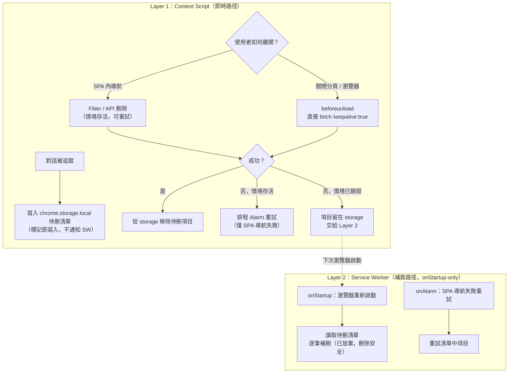
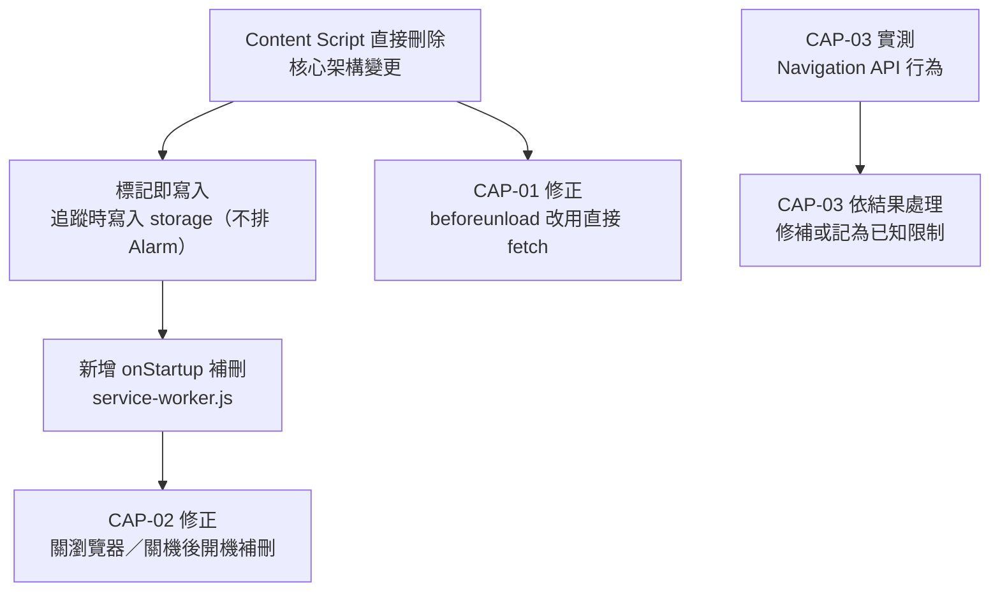

# 暫時對話刪除機制：修正行動計劃

> 本文件記錄針對暫時對話（Temporary Conversation）功能的問題分析、修正方案，以及因瀏覽器擴充套件技術限制而必須明確說明的已知行為邊界。
>
> **本次核心目標**：修復「切換開啟狀態下，暫時對話在某些離開情境中**沒有被刪除（殘留）**」的問題——具體為**直接關閉分頁、直接關閉瀏覽器、直接關機**三種情境。

---

## 問題清單

| 編號 | 問題描述 | 性質 | 方向 | 優先級 |
|-|-|-|-|-|
| CAP-01 | 直接關閉分頁時，刪除請求經由 `sendMessage` 轉送 SW，因 tab teardown 期間 IPC 競態而不可靠 | 設計缺陷 | 刪不掉（殘留） | 高 |
| CAP-02 | 直接關閉瀏覽器 / 強制關機時，刪除無法即時完成，且缺乏開機後的補救機制 | 設計缺陷 + 技術限制 | 刪不掉（殘留） | 高 |
| CAP-03 | 網址列輸入相同 URL 導航時，可能誤判為離開並刪除對話 | 待驗證 | **過度刪除（方向相反）** | 中 |

> CAP-01／CAP-02 是本次主線（殘留問題）。CAP-03 與主線方向相反（屬「不該刪卻刪了」），**且原方案機制不成立**，本次改為「實測優先」處理（見後）。

---

## 核心架構修正：職責分層

這是 CAP-01 與 CAP-02 的共同根本解法。修正的關鍵不是讓 SW 更快，而是**釐清誰該做什麼**。

### 設計原則

> **Content script 負責所有即時刪除**（SPA 導航、tab／瀏覽器關閉，直接打 API）。
> **Service Worker 只負責崩潰／關機後的補救**，且**僅在瀏覽器重新啟動（`onStartup`）時觸發**。
> 兩條路徑完全獨立，互不依賴。

現有架構的根本問題是讓 SW 夾在 `beforeunload` 路徑的中間，引入了一個不必要的非同步躍點（`chrome.runtime.sendMessage`）。SW 不是速度慢，而是根本就不該出現在這條即時路徑上——tab teardown 期間該 IPC 無法保證送達。

### 新架構：兩層分離



### 標記即寫入：在追蹤時就寫入，而非在刪除時

`chrome.storage.local` 的寫入必須在對話被追蹤時立刻完成，不能等到 `beforeunload`。這樣無論分頁／瀏覽器何時被關閉、甚至 OS 強制關機，待刪清單都已在磁碟上，下次開機即可補救。

| 時機 | Content Script 動作 | Service Worker 動作 |
|-|-|-|
| 對話 UUID 首次被追蹤 | 直接寫入 `chrome.storage.local` 待刪清單 | **不參與**（不通知、不排 Alarm） |
| SPA 導航刪除成功 | 直接從 `chrome.storage.local` 移除 | 不參與 |
| SPA 導航刪除失敗（情境存活） | `sendMessage` 請 SW 排程重試 Alarm | 排程 Alarm（情境存活，IPC 可靠） |
| beforeunload（關分頁／瀏覽器） | `fetch(keepalive:true)` 直接打 API；成功則 best-effort 移除清單 | 不參與 |
| 瀏覽器重新啟動 | 不參與 | `onStartup` 讀取清單並逐筆補刪 |

> ⚠️ **關鍵安全修正（相對前一版計畫）**：前一版計畫在「對話被追蹤的當下」就請 SW 排程 Alarm。由於 `chrome.alarms` 最短約 1 分鐘後即觸發，而此時使用者**很可能仍在該對話中**，補刪會把**使用者正在進行的對話刪掉**。
>
> 因此本版規定：**追蹤時只寫入待刪清單、絕不在追蹤時排程 Alarm**。針對「追蹤但尚未離開」的項目，補救**只交給 `onStartup`**——瀏覽器重新啟動代表該對話確實已被放棄，此時刪除才安全。Alarm 僅保留給「已確認離開、但刪除失敗」且**執行情境仍存活**的 SPA 導航重試。

---

## Service Worker 的正確定位

SW 不是常駐行程，閒置約 30 秒後自動終止，有事件進來時按需喚醒。修正後，**SW 完全退出即時刪除路徑**，只處理 content script 沒有機會執行的情境。

> ⚠️ **現況提醒**：目前 `background/service-worker.js` **只有 `onMessage` 與 `onAlarm` 監聽器，並沒有 `onStartup` 監聽器**。Layer 2 的崩潰／關機復原**完全依賴 `onStartup`**，因此本次必須**新增**此監聽器——這是新功能，不是「保留既有邏輯」。

### 喚醒觸發條件

| 觸發事件 | 可靠性 | 本次角色 |
|-|-|-|
| `chrome.runtime.onStartup` | 高 | **（新增）** 瀏覽器正常啟動時觸發，涵蓋關機／崩潰／關閉瀏覽器後重新開機——本次補救主力。 |
| `chrome.alarms.onAlarm` | 極高 | 持久化於 Chrome profile。僅用於「SPA 導航刪除失敗」的重試，**不在追蹤時排程**。 |
| content script `sendMessage` | 中 | 僅在 SPA 導航刪除失敗、情境仍存活時用來請 SW 排程重試 Alarm。 |

### Alarm 的角色澄清

`chrome.alarms` 最短觸發間隔約 1 分鐘（Chrome MV3 規範），設定更短的值會被自動夾高。因此 Alarm **不適合作為即時刪除機制**，也**不可在追蹤時排程**（會誤刪進行中對話），只適合作為「已確認離開但刪除失敗」的補救重試觸發器。

Content script 直接 `fetch(keepalive:true)` 才是分頁／瀏覽器關閉時的即時刪除手段，不受 1 分鐘限制。

### 補刪的時間視窗

| 情境 | 補刪發生時機 |
|-|-|
| 正常 SPA 導航離開 | 立即（content script Fiber／API 刪除） |
| 關閉分頁（瀏覽器仍開啟） | 立即（`keepalive` fetch）；若失敗，殘留至下次瀏覽器啟動由 `onStartup` 補刪 |
| 關閉整個瀏覽器 | 嘗試即時 `keepalive` fetch；無論成敗，下次啟動 `onStartup` 補刪確保不殘留 |
| 強制關機 / 瀏覽器崩潰 | 下次啟動時 `onStartup` 立即補刪（待刪清單已於追蹤時持久化） |
| 長時間不開啟瀏覽器 | 延遲至下次開啟瀏覽器 |

---

## CAP-01：分頁關閉時刪除請求不可靠

### 根本原因

現有 `beforeunload` → `chrome.runtime.sendMessage` → SW → `fetch(keepalive:true)` 的鏈，在「SW 接收訊息」這一環存在競態條件。Content script 在 tab teardown 期間無法保證非同步 IPC 送達 SW（SW 可能正在喚醒，訊息通道就被拆除）。**這是分頁關閉時最常見的殘留來源。**

### 修正方案

移除 `beforeunload` 路徑對 SW 的依賴，改由 content script 直接發送 `keepalive` 請求。keepalive fetch 由瀏覽器網路行程接手，能存活於頁面銷毀之後（與 `navigator.sendBeacon` 同原理）：

```javascript
// handleBeforeUnload 修改後（content/temporary-chat-delete.js）
function handleBeforeUnload() {
    if (_suppressNextUnloadDelete) return;
    if (_isKeyboardRefresh) return;

    const currentUuid = extractUuidFromUrl();
    if (!currentUuid || currentUuid !== _trackedTemporaryUuid) return;
    if (!_capturedAuthToken) return;

    const uuidToDelete = _trackedTemporaryUuid;
    _trackedTemporaryUuid = null;
    saveTrackedUuid(null);

    // 直接發送，不經過 SW
    fetch('https://chat.deepseek.com/api/v0/chat_session/delete', {
        method: 'POST',
        keepalive: true,
        headers: { 'authorization': _capturedAuthToken, 'content-type': 'application/json' },
        body: JSON.stringify({ chat_session_id: uuidToDelete }),
    }).then(r => {
        // best-effort：teardown 期間 .then 可能不執行，殘留項目交給 onStartup 清理
        if (r.ok) removeFromPendingStorage(uuidToDelete);
    }).catch(() => {});
}
```

> **冪等性依賴**：tab 關閉時上述 `.then` callback 可能因執行情境已銷毀而不執行，導致待刪項目殘留。`onStartup` 會對殘留項目重新呼叫刪除 API；對「已刪除的對話」重複刪除應為冪等（伺服器回非 ok 後靜默放棄）。此行為需在實作時確認。

**具體變更：**

1. **`content/temporary-chat-delete.js`**：`deleteTrackedAndClear({ keepalive: true })` 改為直接 `fetch(keepalive: true)`，移除 `chrome.runtime.sendMessage` 呼叫。
2. **`content/temporary-chat-delete.js`**：新增 `writeToPendingStorage` 與 `removeFromPendingStorage` 工具函式（直接操作 `chrome.storage.local`，content script 具此權限）。
3. **`content/temporary-chat-delete.js`**：在「標記對話為臨時」時（`checkCoOccurrence` 與 `handleNavigationEvent` 標記分支）呼叫 `writeToPendingStorage`，落實「標記即寫入」。
4. **`background/service-worker.js`**：移除 `onMessage` 中 `DSS_DELETE_TEMP_CHAT` 的即時刪除邏輯（即時路徑不再經 SW）；保留 Alarm 重試。

---

## CAP-02：關閉瀏覽器 / 強制關機導致對話殘留

### 根本原因

- **關閉整個瀏覽器**：每個分頁的 `beforeunload` 雖會觸發，但與 CAP-01 同樣的 IPC 競態，且 SW 本身也正被關閉，即時刪除更不可靠。
- **強制關機 / 崩潰**：OS 直接終止瀏覽器行程，`beforeunload` 完全不觸發，任何「離開當下才執行」的清理均無效。

兩者共通缺口：**缺乏一個「瀏覽器重新啟動後」的補救機制**。

### 修正方案

1. **標記即寫入**：對話被追蹤時就把 `{ chatUuid, authToken }` 寫入 `chrome.storage.local` 待刪清單，確保關機／崩潰前資料已落地。
2. **新增 `onStartup` 補刪**：瀏覽器重新啟動時，SW 讀取待刪清單並逐筆呼叫刪除 API。此時這些對話**必然已被放棄**（瀏覽器是全新工作階段），因此刪除是安全的。

```javascript
// background/service-worker.js 新增
chrome.runtime.onStartup.addListener(() => {
    (async () => {
        const pending = await getPendingDeletes();
        if (pending.length === 0) return;

        const stillPending = [];
        for (const item of pending) {
            const ok = await performDeleteFetch(item.chatUuid, item.authToken);
            if (!ok && (item.attemptCount ?? 0) < MAX_ATTEMPTS) {
                stillPending.push({ ...item, attemptCount: (item.attemptCount ?? 0) + 1 });
            }
        }
        await savePendingDeletes(stillPending);
        if (stillPending.length > 0) await scheduleRetryAlarm();
    })();
});
```

> **降級行為**：自關機／崩潰至下次開啟瀏覽器之間，對話會殘留。這是瀏覽器擴充套件無法消除的固有邊界（見「已知限制」），屬可接受的降級。

**影響檔案：**

- `background/service-worker.js`：新增 `chrome.runtime.onStartup` 監聽器（**目前不存在**）。
- `content/temporary-chat-delete.js`：標記即寫入（與 CAP-01 變更共用）。

---

## CAP-03：相同 URL 導航誤刪對話（待驗證，實測優先）

> CAP-03 與本次主線方向相反（屬「過度刪除」）。前一版計畫提出的 `PerformanceNavigationTiming` 方案**機制不成立**，本次先以實測釐清真實行為，再決定修法。

### 為什麼前一版的 `PerformanceNavigationTiming` 方案不成立

前一版計畫在 `handleBeforeUnload` 中以 `performance.getEntriesByType('navigation')[0].type === 'reload'` 作為防線。問題在於：

> **`PerformanceNavigationTiming.type` 反映的是「當前頁面當初是如何載入的」，是頁面生命週期內的固定值，與「使用者現在要不要離開、要導航去哪裡」完全無關。**

「使用者於網址列輸入相同 URL + Enter」這個**尚未發生的新導航**，不會改變當前頁面的這個值。實際後果：

- 若當前頁是以 reload 載入 → 之後**任何**離開（含真的該刪的正常導航）都會被誤判抑制 → **該刪的反而沒刪**。
- 若當前頁是以 navigate 載入 → 同 URL 重新進入時 `type` 仍是 navigate，guard 不觸發 → **照樣誤刪**，CAP-03 沒被修掉。

換言之，此 guard 的行為只取決於頁面當初怎麼載入，與要解決的問題正交。**此方案應捨棄。**

### 待驗證的關鍵問題

CAP-03 的真正難點是：`beforeunload` 當下**無法取得目的地 URL**，因此難以在該時點判斷「同 URL 重新導航」。現有 `handleNavigationEvent` 其實已有 `isSameUrl` 判斷並設定 `_suppressNextUnloadDelete`，前提是 Navigation API 的 `navigate` 事件**有觸發且早於 `beforeunload`**。

因此需先實測釐清：

1. 在 Chrome 中，「網址列輸入相同 URL + Enter」是否會觸發 `window.navigation` 的 `navigate` 事件？（規範上跨文件導航也會觸發 `navigate`，只是 `canIntercept` 為 false）
2. 若觸發，其相對於 `beforeunload` 的順序為何？
3. `event.navigationType` 與 `event.destination.url` 在此情境下的實際值為何？

### 依實測結果的修法分支

| 實測結果 | 修法 |
|-|-|
| `navigate` 事件**有觸發且早於 `beforeunload`** | 既有 `isSameUrl` 邏輯已足夠；確認 handler 確實執行並正確設定 `_suppressNextUnloadDelete` 即可，可能無需新增程式碼。 |
| `navigate` 事件**未觸發或晚於 `beforeunload`** | 需另尋 `beforeunload` 當下可用的可靠訊號；若無，則將「同 URL 重新導航誤刪」記錄為**已知限制**，不強行以不可靠訊號修補。 |

**影響檔案（依分支而定）：**

- `content/temporary-chat-delete.js`：可能調整 `handleNavigationEvent` / `handleBeforeUnload` 的判斷。
- `test/unit/temporary-chat-delete.spec.js`：新增「相同 URL 導航」場景測試（依確定的修法撰寫）。

---

## 已知限制與文件化建議

> 本擴充套件為瀏覽器擴充套件（Browser Extension），而非原生 Web 應用程式。在 OS 層級的行程管理面前，擴充套件無法取得與原生應用程式同等的生命週期控制權。以下限制是技術架構層面的固有邊界，無論如何優化都無法完全消除。

### 無法根治的限制

| 場景 | 行為 | 原因 |
|-|-|-|
| 強制關機（電源鍵、斷電） | 對話殘留至下次開啟瀏覽器 | OS 殺行程，`beforeunload` 不觸發；靠 `onStartup` 補救 |
| 瀏覽器崩潰（非正常關閉） | 對話殘留至下次開啟瀏覽器 | 同上 |
| 長時間不開啟瀏覽器 | 對話持續殘留至開啟為止 | SW 未被喚醒，`onStartup` 補刪未執行 |
| Auth token 在補刪前過期 | 補刪失敗，對話永久殘留 | Token 有效期由 DeepSeek 伺服器決定，擴充套件無法控制 |

### 建議的使用者文件說明

以下內容應加入 `docs/FEATURES.md` 或 `docs/spec/04-features.md`：

---

**暫時對話（Temporary Conversation）的隱私保證範圍**

暫時對話功能會在您離開對話後，自動從 DeepSeek 伺服器刪除該對話記錄。本功能在以下情境中**保證有效**：

- 在瀏覽器內正常導航至其他頁面或對話
- 正常關閉瀏覽器分頁或視窗（包含關閉整個瀏覽器）

在以下情境中，刪除將**延遲**至下次開啟瀏覽器時執行：

- 電腦強制關機（長按電源鍵、斷電）
- 瀏覽器崩潰或被作業系統強制終止

本擴充套件以瀏覽器擴充套件的方式運作，無法取得超出瀏覽器本身的系統控制權。若需要最高等級的隱私保證，建議在關閉電腦前先正常關閉瀏覽器。

---

## 修正優先順序與依賴關係



**建議實作順序：**

1. **PR-A（主線，殘留問題）**：CAP-01 + CAP-02（直接 fetch + 標記即寫入 + 新增 `onStartup` 補刪 + SW 退出即時路徑）。
2. **CAP-03 實測**：先驗證 Navigation API 行為，再決定 PR-B 的內容（修補或記為已知限制）。
3. **文件更新**：在 `docs/FEATURES.md` 新增限制說明。

---

## 測試驗證清單

| 場景 | 預期行為 | 對應問題 |
|-|-|-|
| SPA 內正常導航離開暫時對話 | 對話被刪除，storage 待刪項目清除 | 迴歸 |
| F5 / Ctrl+R 刷新 | 對話不被刪除，追蹤狀態保留 | 迴歸 |
| 關閉分頁（正常網路） | keepalive fetch 即時刪除，storage 清除 | CAP-01 |
| 關閉分頁（網路中斷） | keepalive 失敗，項目殘留，下次啟動 `onStartup` 補刪 | CAP-01 / CAP-02 |
| 關閉整個瀏覽器後重開 | `onStartup` 補刪殘留項目 | CAP-02 |
| 強制關機後重新開啟瀏覽器 | 待刪清單已持久化，`onStartup` 補刪 | CAP-02 |
| **追蹤後仍停留在對話中（未離開）達數分鐘** | **對話不被刪除**（驗證未在追蹤時排程 Alarm、未誤刪進行中對話） | 安全迴歸 |
| 標記對話後 auth token 過期 | 補刪失敗，符合已知限制，靜默放棄 | 已知限制 |
| 網址列輸入相同 URL + Enter | 依 CAP-03 實測結果定義預期行為 | CAP-03 |
| 網址列輸入不同 URL | 對話被刪除 | 迴歸 |
