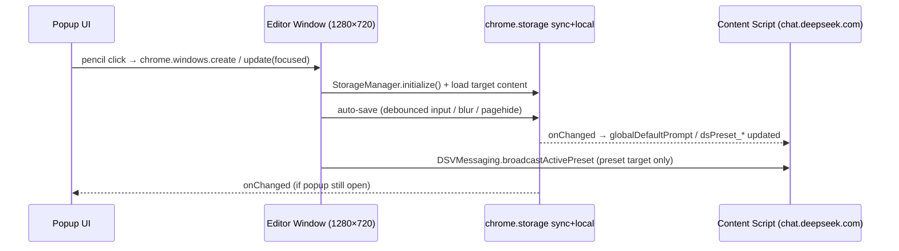

# Popup 與編輯器架構

> 📂 [DS studio 文件](../) › [架構文件](../ARCHITECTURE.md) › Popup 與編輯器
>
> **相關規格**：[Popup UI 規格](../spec/02-popup-ui.md) · [提示詞系統](../spec/01-prompt-system.md)

## Preset Selector & Management

The popup includes a preset selector row composed of:
- A custom combobox component (`custom-select.js`) replacing the old native `<select id="presetList">`. See the Custom Preset Dropdown section below for detailed architecture.
- Inline action buttons: edit (`✎`) and delete (`✕`) rendered inside each dropdown row, and a standalone `+` button for adding new presets.

**Add flow**: Click `+` → `Modal.prompt('新增提示詞組')` with required-field validation → user enters name → preset created with empty content → auto-selected → if on a bound conversation, updates the binding → user edits content in textarea.

**Rename flow**: Click `✎` → `Modal.prompt('重新命名', { value: currentName })` → user edits → preset name updated → dropdown refreshes.

**Delete flow**: Click `✕` → `Modal.confirm('刪除提示詞組', { variant: 'danger' })` → confirmed → preset removed from array, any `chatPresetMap` bindings pointing to the deleted preset are cleaned up. If the deleted preset was the active one, `activePresetId` is cleared to `''` (empty state). Delete is disabled when the empty state is selected. The system allows deleting all custom presets, as the empty option always remains as a fallback.

**Content editing (v3.0.0)**: The popup no longer hosts a content textarea. A pencil button (`#editPresetBtn`, rightmost in the controls row, disabled when `activePresetId === ''`) opens the standalone editor window at `popup/editor/editor.html?target=preset&id=<activePresetId>` (1280×720, singleton focus-or-create). The editor auto-saves via dirty flag + debounced input (600 ms) + `blur`/`visibilitychange`/`pagehide`, and broadcasts `ACTIVE_PRESET_CHANGED` after each preset save.

## Custom Modal System

A custom inline modal controller (`Modal`) replaces browser-native `prompt()`, `confirm()`, and `alert()` dialogs, which cannot be styled or positioned within the popup.

**DOM structure**: A `position: fixed` overlay (with semi-transparent background) covers the entire popup area, centered vertically and horizontally. The dialog box contains a title, optional message, optional input field with a `* 必填` validation indicator, and action buttons.

**API**:
- `Modal.prompt({ title, value?, placeholder? })` → `Promise<string | null>` — Shows an input dialog. The confirm button is disabled when the input is empty, and a red `* 必填` indicator appears. Overlay click does NOT dismiss; only Cancel button or Escape key closes.
- `Modal.confirm({ title, message?, confirmText?, cancelText?, variant? })` → `Promise<boolean>` — Shows a confirmation dialog. Pass `cancelText: null` for single-button (alert) mode. Pass `variant: 'danger'` for a red-styled confirm button (used for destructive actions like delete).
- Name uniqueness validation is performed after submission; duplicate names trigger a follow-up `Modal.confirm` alert.

**Behavior**:
- Overlay click does NOT dismiss any modal (prevents accidental loss of input).
- Escape key dismisses with cancel/null result.
- Enter key in prompt mode confirms only when input is non-empty.
- All modal state (required indicator, input display) is fully cleaned up between calls.

## Custom Preset Dropdown (custom-select.js)

The preset selector in v1.6.x was a native `<select>` element (`#presetList`) with limited styling and no search or drag support. v1.9.0 replaces it with a fully custom combobox component implemented in `popup/custom-select.js`.

### Module Structure

`custom-select.js` is a standalone classic script (not an ES module) wrapped in an IIFE:

```javascript
(function (global) {
    'use strict';
    // ... private functions ...
    global.__DSSCustomSelect = { createPresetCustomSelect };
})(window);
```

This design allows the component to be loaded as a plain `<script>` tag in `popup.html` without requiring module bundling. It exposes a single factory function on `window.__DSSCustomSelect`.

### Public API

`createPresetCustomSelect(options)` returns an object with six methods:

| Method | Description |
|-|-|
| `render()` | Re-renders the trigger text and the dropdown list from current state. Called after any preset list mutation (add, rename, delete, reorder, active change). |
| `open()` | Opens the dropdown panel. Clears search input, resets filter, re-renders full list, focuses search input. Registers an outside-click listener. |
| `close()` | Closes the dropdown panel. Unregisters outside-click listener. |
| `isOpen()` | Returns `true` if the panel is currently open. |
| `setActive(presetId)` | Updates the trigger display text and re-highlights the active item in the list. Does not close the dropdown. |
| `destroy()` | Cleans up: removes outside-click listener and any drag artifacts. |

### Options (input contract)

The factory receives a configuration object with the following properties:

| Option | Type | Description |
|-|-|-|
| `triggerEl` | `Element` | The combobox trigger (`#presetSelect`, a `<div>` with `role="combobox"`). |
| `panelEl` | `Element` | The dropdown panel (`#presetSelectPanel`). |
| `valueEl` | `Element` | The trigger text span (`#presetSelectValue`). |
| `searchInputEl` | `Element` | The search input field (`#presetSearchInput`). |
| `listEl` | `Element` | The list container for preset items (`#presetSelectList`). |
| `blankItemEl` | `Element` | The static "(無提示詞組)" blank option element. |
| `emptyHintEl` | `Element` | The "無相符結果" empty-search hint element. |
| `getPresets` | `Function` | Returns the current `presets` array. |
| `getActivePresetId` | `Function` | Returns the current `activePresetId`. |
| `onSelect` | `Function` | Called with `(presetId)` when a user clicks a preset item. The caller (popup.js) handles storage persistence and chat binding. |
| `onReorder` | `Function` | Called with `(newPresets)` after a drag-reorder completes. The caller persists the new order to storage. |
| `onRequestEdit` | `Function` | Called with `(presetId)` when the edit button is clicked. popup.js opens a rename modal. |
| `onRequestDelete` | `Function` | Called with `(presetId)` when the delete button is clicked. popup.js opens a delete confirmation modal. |

This "inversion of control" pattern keeps the component agnostic to storage logic: it only manages DOM and interaction state, while the caller (popup.js) owns persistence and business logic.

### Internal State Machine

The component maintains a single `state` object with the following fields:

| Field | Type | Description |
|-|-|-|
| `isOpen` | `boolean` | Whether the dropdown panel is visible. |
| `keyword` | `string` | The current search input value. |
| `filteredIds` | `Set<string>` | IDs of presets matching the current keyword. |
| `drag` | `Object|null` | Active drag session data, or `null` when not dragging. |
| `dragArmed` | `boolean` | Whether a pointer press is pending drag activation (used for the 5px threshold). |

### Key Internal Functions

- **`_updateTrigger()`**: Reads the active preset ID, finds its name in the presets list, and sets `valueEl.textContent`. Falls back to "(無提示詞組)" when no preset is active.

- **`_renderList()`**: Rebuilds the dropdown list DOM. Iterates presets, filters by `filteredIds`, and creates `div.ds-select__item` elements with three child regions:
  - Drag handle (`⠿` character, class `ds-select__drag-handle`)
  - Item name (class `ds-select__item-name`, HTML-escaped)
  - Inline action buttons (edit `✎` / delete `✕`, classes `ds-select__item-btn--edit` / `ds-select__item-btn--delete`)
  - Skips rendering when a drag is in progress (`state.drag !== null`) to avoid DOM churn during drag.
  - Calls `_bindDrag()` after populating the list to attach pointer event handlers to each drag handle.

- **`_applyFilter()`**: Reads the current search input value, iterates all presets with `_fuzzyMatch()`, updates `filteredIds`, and calls `_renderList()`. Called via a debounced wrapper `_debouncedFilter`.

- **`_bindDrag()`**: Iterates all `.ds-select__drag-handle` elements and attaches `pointerdown` listeners via `_onHandlePointerDown`.

- **`_registerOutsideClick()` / `_unregisterOutsideClick()`**: Manages a `pointerdown` listener on `document` that calls `close()` when the user clicks outside the trigger, panel, or add-preset button.

- **`_bindEvents()`**: Called once during construction. Sets up:
  - Trigger click → toggle open/close.
  - Search input `input` → `_debouncedFilter` (400ms debounce).
  - Panel click → routes clicks to blank option selection, edit button, delete button, or preset selection.
  - `pointerdown` stop-propagation on trigger, search input, and panel to prevent outside-click handler from closing immediately after opening.

- **`destroy()`**: Cleans up the outside-click listener and any residual drag DOM artifacts.

### Drag and Reorder Implementation

Drag uses the Pointer Events API for unified mouse+touch handling, bypassing the HTML Drag and Drop API for finer control and visual fidelity:

1. **Arming**: `_onHandlePointerDown` records the starting position and enters an armed state (`state.dragArmed = true`). Pointer capture is set on the handle element to receive events even outside the handle bounds.

2. **Activation**: `_onPointerMove` computes `Math.hypot(dx, dy)`. Once the cursor moves 5px from the start, `_activateDrag()` is called:
   - The source item gets `ds-select__item--dragging` (CSS opacity reduction).
   - A `div.ds-select__drag-ghost` is created, positioned absolutely at the cursor, following the pointer via `translate()`.
   - The ghost displays the preset name as plain text, serving as a lightweight drag preview.

3. **Insertion line**: `_updateInsertionLine()` iterates all non-dragging list items, finds the one closest to the cursor's Y position (bisected by each item's vertical midpoint), and places a `div.ds-select__insertion-line` at the appropriate position. This line is a thin visual indicator showing where the dragged preset will land.

4. **Completion**: `_onPointerUp` finalizes the drag:
   - If a ghost was created (meaning the 5px threshold was crossed), it calls `_reorderPresets()` (the private helper, not `popup-utils.js`'s `reorderPresets`, though they share identical logic) and invokes the `onReorder` callback with the new array.
   - If no ghost was created (a tap rather than a drag), it treats the interaction as a selection click and calls `onSelect(drag.id)` + `close()`.
   - `_removeDragVisuals()` cleans up all drag artifacts.

5. **Cancel**: `_onPointerCancel` removes drag visuals and calls `_renderList()` to restore normal list state.

### Search and Debounce

- **`_fuzzyMatch(name, keyword)`**: A character-by-character sequential match (not true fuzzy / Levenshtein). Iterates characters in `name`; each character that matches the next unconsumed character of `keyword` advances the pointer. Returns `true` if all keyword characters are consumed. This handles substring matching and supports partial character skips in the name.

- **`_debounce(fn, delayMs)`**: Standard debounce wrapper. Returns a function that delays invocation until `delayMs` of inactivity. The search input uses a 400ms debounce, balancing responsiveness against filtering cost during typing.

Note: `custom-select.js` contains its own private copies of `_fuzzyMatch()` and `_debounce()` (prefixed with `_`). Exported ES-module versions also exist in `popup-utils.js` as `fuzzyMatch()` and `debounce()` for unit testing and potential reuse.

### Module Loading Order

In `popup.html`, the script tags appear in this order:

```html
<script src="../utils/storage-manager.chunking.js"></script>
<script src="../utils/storage-manager.lock.js"></script>
<script src="../utils/storage-manager.sync.js"></script>
<script src="../utils/storage-manager.presets.js"></script>
<script src="../utils/storage-manager.js"></script>
<script src="../utils/messaging.js"></script>
<script src="custom-select.js"></script>
<script src="popup.modal.js"></script>
<script src="popup.preset-manager.js"></script>
<script src="popup.backup-manager.js"></script>
<script src="popup.live-sync.js"></script>
<script src="popup.js"></script>
```

- The four `storage-manager.*.js` bundles load first; each attaches its method group to a `globalThis.__DS_StorageManager_*` key (v4.0.0 split).
- `storage-manager.js` (entry) loads next and runs `Object.assign(StorageManager, ...)` to merge the bundles before exposing `window.StorageManager`. Both custom-select.js users and popup.js depend on it at runtime.
- `messaging.js` registers `window.DSVMessaging` (used by popup.js for the `ACTIVE_PRESET_CHANGED` broadcast).
- `custom-select.js` registers `window.__DSSCustomSelect` on the global scope.
- `popup.modal.js`, `popup.preset-manager.js`, `popup.backup-manager.js` (v4.0.0 split) register `window.__DS_PopupModal` / `window.__DS_PopupPresetManager` / `window.__DS_PopupBackupManager`. The two manager bundles expose `createPresetManager(ctx)` / `createBackupManager(ctx)` factories so they can read and mutate popup.js's `DOMContentLoaded` closure state via live getter/setter callbacks.
- `popup.live-sync.js` (v4.8.0) registers `window.__DS_PopupLiveSync`, exposing `createLiveSyncListener(ctx)` — see the Live Sync Listener section below.
- `popup.js` (entry) loads last, binding `Modal`/`Toast` and instantiating the manager factories, then calling `window.__DSSCustomSelect.createPresetCustomSelect({...})` inside its `DOMContentLoaded` handler.

The editor window (`popup/editor/editor.html`) loads the four `storage-manager.*.js` bundles, then `../../utils/storage-manager.js`, `../../utils/messaging.js`, then `editor.js` — all classic scripts, no inline JS (MV3 CSP-safe). `popup-utils.js` is an ES module (top-level `export`) and is deliberately NOT loaded as a classic script anywhere; `editor.js` carries its own local `debounce` copy for this reason.

### Data Flow Integration

The component sits between the DOM and popup.js's storage layer:

```
popup.html (DOM elements)
    ↓  reads/writes DOM
custom-select.js (interaction state, rendering)
    ↓  callbacks (onSelect, onReorder, onRequestEdit, onRequestDelete)
popup.js (business logic, storage calls)
    ↓  async storage API
storage-manager.js (chrome.storage wrapper)
```

1. User interacts with the dropdown (click, search, drag).
2. `custom-select.js` handles the interaction, updates its internal state, re-renders the DOM.
3. For actions that require persistence (select, reorder, edit, delete), it calls the appropriate callback.
4. popup.js executes the storage operation, then calls `customSelect.render()` to sync the UI to the new state.

This one-way data flow (DOM → component → callback → storage → re-render) keeps state management predictable and testable.

## Live Sync Listener (popup.live-sync.js, v4.8.0)

The popup previously only read storage once at open time (via `StorageManager.syncNow()`, v4.7.0) — changes made from another device, tab, or the standalone editor window while the popup stayed open were not reflected until the popup was closed and reopened. `popup.live-sync.js` closes this gap by registering a single `chrome.storage.onChanged` listener, modeled on the equivalent listener already used by `content/content-script.js`.

**Factory pattern**: `createLiveSyncListener(ctx)` returns `{ start() }`. `ctx` carries the `StorageManager` reference, a `dom` map of the elements to keep in sync, `applyMasterSwitchUI`/`updateEditPresetBtnState` callbacks, and getter/setter pairs for `presets`, `activePresetId`, and `chatPresetMap` (mirroring the ctx-factory pattern already used by `popup.preset-manager.js`/`popup.backup-manager.js`). `popup.js` constructs this context and calls `.start()` once, right after the custom-select is created.

**Coverage**:
- `isEnabled` / `globalPromptEnabled` (local-only, v4.7.3) → toggle checkbox + `applyMasterSwitchUI()`.
- `includeThinking`, `includeReferences`, `dsSidebarAutoHide`, `dsHideThinking`, `dsShowSystemTime` → matching toggle checkbox.
- `dsChatWidth`/`dsChatWidthEnabled` and `dsInputWidth`/`dsInputWidthEnabled` → slider value, label text, and collapsed-container class.
- `dsPresetIndex` / preset order meta / any `dsPreset_<id>` key → re-fetches `StorageManager.getSettings()` and re-renders the custom select (preset add/rename/delete/reorder/content edit from elsewhere).
- ChatPresetMap chunk/meta keys → re-fetches `StorageManager.getChatPresetMap()`.
- `activePresetId` → re-renders only when the incoming value differs from the popup's own in-memory value (guards against a redundant re-render echo of the popup's own write).

**No feedback loop**: every DOM write is idempotent (`applyToggle`/`applySlider` only assign when the value actually differs), and the module never calls any `StorageManager.save*` itself — so a change the popup itself just wrote flows back through `onChanged` as a same-value no-op rather than a loop.

## Standalone Prompt Editor Window (v3.0.0)

Prompt content editing lives in `popup/editor/` — an extension page opened as a separate OS window, replacing the popup's former inline textareas.

### Opening (popup side)

- Two pencil buttons in the popup: `#editGlobalPromptBtn` (Global Prompt card) and `#editPresetBtn` (Prompt Group card, disabled when `activePresetId === ''`).
- `openEditorWindow()` in `popup.js` builds the URL via `chrome.runtime.getURL('popup/editor/editor.html')` plus the query string, then creates the window with `chrome.windows.create({ url, type: 'popup', width: 1280, height: 720 })`.
- **Singleton per target**: module-level slots (`globalEditorWindowId` / `presetEditorWindowId`) track open windows. A repeat click tries `chrome.windows.update(id, { focused: true })` first; if that rejects (window closed), the slot is cleared and a new window is created. `chrome.windows.create` requires no extra permission, and no `web_accessible_resources` entry is needed for extension-origin pages.

### Query-string contract

| Query | Target |
|-|-|
| `?target=global` | Global default prompt (`globalDefaultPrompt`) |
| `?target=preset&id=<presetId>` | That preset's `content` |

Invalid targets and presets that no longer exist (deleted while the link was stale) render a disabled textarea with an explanatory title — no uncaught errors.

### Auto-save pipeline (editor side)

A standalone window can be closed directly by the OS, so saving is defensive: `input` sets a dirty flag and schedules a 600 ms debounced save; `blur`, `visibilitychange` (hidden), and `pagehide` flush immediately (fire-and-forget). Saves only fire when dirty. Routing: global → `StorageManager.saveGlobalDefaultPrompt()`; preset → re-fetch the preset, stamp `content` + `updatedAt`, then `StorageManager.saveOnePromptPreset()` followed by `DSVMessaging.broadcastActivePreset()`. All persistence goes through `StorageManager` — the editor never touches `chrome.storage` directly.

### Propagation



The content script needs no editor-specific code: its existing `chrome.storage.onChanged` listeners pick up every save, and the explicit `ACTIVE_PRESET_CHANGED` broadcast keeps parity with the popup's historical behavior for the actively-typed prefix.
