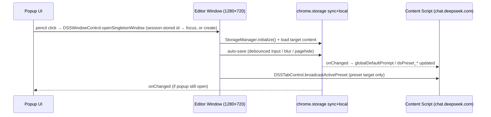

# Popup 與編輯器架構

> 📂 [DS studio 文件](../) › [架構文件](../ARCHITECTURE.md) › Popup 與編輯器
>
> **相關規格**：[Popup UI 規格](../spec/02-popup-ui.md) · [提示詞系統](../spec/01-prompt-system.md)

## 提示詞組選擇與管理 (Preset Selector & Management)

Popup 包含一列提示詞組選擇器，由以下元件組成：
- 自訂 combobox 元件（`custom-select.js`），取代舊版原生 `<select id="presetList">`。詳細架構見下方「自訂提示詞組下拉選單 (custom-select.js)」一節。
- 行內操作按鈕：釘選切換鈕與刪除鈕（`✕`）皆渲染於每個下拉選單列內，另有一顆獨立的 `+` 按鈕用於新增提示詞組。重新命名在獨立編輯視窗中進行；釘選切換鈕（v4.18.0）位於 `✕` 左側。

**新增流程**：點擊 `+` → `Modal.prompt('新增提示詞組')`（含必填驗證）→ 使用者輸入名稱 → 建立內容為空的提示詞組 → 自動選取 → 若位於已綁定的對話，更新綁定 → 使用者於 textarea 編輯內容。

**重新命名流程（v4.14.0）**：重新命名在獨立編輯視窗中進行。點擊 `#editPresetBtn` → 編輯視窗開啟，標頭的名稱輸入框（`#editorNameInput`）顯示提示詞組名稱，且已取得焦點並全選 → 編輯名稱與內容共用同一條自動儲存管線（500 ms 防抖，並於 blur／關閉時立即寫入）。重複名稱於儲存時被拒絕（`DUPLICATE_NAME`），並在儲存狀態區顯示紅色錯誤；名稱唯一之前，儲存一律被擋下。已開啟的 popup 下拉選單會透過 live-sync 自動刷新。（v4.14.0 之前的流程為：點擊下拉選單列中的 `✎` → `Modal.prompt('重新命名', { value: currentName })`。）

**釘選（預設提示詞組）流程（v4.18.0）**：點擊某列的釘選鈕 → `custom-select.js` 的委派面板處理器比對到 `.ds-select__item-btn--pin`，停止事件傳遞（因此該點擊既不會選取該列，也不會關閉面板），並呼叫 `onRequestTogglePin(presetId)` → `popup.js` 委派給 `popup.pin-manager.js` 的 `togglePin(id)`，由其透過 `StorageManager.savePinnedPresetId(id)` 持久化、更新 popup.js 快取的 `pinnedPresetId`，並觸發 `onPinChanged()`，以新的點亮狀態重新渲染下拉選單。點擊已釘選列的釘選鈕則改為寫入 `''`（取消釘選）。由於釘選預設值是單一純量鍵，釘選第二個提示詞組會隱含取消第一個——唯一性由資料形狀本身保證，無需額外檢查。content script 只在開啟新對話時讀取釘選值；見 `docs/spec/01-prompt-system.md` §6。

**刪除流程**：點擊 `✕` → `Modal.confirm('刪除提示詞組', { variant: 'danger' })` → 確認 → 將該提示詞組自陣列移除，並清理所有指向它的 `chatPresetMap` 綁定。若被刪除的是作用中提示詞組，`activePresetId` 會清為 `''`（空狀態）。（v4.18.0）`requestDeletePreset(id)` 與 `requestDeleteAllPresets()` 也都會呼叫 `ctx.pinManager?.clearPinIfDeleted([...ids])`：僅當被釘選的提示詞組位於刪除名單中時才清除 `pinnedPresetId`，其餘情況完全不寫入儲存。選取空狀態時刪除鈕為停用。系統允許刪除全部自訂提示詞組，因為空選項永遠保留作為備援。（v4.8.3）刪除時也會在 `dsPresetTombstones`（本地與同步）記錄一筆墓碑，使刪除在衝突解決合併時正確傳播到其他裝置，而非被過期副本復活。

**內容編輯（v3.0.0；v4.8.1 更新時序；v4.14.0 加入名稱編輯）**：提示詞組內容在獨立編輯視窗中檢視與編輯。鉛筆按鈕（`#editPresetBtn`，位於控制列最右側，`activePresetId === ''` 時停用）會開啟獨立編輯視窗 `popup/editor/editor.html?target=preset&id=<activePresetId>`（1280×720，單例：已開啟則聚焦，否則建立）。編輯視窗透過 dirty 旗標 + 防抖輸入（500 ms）+ `blur`／`visibilitychange`／`pagehide` 自動儲存，並於每次提示詞組儲存後廣播 `ACTIVE_PRESET_CHANGED`。自 v4.14.0 起，編輯視窗也是重新命名的介面：提示詞組目標會在標頭顯示已取得焦點的名稱輸入框（`#editorTitle` h1 隱藏），接入同一條自動儲存管線，並拒絕重複名稱（`saveContent` 中的 `isDuplicateName` 檢查，錯誤顯示於 `#editorSaveStatus`）。全域目標維持唯讀的 h1。

**對話／輸入框寬度滑桿（防抖寫入，v4.8.1）**：`chatWidthSlider` 與 `inputWidthSlider` 將 `input` 事件（同步更新即時百分比標籤，不寫入儲存）與 `change` 事件分開處理；`change` 事件呼叫 500 ms 的防抖包裝函式——`debouncedSaveChatWidth`／`debouncedSaveInputWidth`——透過 `StorageManager.saveChatWidth()`／`saveInputWidth()` 持久化數值，再刷新同步狀態。這讓滑桿寫入節奏與編輯視窗 500 ms 自動儲存防抖一致，降低拖曳時的 `chrome.storage` 寫入壓力。對應的切換開關（`chatWidthToggle`、`inputWidthToggle`）維持同步、不防抖。防抖包裝函式本身來自共用的 `utils/debounce.js` 模組，該模組發布 `globalThis.DSSDebounce`；`popup.width-sliders.js` 以 `const debounce = DSSDebounce;` 綁定。

## 自訂對話框系統 (Custom Modal System)

自訂的行內對話框控制器（`Modal`）取代瀏覽器原生的 `prompt()`、`confirm()` 與 `alert()` 對話框——原生對話框無法在 popup 內調整樣式或位置。

**DOM 結構**：一層 `position: fixed` 遮罩（半透明背景）覆蓋整個 popup 區域，對話框水平與垂直置中。對話框包含標題、選用訊息、帶有 `* 必填` 驗證提示的選用輸入欄位，以及操作按鈕。

**API**：
- `Modal.prompt({ title, value?, placeholder? })` → `Promise<string | null>` — 顯示輸入對話框。輸入為空時確認鈕停用，並顯示紅色 `* 必填` 提示。點擊遮罩**不會**關閉；只有取消鈕或 Escape 鍵能關閉。
- `Modal.confirm({ title, message?, confirmText?, cancelText?, variant? })` → `Promise<boolean>` — 顯示確認對話框。傳入 `cancelText: null` 即為單鈕（alert）模式。傳入 `variant: 'danger'` 會使確認鈕呈紅色（用於刪除等破壞性操作）。
- 名稱唯一性驗證在送出後進行；重複名稱會接著觸發一個 `Modal.confirm` 提示。

**行為**：
- 點擊遮罩**不會**關閉任何對話框（避免誤觸而遺失輸入）。
- Escape 鍵關閉對話框，並回傳取消／null 結果。
- prompt 模式下按 Enter 僅在輸入非空時確認。
- 所有對話框狀態（必填提示、輸入框顯示）在每次呼叫之間完全清理。

## 自訂提示詞組下拉選單 (custom-select.js)

v1.6.x 的提示詞組選擇器是原生 `<select>` 元素（`#presetList`），樣式受限，功能僅限基本選取。v1.9.0 以 `popup/custom-select.js` 實作的完全自訂 combobox 元件取而代之，支援搜尋與拖曳。

### 模組結構 (Module Structure)

`custom-select.js` 是一支獨立的 classic script（非 ES module），以 IIFE 包裹：

```javascript
(function (global) {
    'use strict';
    // ... private functions ...
    global.__DSSCustomSelect = { createPresetCustomSelect };
})(window);
```

此設計讓元件能以一般 `<script>` 標籤載入 `popup.html`，無需模組打包。它只在 `window.__DSSCustomSelect` 上暴露一個工廠函式。

### 公開 API (Public API)

`createPresetCustomSelect(options)` 回傳一個具有三個方法的物件：

| 方法 | 說明 |
|-|-|
| `render()` | 依目前狀態重新渲染觸發區文字與下拉清單。在任何提示詞組清單變動（新增、刪除、重新排序、作用中變更、釘選變更）後呼叫；來自編輯視窗的重新命名則經由 live-sync 抵達。 |
| `open()` | 開啟下拉面板。清空搜尋輸入、重設篩選、重新渲染完整清單，並聚焦搜尋輸入框。註冊外部點擊監聽器。 |
| `close()` | 關閉下拉面板。取消註冊外部點擊監聽器。 |

開啟／關閉狀態由內部的 `state.isOpen` 追蹤，並由觸發區自身的點擊處理器切換；作用中提示詞組的顯示是 `render()` 內（透過 `getActivePresetId` 回呼）衍生讀取的結果，因此呼叫端應重新渲染，而非把作用中 id 推入元件。

### 選項輸入契約 (Options)

工廠函式接收一個具有下列屬性的設定物件：

| 選項 | 型別 | 說明 |
|-|-|-|
| `triggerEl` | `Element` | combobox 觸發區（`#presetSelect`，帶 `role="combobox"` 的 `<div>`）。 |
| `panelEl` | `Element` | 下拉面板（`#presetSelectPanel`）。 |
| `valueEl` | `Element` | 觸發區的文字 span（`#presetSelectValue`）。 |
| `searchInputEl` | `Element` | 搜尋輸入欄位（`#presetSearchInput`）。 |
| `listEl` | `Element` | 提示詞組項目的清單容器（`#presetSelectList`）。 |
| `blankItemEl` | `Element` | 靜態的「(無提示詞組)」空白選項元素。 |
| `emptyHintEl` | `Element` | 「無相符結果」空搜尋提示元素。 |
| `getPresets` | `Function` | 回傳目前的 `presets` 陣列。 |
| `getActivePresetId` | `Function` | 回傳目前的 `activePresetId`。 |
| `getPinnedPresetId` | `Function`（v4.18.0，選用） | 回傳目前被釘選的提示詞組 id（無則為 `''`）。每次渲染讀取一次；id 相符的那一列以點亮的釘選鈕渲染。省略時每一列都渲染為未釘選，不會拋錯，因此不支援釘選的呼叫端照常運作。 |
| `onRequestTogglePin` | `Function`（v4.18.0，選用） | 某列的釘選鈕被點擊時以 `(presetId)` 呼叫。處理器在列選取分支之前停止事件傳遞，且從不關閉面板，與 `onRequestDelete` 相同。省略時點擊釘選鈕為無害的 no-op。 |
| `onSelect` | `Function` | 使用者點擊提示詞組項目時以 `(presetId)` 呼叫。由呼叫端（popup.js）處理儲存持久化與對話綁定。 |
| `onReorder` | `Function` | 拖曳重新排序完成後以 `(newPresets)` 呼叫。由呼叫端將新順序持久化到儲存。 |
| `onRequestDelete` | `Function` | 點擊刪除鈕時以 `(presetId)` 呼叫。popup.js 會開啟刪除確認對話框。 |
| `onRequestDeleteAll` | `Function`（v4.10.0） | 點擊空白 `(無提示詞組)` 項目上的「全部刪除」按鈕時以無參數呼叫。popup.js 透過 `presetManager.requestDeleteAllPresets()` 開啟「刪除全部提示詞組」確認對話框。面板點擊處理器會在空白項目的 `onSelect('')` 分支執行前停止此按鈕的事件傳遞，因此點擊全部刪除絕不會同時選取空白選項。 |

這種「控制反轉」模式讓元件與儲存邏輯解耦：元件只管理 DOM 與互動狀態，持久化與業務邏輯則由呼叫端（popup.js）負責。

### 內部狀態機 (Internal State Machine)

元件維護單一 `state` 物件，包含下列欄位：

| 欄位 | 型別 | 說明 |
|-|-|-|
| `isOpen` | `boolean` | 下拉面板是否可見。 |
| `keyword` | `string` | 目前的搜尋輸入值。 |
| `filteredIds` | `Set<string>` | 符合目前關鍵字的提示詞組 ID。 |

拖曳工作階段狀態（作用中的拖曳紀錄，以及 5px 門檻背後的待啟動旗標）存放在 `popup/custom-select.drag.js` 的 `createDragReorder()` 閉包內，與此物件分離；`custom-select.js` 只透過 `isDragging()` 查詢它。

### 關鍵內部函式 (Key Internal Functions)

- **`_updateTrigger()`**：讀取作用中提示詞組 ID，在提示詞組清單中找出其名稱，並設定 `valueEl.textContent`。無作用中提示詞組時退回顯示「(無提示詞組)」。

- **`_renderList()`**：重建下拉清單 DOM。逐一走訪提示詞組、依 `filteredIds` 篩選，並建立含三個子區域的 `div.ds-select__item` 元素：
  - 拖曳把手（`⠿` 字元，class `ds-select__drag-handle`）
  - 項目名稱（class `ds-select__item-name`，已做 HTML 跳脫）
  - 行內操作按鈕（釘選鈕 class `ds-select__item-btn--pin`，位於刪除鈕 class `ds-select__item-btn--delete` 左側），帶有 i18n `title`／`aria-label`（刪除：`刪除提示詞`；重新命名在編輯視窗中進行）
  - 拖曳進行中（`_dragReorder.isDragging()`）時略過渲染，避免拖曳期間 DOM 反覆變動。
  - 填入清單後呼叫 `_dragReorder.bindHandles()`，為每個拖曳把手掛上 pointer 事件處理器。
  - 列標記由 `popup/preset-item-renderer.js` 的 `buildPresetItemMarkup(preset)` 建立（v4.10.0——自 `custom-select.js` 抽出，以維持在 450 行主動拆分門檻之下）。刪除鈕保留 `✕` 字形。

- **`_applyFilter()`**：讀取目前的搜尋輸入值，以 `_fuzzyMatch()` 走訪所有提示詞組、更新 `filteredIds`，並呼叫 `_renderList()`。透過防抖包裝 `_debouncedFilter` 呼叫。

- **`_registerOutsideClick()` / `_unregisterOutsideClick()`**：管理 `document` 上的 `pointerdown` 監聽器，使用者點擊觸發區、面板或新增提示詞組按鈕以外的區域時呼叫 `close()`。

- **`_bindEvents()`**：於建構時呼叫一次。設定：
  - 觸發區點擊 → 切換開啟／關閉。
  - 搜尋輸入 `input` → `_debouncedFilter`（400ms 防抖）。
  - 面板點擊 → 依序將點擊分派給全部刪除、空白選項選取、單列刪除、單列釘選，最後是提示詞組選取。
  - 在觸發區、搜尋輸入框與面板上對 `pointerdown` 停止事件傳遞，避免外部點擊處理器在開啟後立刻關閉面板。

### 拖曳排序實作 (custom-select.drag.js)

拖曳位於獨立模組 `popup/custom-select.drag.js`，該模組註冊 `window.__DSSCustomSelectDrag = { createDragReorder, reorderPresets }`，且必須在 `custom-select.js` 之前載入——缺少時工廠函式會拋出具名錯誤。`createDragReorder(deps)` 接收 `listEl`、`getPresets`、`getKeyword`、`onReorder`、`onSelect`、`closePanel` 與 `renderList`，只回傳 `{ bindHandles, isDragging }`，因此整個拖曳工作階段都封閉在該閉包內。`reorderPresets(presets, srcId, dstId, isInsertBefore)` 另行匯出，為純陣列轉換函式。

拖曳使用 Pointer Events API 統一處理滑鼠與觸控，繞過 HTML Drag and Drop API，以取得更細緻的控制與視覺精確度：

1. **預備**：`_onHandlePointerDown` 記錄起始位置並進入預備狀態（`state.dragArmed = true`）。在把手元素上設定 pointer capture，使指標移出把手範圍時仍能收到事件。

2. **啟動**：`_onPointerMove` 計算 `Math.hypot(dx, dy)`。游標離起點移動 5px 後呼叫 `_activateDrag()`：
   - 來源項目加上 `ds-select__item--dragging`（以 CSS 降低不透明度）。
   - 建立 `div.ds-select__drag-ghost`，以絕對定位置於游標處，透過 `translate()` 跟隨指標。
   - 拖曳殘影以純文字顯示提示詞組名稱，作為輕量的拖曳預覽。

3. **插入線**：`_updateInsertionLine()` 走訪所有非拖曳中的清單項目，找出最接近游標 Y 座標者（以各項目的垂直中點切分），並在適當位置放置 `div.ds-select__insertion-line`。這條細線是視覺指示，標出被拖曳的提示詞組將落下的位置。

4. **完成**：`_onPointerUp` 結束拖曳：
   - 若已建立拖曳殘影（代表跨過 5px 門檻），呼叫純函式 `reorderPresets()`，並以新陣列呼叫 `onReorder` 回呼。
   - 若未建立拖曳殘影（輕點而非拖曳），將此互動視為選取點擊，呼叫 `onSelect(drag.id)` + `close()`。
   - `_removeDragVisuals()` 清除所有拖曳殘留元素。

5. **取消**：`_onPointerCancel` 移除拖曳視覺元素，並呼叫 `_renderList()` 還原一般清單狀態。

### 搜尋與防抖 (Search and Debounce)

- **`_fuzzyMatch(name, keyword)`**：逐字元的循序比對（並非真正的模糊比對／Levenshtein）。走訪 `name` 中的字元；每個與 `keyword` 下一個未消耗字元相符的字元會推進指標。keyword 字元全部消耗時回傳 `true`。此法可處理子字串比對，並允許名稱中跳過部分字元。

- **防抖**：搜尋輸入使用 400ms 防抖，在輸入期間的回應速度與篩選成本之間取得平衡。包裝函式為共用版本——`custom-select.js` 從 `utils/debounce.js` 綁定 `const _debounce = DSSDebounce;`，並以 `_debounce(_applyFilter, 400)` 套用。

註：`_fuzzyMatch()` 是 `custom-select.js` 中的模組層級私有函式。`test/unit/popup-utils.fuzzy-debounce.spec.js` 與 `test/unit/popup-custom-select.spec.js` 以 eval 載入實際出貨的 `custom-select.js` 來測試它。

### 共用防抖模組 (utils/debounce.js)

`utils/debounce.js` 是整個擴充功能唯一的 trailing-edge 防抖實作。它是一支 classic script，載入時唯一的副作用是 `globalThis.DSSDebounce = debounce;`，另有一行供 Vitest 路徑使用的 `module.exports`。每個使用端都以參照綁定，而非重新定義：`custom-select.js`（`_debounce`）、`popup.width-sliders.js`（`debounce`）與 `popup/editor/editor.js`（`debounce`）。`popup.html` 與 `editor.html` 都在 `logger.js` 之後、任何使用端之前立即載入它。

### 空白項目的全部刪除按鈕 (Delete-All Button, v4.10.0)

靜態的「(無提示詞組)」空白項目（`blankItemEl`）也會渲染一顆 `.ds-select__item-btn--delete-all` 按鈕（`✕` 字形，i18n 標題 `刪除全部提示詞組`），位置與單列刪除鈕相同，並透過 `popup-select.css` 中同一條 `.ds-select__item--empty:hover .ds-select__item-btn` 規則於 hover 時顯示。`_bindEvents()` 中的面板點擊處理器會在空白選項選取分支之前檢查此按鈕 class，呼叫 `onRequestDeleteAll()` 後提早返回（停止事件傳遞），因此點擊絕不會同時觸發 `onSelect('')`。`popup.preset-manager.js` 的 `requestDeleteAllPresets()` 與 `requestDeletePreset(id)` 對應：先以 `Modal.confirm({ title: '刪除全部提示詞組', message: '確定要刪除全部提示詞組嗎？此操作無法復原。', variant: 'danger' })` 確認，確認後將 `presets` 清為 `[]`、將 `activePresetId` 重設為 `''`、移除所有參照任一被刪除提示詞組 id 的 `chatPresetMap` 項目（涵蓋全部被刪除的 id，有別於單筆刪除路徑），並呼叫 `StorageManager.savePromptPresets([])`——沿用 `storage-manager.presets.js` 既有的墓碑／清理機制，因為它會比對新舊 `PRESET_INDEX` 以算出 `deletedIds`。

### 模組載入順序 (Module Loading Order)

在 `popup.html` 中，script 標籤依下列順序出現：

```html
<script src="../utils/logger.js"></script>
<script src="../utils/debounce.js"></script>
<script src="../utils/message-constants.js"></script>
<script src="../utils/tab-control.js"></script>
<script src="../utils/window-control.js"></script>
<script src="../utils/storage-manager.keys.js"></script>
<script src="../utils/storage-manager.rw.js"></script>
<script src="../utils/storage-manager.sync.js"></script>
<script src="../utils/storage-manager.sync.retry.js"></script>
<script src="../utils/storage-manager.restore.js"></script>
<script src="../utils/storage-manager.tombstone.js"></script>
<script src="../utils/storage-manager.preset-merge.js"></script>
<script src="../utils/storage-manager.preset-recency.js"></script>
<script src="../utils/storage-manager.presets.js"></script>
<script src="../utils/storage-manager.chatmap.diff.js"></script>
<script src="../utils/storage-manager.chatmap.ops.js"></script>
<script src="../utils/storage-manager.chatmap.js"></script>
<script src="../utils/storage-manager.chatmap.client.js"></script>
<script src="../utils/storage-manager.local.js"></script>
<script src="../utils/storage-manager.init.js"></script>
<script src="../utils/storage-manager.setters.js"></script>
<script src="../utils/storage-manager.settings-read.js"></script>
<script src="../utils/storage-manager.js"></script>
<script src="../utils/i18n.locales.zhTW.js"></script>
<script src="../utils/i18n.locales.en.js"></script>
<script src="../utils/i18n.locales.js"></script>
<script src="../utils/i18n.js"></script>
<script src="popup.i18n-apply.js"></script>
<script src="preset-item-renderer.js"></script>
<script src="custom-select.drag.js"></script>
<script src="custom-select.js"></script>
<script src="popup.modal.js"></script>
<script src="popup.toast.js"></script>
<script src="popup.preset-domain.js"></script>
<script src="../utils/chat-session-id.js"></script>
<script src="popup.preset-manager.js"></script>
<script src="popup.pin-manager.js"></script>
<script src="popup.backup-manager.js"></script>
<script src="popup.settings-view.js"></script>
<script src="popup.live-sync.js"></script>
<script src="popup.editor-window.js"></script>
<script src="popup.width-sliders.js"></script>
<script src="popup.markdown-export.js"></script>
<script src="popup.toggles.js"></script>
<script src="popup.locale.js"></script>
<script src="popup.js"></script>
```

- `utils/logger.js` 最先載入，提供結構化日誌；接著是 `utils/debounce.js`（`DSSDebounce`）、`utils/message-constants.js`（`DSS_TAB_URL`、`DSS_EDITOR_WINDOW`、`DSS_SETTINGS_MSG`、`DSS_CONTENT_MSG`），再來是兩個與層級無關的輔助模組 `utils/tab-control.js`（`DSSTabControl`）與 `utils/window-control.js`（`DSSWindowControl`）。之後載入十七個 `storage-manager.*.js` 方法包（keys、rw、sync、sync.retry、restore、tombstone、preset-merge、preset-recency、presets、chatmap.diff、chatmap.ops、chatmap、chatmap.client、local、init、setters、settings-read）；每個方法包將自己的方法群組掛到一個 `globalThis.__DS_StorageManager_*` 鍵上（v4.0.0 拆分）。
- `utils/storage-manager.settings-read.js` 註冊 `globalThis.__DS_StorageManager_settingsRead`，承載設定 API 的讀取端：`getSettings()` 與 `getActivePromptContent()`。`getSettings()` 以允許清單驅動，而非以鍵空間驅動——兩張模組層級對照表 `SYNCED_SETTINGS_KEYS`（18 項：`presetIndex`、`activePresetId`、`pinnedPresetId`、`includeThinking`、`includeReferences`、`globalDefaultPrompt`、`sidebarAutoHide`、`hideThinking`、`autoExpandMessages`、`preventAutoScroll`、`websearchToggle`、`isShowSystemTime`、`chatWidth`、`chatWidthEnabled`、`inputWidth`、`inputWidthEnabled`、`syncInitialized`、`syncConflictPending`）與 `LOCAL_ONLY_SETTINGS_KEYS`（2 項：`isEnabled`、`globalPromptEnabled`，從 `chrome.storage.local` 讀取、不經同步合併路徑）列出所有可能出現的鍵。回傳物件只含這兩張表列出的鍵；`StorageManager.KEYS` 上其餘的鍵——同步重試記錄、分塊配置中繼資料、鍵前綴常數——屬內部細節。`promptPresets`（由 `PRESET_INDEX` 還原）與 `chatPresetMap`（分塊儲存，經 `getChatPresetMap()` 取得）隨後附加，因此回傳物件共 22 個欄位。`websearchToggle` 會經過共用的 `normalizeWebsearchToggle()`，使舊版 `'default'` 值在每條讀取路徑上都一致解析。
- `storage-manager.js`（入口）接著載入，執行 `Object.assign(StorageManager, ...)` 合併各方法包，再暴露 `window.StorageManager`。custom-select.js 的使用端與 popup.js 在執行期都依賴它。

**載入順序不變式（Load-order invariant，v4.11.3）。** 唯一的順序限制是**每個方法包都必須在入口檔之前載入**。方法包*之間*的順序無關緊要：每個方法包在 IIFE 頂層只指派自己的全域變數，且所有跨方法包呼叫都經由 `async` 函式本體內的 `this.<method>()`，於呼叫時而非載入時解析。

此不變式至關重要，且違反時會**靜默**失敗。入口檔以 `root.__DS_StorageManager_X || {}` 合併各方法包，因此尚未載入的方法包會被當成空物件混入：它提供的每個方法在該 context 的整個生命週期內都缺席，既不報錯也不會出現 console 警告。這並非假設——v4.11.3 之前，`background/service-worker.js` 的 `importScripts` 清單遺漏了墓碑方法包 `storage-manager.tombstone.js`，而 `resolveSyncConflict()` 會呼叫 `_mergeTombstones()`，導致背景同步重試拋出的 `TypeError` 被一個刻意吞掉錯誤的 `catch` 吃掉，長期靜默失效。見 `docs/changelog/v4.md`（4.11.3）。

因此五個載入端必須保持一致：`manifest.json`（`content_scripts[0].js`）、`popup/popup.html`、`popup/editor/editor.html`、`background/service-worker.js`（`importScripts`）與 `test/setup/vitest.setup.js`。`test/unit/storage-manager.loader-contract.spec.js` 會自動強制檢查——它從入口檔的 `Object.assign` 呼叫與 `utils/` 目錄清單找出方法包集合，再斷言每個載入端都列出每個方法包，且放在入口檔之前。新增或重新命名方法包卻未更新載入端，會讓該測試失敗，而非靜默破壞某個執行環境。
- `utils/tab-control.js` 註冊 `globalThis.DSSTabControl`，其 `broadcastActivePreset(presetId, presetContent)` 供 `popup.js` 與 `editor.storage.js` 發送 `ACTIVE_PRESET_CHANGED` 廣播。這是真正的廣播：它查詢**所有**已開啟的 `chat.deepseek.com` 分頁，並以 `Promise.all` 併發送出訊息給全部分頁，而非只送達作用中分頁。沒有 `id` 的分頁會略過，每個分頁的 `sendMessage` 拒絕各自吞掉——content script 尚未載入（或正在導覽中）的分頁無法阻止其餘分頁收到更新，呼叫端的 `await` 也一定會 resolve。
- 三支語系腳本依序載入：`utils/i18n.locales.zhTW.js` 將 `zh_TW` 字典註冊到 `globalThis.__DS_I18N_Locales_zhTW`，`utils/i18n.locales.en.js` 將 `en` 字典註冊到 `globalThis.__DS_I18N_Locales_en`，`utils/i18n.locales.js`（v4.11.14 拆分）再將兩者彙整到 `globalThis.__DS_I18N_Locales`。三支都只承載純資料、不含邏輯。
- `utils/i18n.js`（v4.3.3）註冊 `window.dsI18n`，即具備 `setLocale()` 與 `t(key)` 查詢的核心 i18n 引擎——見下方「語言切換器 (Language / Locale Switcher, v4.3.3)」一節。語系字串對照表位於 `utils/i18n.locales.zhTW.js` 與 `utils/i18n.locales.en.js`（由 `utils/i18n.locales.js` 彙整）；引擎在其 IIFE 頂端同步從 `__DS_I18N_Locales` 讀取，並以 `typeof require !== 'undefined'` 保護的 `require('./i18n.locales.js')` 作為 Node／vitest 路徑的備援。**此備援僅存在於 Node 路徑**，因此每個瀏覽器載入端都必須將三支語系腳本（`i18n.locales.zhTW.js`、`i18n.locales.en.js`、`i18n.locales.js`）緊接在 `i18n.js` 之前載入，否則 `zh_TW`／`en` 會解析為 undefined，所有翻譯字串都會靜默失效。四個載入端必須保持一致：`manifest.json`（`content_scripts[0].js`）、`popup/popup.html`、`popup/editor/editor.html` 與 `test/setup/vitest.setup.js`。
- `popup/popup.i18n-apply.js` 註冊 `window.__DS_PopupI18nApply`，僅有單一進入點 `apply(root)`：走訪 `root` 底下的 `data-i18n` 屬性並寫入翻譯文字。它是 popup 與編輯視窗共用的 DOM 套用器（`editor.html` 以 `../popup.i18n-apply.js` 載入），各 context 完成 `await dsI18n.init()` 後明確呼叫一次。將套用器放在 `utils/i18n.js` 之外，正是引擎得以與 DOM 無關的關鍵——`utils/i18n.js` 全檔零 `document` 參照——見下方「語言切換器 (Language / Locale Switcher, v4.3.3)」一節。
- `preset-item-renderer.js`（v4.10.0）註冊 `window.__DS_PresetItemRenderer`（`escapeHtml`、`buildPresetItemMarkup`），且必須在會解構它的 `custom-select.js` 之前載入。
- `custom-select.drag.js` 註冊 `window.__DSSCustomSelectDrag`（`createDragReorder`、`reorderPresets`），且必須在 `custom-select.js` 之前載入；後者於工廠建立時讀取它，缺少時拋出具名錯誤。
- `custom-select.js` 在全域範圍註冊 `window.__DSSCustomSelect`。
- `popup.preset-domain.js` 註冊 `globalThis.DSSPresetDomain`（`createPreset`、`validatePresetName`）——純粹的提示詞組領域規則，與 DOM 及儲存存取無關。`validatePresetName(name, existingPresets, options)` 回傳 `{ ok: true }` 或 `{ ok: false, reason: 'empty' | 'duplicate' }`，其中 `options.selfId` 會將正在重新命名的提示詞組排除於重複檢查之外。`editor.html` 載入同一支檔案，因此編輯視窗的重新命名驗證與 popup 的新增驗證共用同一份實作。
- `popup.settings-view.js` 註冊 `window.__DS_PopupSettingsView`，提供 `applySettingsToDom(dom, settings)`——將 `StorageManager.getSettings()` 結果單向映射到 popup 控制項的呈現函式。它只操作 DOM：不存取 `chrome.storage`、不觸發 `change` 監聽器，因此首次載入還原與之後任何批次 UI 還原共用同一張鍵對控制項對照表，而非各自重複一份。
- `popup.modal.js`、`popup.preset-manager.js`、`popup.backup-manager.js`（v4.0.0 拆分）分別註冊 `window.__DS_PopupModal`／`window.__DS_PopupPresetManager`／`window.__DS_PopupBackupManager`。兩個 manager 方法包暴露 `createPresetManager(ctx)`／`createBackupManager(ctx)` 工廠，透過即時的 getter/setter 回呼讀取並修改 popup.js `DOMContentLoaded` 閉包內的狀態。
- `popup.toast.js`（v4.11.10 拆分）將 `Toast` 鍵註冊到同一個 `window.__DS_PopupModal` 物件上。`popup.modal.js` 只承載 `Modal`，依 `coding-guidelines` §8 讓兩個不相關的元件分居不同檔案。兩支檔案都以 `Object.assign(window.__DS_PopupModal || {}, { … })` 自行掛載，而非單一物件字面值，因此彼此保留對方的鍵，載入順序也互不相依。`popup.js` 以 `const { Modal, Toast } = window.__DS_PopupModal;` 解構。manager 方法包經由 `ctx` 參數取得 `Modal`／`Toast`，而非讀取全域。
- `popup.pin-manager.js`（v4.18.0）註冊 `window.__DS_PopupPinManager`，暴露 `createPinManager(ctx)` → `{ togglePin, clearPinIfDeleted }`，沿用提示詞組與備份 manager 的 ctx 工廠慣例。其 `ctx` 接收 `StorageManager`、存取 popup.js 閉包狀態的 `getPinnedPresetId`/`setPinnedPresetId`，以及選用的 `onPinChanged` 重新渲染回呼。它負責整個釘選預設值的決策（釘選、取消釘選、刪除時清除），讓 `popup.js` 只需接線——入口檔當時已超過 `coding-guidelines` §8 門檻，新的關注點必須以獨立檔案加入。它一度以 ES module 撰寫並以動態 `import()` 載入；後來改正為 classic script，因為其他 popup 工廠都是 classic script，且 `popup.html` 的 script 標籤全為 classic。
- `popup.live-sync.js`（v4.8.0）註冊 `window.__DS_PopupLiveSync`，暴露 `createLiveSyncListener(ctx)`——見下方「即時同步監聽器 (popup.live-sync.js, v4.8.0)」一節。
- `popup.editor-window.js`／`popup.width-sliders.js`／`popup.markdown-export.js`（v4.11.16 拆分）暴露 `createEditorWindowManager(ctx)`／`createWidthSliderManager(ctx)`／`createMarkdownExportManager(ctx)`，沿用提示詞組與備份 manager 的 ctx 工廠慣例。`popup.js` 當時為 572 行——超過 `coding-guidelines` §8 門檻 122 行——而這三者是綁在其 `DOMContentLoaded` 處理器內、各自獨立的關注點；抽出後入口檔當時降至 441 行。`popup.editor-window.js` 負責 `openEditorWindow`、兩顆編輯按鈕的綁定，以及 `globalEditorWindowId`/`presetEditorWindowId` 單例狀態；`popup.width-sliders.js` 負責 `debounce` 輔助函式與兩組寬度切換開關／滑桿的綁定（DOM 元素的 `const` 仍留在 `popup.js`，因為 live-sync 接線仍會參照它們）；`popup.markdown-export.js` 負責匯出按鈕綁定。
- `popup.toggles.js` 註冊 `window.__DS_PopupToggles`，暴露 `createToggleManager(ctx)` → `{ bindToggles, renderGlobalPromptToggle }`（第二個匯出於 v4.20.0 加入），沿用相同的 ctx 工廠慣例。其 `ctx` 接收 `StorageManager`、`refreshSyncStatus`、`showSaveStatus`、`applyMasterSwitchUI`，以及（v4.20.0）`getPresets`/`setPresets`/`getActivePresetId`/`setActivePresetId` 存取器。`renderGlobalPromptToggle(el)` 透過私有的 `resolveActivePreset()` 輔助函式解析作用中提示詞組，並依 `StorageManager.resolveGlobalPromptEnabled(activePreset, legacyFlag)` 設定 `el.checked`；全域提示詞的 `change` 處理器在有作用中提示詞組時寫回該提示詞組的 `globalPromptEnabled`（更新其 `updatedAt` 並透過 `saveOnePromptPreset` 持久化），無作用中提示詞組時則退回以 `saveGlobalPromptEnabled()` 寫入舊版裝置鍵。此切換開關的所有寫入路徑都集中於此。`bindToggles(elements)` 接收九個 DOM 參照（仍宣告在 `popup.js` 中，因為 live-sync 接線仍會參照它們），並掛上每一個功能切換開關的 `change` 監聽器：全域提示詞、主開關、包含思考、包含參考資料、側邊欄自動隱藏、隱藏思考、顯示系統時間、防止自動捲動，以及網路搜尋 radio 群組。此次抽出前 `popup.js` 為 484 行——超過 `coding-guidelines` §8 門檻 34 行——抽出後降至 428 行。
- 以 `readFileSync` + regex 從原始碼文字擷取函式、而非 import 的 spec，在程式區塊搬移時必須跟著更新。目前有：`test/unit/popup-slider-debounce.spec.js` 讀取 `popup.width-sliders.js`，`test/unit/popup.spec.js` 讀取 `popup.editor-window.js`，`test/unit/popup-prevent-auto-scroll-toggle.spec.js`／`test/unit/popup-websearch-toggle.spec.js` 讀取 `popup.toggles.js` 做 change 處理器斷言，而其 DOM 參照、載入還原與 `applyMasterSwitchUI` 斷言仍指向 `popup.js`。只有路徑改變——每個 regex 依然相符，因為搬移是逐字進行、連縮排都相同。日後任何自 `popup.js` 移出的程式碼都必須檢查這些 spec。
- `popup.locale.js`（v4.3.3）註冊 `window.__DS_PopupLocale`，提供 `bindLocaleSwitcher()`——見下方「語言切換器 (Language / Locale Switcher, v4.3.3)」一節。
- `popup.js`（入口）最後載入，綁定 `Modal`/`Toast`、實例化各 manager 工廠，並於 `DOMContentLoaded` 處理器內呼叫 `window.__DSSCustomSelect.createPresetCustomSelect({...})`。

編輯視窗（`popup/editor/editor.html`）依序載入 `../../utils/logger.js`、`../../utils/debounce.js`、十七個 `storage-manager.*.js` 方法包（keys、rw、sync、sync.retry、restore、tombstone、preset-merge、preset-recency、presets、chatmap.diff、chatmap.ops、chatmap、chatmap.client、local、init、setters、settings-read），接著是 `../../utils/storage-manager.js`、`../../utils/message-constants.js`、`../../utils/tab-control.js`、`../../utils/i18n.locales.zhTW.js`、`../../utils/i18n.locales.en.js`、`../../utils/i18n.locales.js`、`../../utils/i18n.js`、`../popup.i18n-apply.js`、`../popup.preset-domain.js`，再來是 `editor.parse.js`、`editor.render.js`、`editor.storage.js` 與 `editor.js`——共 32 支 classic script，全數以外部檔案載入（符合 MV3 CSP）。`test/unit/editor-html.spec.js` 逐位置斷言這份確切清單與順序。`editor.js` 的防抖取自共用的 `DSSDebounce` 全域，而非自行定義。

### 資料流整合 (Data Flow Integration)

此元件位於 DOM 與 popup.js 的儲存層之間：

```
popup.html (DOM elements)
    ↓  reads/writes DOM
custom-select.js (interaction state, rendering)
    ↓  callbacks (onSelect, onReorder, onRequestDelete)
popup.js (business logic, storage calls)
    ↓  async storage API
storage-manager.js (chrome.storage wrapper)
```

1. 使用者與下拉選單互動（點擊、搜尋、拖曳）。
2. `custom-select.js` 處理互動、更新內部狀態、重新渲染 DOM。
3. 需要持久化的操作（選取、重新排序、刪除）會呼叫對應的回呼。
4. popup.js 執行儲存操作，再呼叫 `customSelect.render()` 將 UI 同步到新狀態。

這種單向資料流（DOM → 元件 → 回呼 → 儲存 → 重新渲染）讓狀態管理可預測、可測試。

## 即時同步監聽器 (popup.live-sync.js, v4.8.0)

在開啟時的讀取（`StorageManager.syncNow()`，v4.7.0）之外，`popup.live-sync.js` 會註冊單一 `chrome.storage.onChanged` 監聽器，在 popup 保持開啟期間反映來自其他裝置、分頁或獨立編輯視窗的變更；此監聽器仿照 `content/content-script.js` 既有的同類監聽器。

**工廠模式**：`createLiveSyncListener(ctx)` 回傳 `{ start() }`。`ctx` 攜帶 `StorageManager` 參照、需保持同步的元素 `dom` 對照表、`applyMasterSwitchUI`/`updateEditPresetBtnState` 回呼，以及 `presets`、`activePresetId`、`chatPresetMap` 的 getter/setter 組（與 `popup.preset-manager.js`/`popup.backup-manager.js` 既有的 ctx 工廠模式相同）。`popup.js` 建構此 context，並在建立 custom-select 後立即呼叫一次 `.start()`。

**涵蓋範圍**：
- `isEnabled` / `globalPromptEnabled`（僅本地，v4.7.3）→ 切換 checkbox + `applyMasterSwitchUI()`。（v4.20.0）裝置層級的 `globalPromptEnabled` 鍵僅作為備援；`#globalPromptToggle` 實際顯示的值由 `popup.toggles.js` 的 `renderGlobalPromptToggle()` 產生，優先採用作用中提示詞組自身的旗標。
- `includeThinking`、`includeReferences`、`dsSidebarAutoHide`、`dsHideThinking`、`dsPreventAutoScroll`（v4.12.0）、`dsShowSystemTime` → 對應的切換 checkbox。
- `dsWebSearchToggle`（v4.13.0；自 v4.17.0 起為兩個選項）→ radio 群組（`on`/`off`），僅勾選 `r.value === val` 者。儲存值為 nullish 或為舊版 `'default'` 值時，皆解析為 `'on'`。
- `dsChatWidth`/`dsChatWidthEnabled` 與 `dsInputWidth`/`dsInputWidthEnabled` → 滑桿值、標籤文字與收合容器的 class。
- `dsPresetIndex` / 提示詞組順序中繼資料 / 任何 `dsPreset_<id>` 鍵 → 重新取得 `StorageManager.getSettings()` 並重新渲染 custom select（來自他處的提示詞組新增／重新命名／刪除／重新排序／內容編輯）。
- ChatPresetMap 分塊／中繼資料鍵 → 重新取得 `StorageManager.getChatPresetMap()`。
- `activePresetId` → 僅在傳入值與 popup 自身記憶體中的值不同時重新渲染（防止 popup 自身寫入的回聲造成多餘的重新渲染）。

**回饋迴圈防護**：每次 DOM 寫入都具冪等性（`applyToggle`/`applySlider` 僅在值確實不同時才指派），且模組本身從不呼叫任何 `StorageManager.save*`——因此 popup 剛寫入的變更經 `onChanged` 流回時，只是同值的 no-op，而非形成迴圈。

## 語言切換器 (Language / Locale Switcher, v4.3.3)

Popup 內建語言切換器，可在正體中文（zh_TW）與英文（en）之間切換。

**DOM 結構**：匯出卡片標頭中的地球圖示按鈕（`#localeSwitcherBtn`），切換顯示 `#localePanel`，面板內每個語系各有一個 radio 輸入。

**實作**：
- `utils/i18n.js` — 核心 i18n 引擎：定義 `dsI18n` 物件，提供 `setLocale(locale)`、`t(key)` 查詢與 `onLocaleChanged(callback)` 訂閱。引擎與 DOM 無關；語系字串來自 `utils/i18n.locales.js`。將所選語系以 `dsLocale` 持久化到 `chrome.storage.local`。
- `popup/popup.i18n-apply.js` — 自引擎拆出的 DOM 套用器：`window.__DS_PopupI18nApply.apply(root)` 處理 `root` 底下的 `data-i18n` 屬性。`popup.html` 與 `editor.html` 都會載入；編輯視窗在 `editor.js` 中於 `await dsI18n.init()` 之後直接呼叫，popup 則經由 `bindLocaleSwitcher()` 呼叫。
- `popup/popup.locale.js` — Popup 語系切換 UI。它在 `window.__DS_PopupLocale` 上匯出 `bindLocaleSwitcher()`，載入時不執行任何動作；`popup.js` 在 `await dsI18n.init()` 之後立即呼叫它。此函式先執行 `window.__DS_PopupI18nApply.apply()` 繪製初始字串，再將 `#localeSwitcherBtn` 點擊接到面板切換、以外部點擊處理器關閉面板，並將 radio 變更接到 `dsI18n.setLocale()` 加上 `window.location.reload()`。正因為會重新載入，popup 自身無需訂閱 `onLocaleChanged`——新的文件會重新執行套用器。content script 無法重新載入，因此改走訂閱途徑。
- content script 透過 `dsI18n.onLocaleChanged(cb)` 訂閱，無需重新載入頁面即可即時更新 UI 文字——`content/quote-reply.js` 重新渲染引用回覆按鈕標籤，`content/preset-overlay.controller.js` 呼叫下拉選單的 `updateLocale()`。直接的回呼註冊表讓引擎得以與 DOM 無關：它無需事件目標、無需冒泡假設，作用域中也無需 `document`。訂閱為永久有效，因此訂閱者只註冊一次並在回呼內自行防護——`quote-reply.js` 維護 `hasLocaleSubscription` 旗標，只在首次啟用時訂閱，並依賴 `btnEl === null` 讓功能關閉時回呼成為 no-op。

`popup.js` 的 `DOMContentLoaded` 處理器會及早初始化 `dsI18n`，早於渲染任何依賴語系的文字。

## 獨立提示詞編輯視窗 (Standalone Prompt Editor Window, v3.0.0)

提示詞內容編輯位於 `popup/editor/`——以獨立 OS 視窗開啟的擴充功能頁面，取代 popup 先前的行內 textarea。

### 開啟流程：popup 端 (Opening)

- popup 中有兩顆鉛筆按鈕：`#editGlobalPromptBtn`（全域提示詞卡片）與 `#editPresetBtn`（提示詞組卡片，`activePresetId === ''` 時停用）。
- `popup/popup.editor-window.js` 中的 `openEditorWindow(target, presetId)` 以 `chrome.runtime.getURL('popup/editor/editor.html')` 加上查詢字串組出 URL，再將視窗處理委派給 `DSSWindowControl.openSingletonWindow({ url, createOptions, storageKey })`，其中 `createOptions = { type: 'popup', width: 1280, height: 720 }`。
- **每個目標真正的單例**：`utils/window-control.js` 將已開啟視窗的 id 以 `dss-editor-window-id-global` / `dss-editor-window-id-preset`（`EDITOR_WINDOW_STORAGE_KEYS`）存入 `chrome.storage.session`。由於 id 的存續超過 popup 頁面 context，關閉 popup 後再次點擊鉛筆，會聚焦已開啟的視窗，而非再開第二個。
- **共用鍵定義（v4.29.0）**：`EDITOR_WINDOW_STORAGE_KEYS` 讀自 `utils/message-constants.js` 發布的 `globalThis.DSS_EDITOR_WINDOW.STORAGE_KEYS`——也就是 `background/editor-window-routes.js` 載入的同一支檔案，因此寫入 id 的 popup 與清除 id 的 worker 共用同一份兩個鍵的定義。`popup.html` 在 `popup.editor-window.js` 之前載入它；若缺少，`popup.editor-window.js` 會在載入時拋錯，訊息指名需加入的檔案，而非退回使用字面值。
- **聚焦／導覽／重建**：`openSingletonWindow()` 讀取已儲存的 id；若存在則呼叫 `chrome.windows.get(id, { populate: true })` + `chrome.windows.update(id, { focused: true })`。若 `get` 被拒絕（使用者已關閉視窗），則往下改為建立新視窗並持久化新 id。聚焦成功時，會比對既有分頁的 `url` 與請求的 URL，**僅在兩者不同時**發出 `chrome.tabs.update(tab.id, { url })`——因此切換提示詞組會就地替換編輯視窗內容，重複點擊同一組則只聚焦、不重新載入。替換時資料完整保留：編輯視窗的 `pagehide` 處理器會在卸載前寫入 dirty 內容。
- 失敗時優先確保可用性，其次才是去重：`chrome.storage.session` 讀取錯誤會記錄日誌並視為「未記錄任何視窗」，使用者仍能開啟編輯視窗。`chrome.windows.create` 無需額外權限，擴充功能來源的頁面也無需 `web_accessible_resources` 項目。

### 查詢字串契約 (Query-string Contract)

| 查詢字串 | 目標 |
|-|-|
| `?target=global` | 全域提示詞（`globalDefaultPrompt`） |
| `?target=preset&id=<presetId>` | 該提示詞組的 `content` |

無效目標與不存在的提示詞組（連結過期期間已被刪除）會渲染為停用的 textarea，並附上說明標題——所有錯誤皆已捕捉。

### 自動儲存管線：編輯器端 (Auto-save Pipeline)

獨立視窗可能被 OS 直接關閉，因此儲存採防禦式設計：`input` 設定 dirty 旗標並排程 500 ms 防抖儲存（`debounce(performSave, 500)`，包裝函式取自 `DSSDebounce`）；`blur`、`visibilitychange`（hidden）與 `pagehide` 會立即寫入（fire-and-forget）。只有 dirty 時才會儲存。自 v4.15.0 起，按 `Esc` 會關閉視窗（視窗層級 `keydown` 監聽器 → `window.close()`）；`pagehide` 會先寫入所有 dirty 內容，因此此快捷鍵完整保留資料。路由：全域 → `StorageManager.saveGlobalDefaultPrompt()`；提示詞組 → 重新取得該提示詞組，寫上 `content` + `updatedAt`（名稱輸入框變更時再加上 `name`，v4.14.0），接著呼叫 `StorageManager.saveOnePromptPreset()`，再呼叫 `DSSTabControl.broadcastActivePreset()`。名稱輸入框（`#editorNameInput`）共用此管線：其 `input`/`blur` 處理器設定同一個 dirty 旗標並呼叫同一組防抖／立即儲存；當 `DSSPresetDomain.validatePresetName(nextName, settings.promptPresets, { selfId: target.id })` 回報 `reason: 'duplicate'`（完全相符、區分大小寫、排除自身）時，`saveContent` 以 `code: 'DUPLICATE_NAME'` 拒絕——儲存狀態區顯示紅色錯誤，且不寫入任何資料。所有持久化都經由 `StorageManager`——編輯視窗只透過它存取 `chrome.storage`。

**頁面聚焦時自動關閉（v4.29.0）。** 關閉編輯視窗的三種方式並存：在編輯視窗內按 `Esc`、OS 視窗控制鈕，以及將焦點移回 DeepSeek 頁面。第三種由 content 端驅動——`content/editor-window-autoclose.js` 在頁面 `focus` 事件時送出 `DSS_CLOSE_EDITOR_WINDOWS`，`background/editor-window-routes.js` 移除 `chrome.storage.session` 中仍在追蹤的編輯視窗，並清除其鍵，讓下次點擊鉛筆時建立新視窗。上述自動儲存管線確保了安全性：`pagehide` / `visibilitychange` 寫入會在視窗消失前寫入 dirty 內容，與 `Esc` 快捷鍵的情況完全相同。訊息契約見 [ARCHITECTURE.md](../ARCHITECTURE.md#編輯視窗自動關閉-editor-window-auto-close-v4290) 的「編輯視窗自動關閉 (Editor Window Auto-Close, v4.29.0)」一節。

### 變更傳播 (Propagation)


```mermaid
sequenceDiagram
    participant Popup as Popup UI
    participant Editor as Editor Window (1280×720)
    participant Storage as chrome.storage sync+local
    participant Content as Content Script (chat.deepseek.com)

    Popup->>Editor: pencil click → DSSWindowControl.openSingletonWindow (session-stored id → focus, or create)
    Editor->>Storage: StorageManager.initialize() + load target content
    Editor->>Storage: auto-save (debounced input / blur / pagehide)
    Storage-->>Content: onChanged → globalDefaultPrompt / dsPreset_* updated
    Editor->>Content: DSSTabControl.broadcastActivePreset (preset target only)
    Storage-->>Popup: onChanged (if popup still open)
```

content script 無需任何編輯視窗專用程式碼：其既有的 `chrome.storage.onChanged` 監聽器會接收每一次儲存，而明確的 `ACTIVE_PRESET_CHANGED` 廣播則讓正在輸入的前綴維持與 popup 歷來行為一致。
