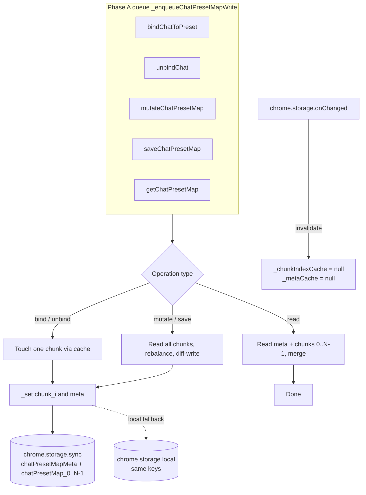
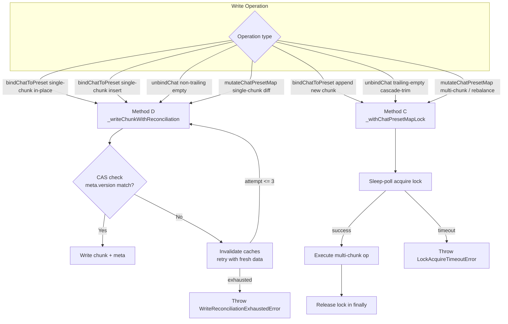

# 儲存與狀態管理架構

> 📂 [DS studio 文件](../) › [架構文件](../ARCHITECTURE.md) › 儲存與狀態管理
>
> **相關規格**：[資料儲存規格](../spec/05-data-storage.md) · [提示詞系統規格](../spec/01-prompt-system.md)
>
> **v4.0.0 模組化**：`StorageManager` 已拆分為入口檔 `utils/storage-manager.js`（API、`getSettings`、`initialize`、共享狀態）加四個方法包：`storage-manager.chunking.js`（分塊）、`storage-manager.lock.js`（跨 context 鎖）、`storage-manager.sync.js`（雲端同步/衝突/還原）、`storage-manager.presets.js`（提示詞 CRUD 與對話綁定）。入口檔以 `Object.assign` 合併方法包，對外 API 與行為完全不變；本文件描述的所有機制仍然適用。

## State Management

User settings and prompt presets are managed across `chrome.storage.sync` (primary) and `chrome.storage.local` (fallback + local-authoritative tracking).

| Key | Type | Default | Description |
|-|-|-|-|
| `dsPresetIndex` | `string[]` | `[]` | Ordered array of prompt preset IDs. |
| `dsPreset_<id>` | `PromptPreset` | — | Individual prompt preset object, stored under its own key to bypass the 8KB per-item sync limit. |
| `activePresetId` | string | `""` | The ID of the currently active preset. |
| `isEnabled` | boolean | `false` | Whether prompt injection is active (master switch). |
| `includeThinking` | boolean | `true` | Include AI thinking process in exported MD. |
| `includeReferences` | boolean | `true` | Include citation reference links in exported MD. |
| `globalDefaultPrompt` | string | `''` | A global prompt prepended before the per-preset prompt in every conversation. |
| `globalPromptEnabled` | boolean | `true` | Whether the global default prompt is injected (v3.0.0). Subordinate to the master switch — when `isEnabled` is false, the global prompt is never injected regardless of this flag. |
| `chatPresetMap` | object | `{}` | Maps chat UUIDs (`/a/chat/s/{uuid}`) to preset IDs, enabling per-conversation preset binding. *Replaced in v2.4.0 by chunked keys (see Physical Chunking section).* |
| `chatPresetMapMeta` | `{ version, chunkCount, chunkSizes[] }` | `{ version:0, chunkCount:0, chunkSizes:[] }` | Index key for chunk discovery and write-target selection (v2.4.0+). |
| `chatPresetMap_0`, `chatPresetMap_1`, ... | `{ [uuid]: presetId }` | — | Physical chunks, each <= 7KB, holding a subset of the chatPresetMap entries (v2.4.0+). |
| `dsSidebarAutoHide` | boolean | `false` | Whether the sidebar auto-hide feature is enabled. |
| `dsHideThinking` | boolean | `false` | Whether the hide-thinking-process feature is enabled. |
| `dsShowSystemTime` | boolean | `false` | Whether system time injection before user messages is active (added in v2.7.0). |
| `dsChatWidth` | number | `70` | Chat width percentage (30–100). |
| `dsChatWidthEnabled` | boolean | `false` | Whether the chat width adjustment is active. |
| `dsInputWidth` | number | `70` | Input width percentage (30–100). |
| `dsInputWidthEnabled` | boolean | `false` | Whether the input width adjustment is active. |
| `syncInitialized` | boolean | `false` | Whether initial sync has been performed (local-only). |
| `syncConflictPending` | boolean | `false` | Whether a sync conflict needs user resolution (local-only). |
| `restored_messages` | object | `{}` | Stores censor-restored messages keyed by message ID (local-only, excluded from sync). |
| `dsLocalAuth` | `string[]` | `[]` | List of keys where local storage is authoritative over sync (local-only, used for Plan A fallback). |
| `promptPresets` | `PromptPreset[]` | — | *Retired in v1.7.0*: Replaced by `dsPresetIndex` and individual keys. |

### PromptPreset Interface

```typescript
interface PromptPreset {
  id: string;
  name: string;
  content: string;
  createdAt: number;
  updatedAt: number;
}
```

### Dual-Storage Architecture

`StorageManager` uses a dual-storage strategy with per-preset key isolation and local-authoritative tracking:

- **Per-Preset Key Isolation**: To bypass the `QUOTA_BYTES_PER_ITEM` (8KB) limit of `chrome.storage.sync`, each prompt preset is stored under its own key (`dsPreset_<id>`). An index key (`dsPresetIndex`) maintains the order and list of active presets.
- **Read path** (`_get()`): Attempts `chrome.storage.sync.get()` first, then `chrome.storage.local.get()`. Normally, sync data overrides local data. However, if a key is present in `dsLocalAuth`, the local value is prioritized to ensure that data saved locally during a sync failure is not lost. During a pending conflict (`syncConflictPending === true`), it strictly returns local data.
- **Write path** (`_set()`): Tries `chrome.storage.sync.set()` first.
  - **On Success**: The keys are removed from `dsLocalAuth` in local storage, and a backup is written to local.
  - **On Failure** (e.g., quota exceeded): The keys are added to `dsLocalAuth` in local storage, and the data is written to local storage. This ensures the extension remains functional even when sync limits are reached.

### ChatPresetMap Write Queue (v2.3.0)

`StorageManager` serializes all `chatPresetMap` writes through an **in-memory promise-chain queue** to eliminate same-context race conditions (e.g., popup cleanup loop racing with a content-script auto-bind). The queue is private to the module:

- `_chatPresetMapChainTail` (`Promise.resolve()`) — the tail of the promise chain, module-scoped so it survives all `StorageManager` instances.
- `_enqueueChatPresetMapWrite(taskFn)` — appends `taskFn` to the chain; returns a promise for the task's result. One task's rejection does NOT block subsequent tasks (`.catch(() => {})` on the tail only).
- `mutateChatPresetMap(mutator)` — the public transactional API. Reads the freshest map from storage inside the queue, calls `mutator(map)`, writes back. If `mutator` returns `undefined`, the in-place-mutated `map` is written; otherwise the returned value is written.

All four write entry points (`saveChatPresetMap`, `bindChatToPreset`, `unbindChat`, and the `chatPresetMap` branch of `restoreSettings`) route through this queue. Same-context calls from popup.js and content-script.js are fully serialized. Cross-context races (Tab A vs Tab B vs Popup) remain possible and are deferred to later phases.

### ChatPresetMap Physical Chunking (v2.4.0)

To bypass Chrome's 8KB per-item sync quota (which `chatPresetMap` reached at ~170 UUID bindings), the map is split across N physical storage keys, each <= 7KB, with a small meta index key for discovery.

**Data model:**

| Key | Shape | Purpose |
|---|---|---|
| `chatPresetMapMeta` | `{ version, chunkCount, chunkSizes[] }` | Index for discovery + concurrency token |
| `chatPresetMap_0..N-1` | `{ [uuid]: presetId }` | Physical chunks, each <= `CHUNK_SOFT_LIMIT_BYTES` (7168) |

**Invariants:**
- A uuid appears in **at most one** chunk.
- `chunkCount >= 0`. When 0, the logical map is empty and no `chatPresetMap_*` keys exist.
- `chunkSizes[i] = JSON.stringify(chunk_i).length` (byte-accurate for ASCII payload).
- The empty map `{}` has JSON.stringify length 2.
- `version` is strictly monotonic: incremented by exactly 1 on every successful write. No-op operations (same-value bind, unknown-uuid unbind, empty-diff mutate) do not bump version. Reserved as a concurrency token for Method D.

**Strategy β (single-chunk affinity):** Each `uuid` is assigned to exactly one physical chunk. `bindChatToPreset` and `unbindChat` locate the target via an in-memory `_chunkIndexCache` (Map<uuid, chunkIdx>) and read/write only that single chunk — no write-amplification on the hot path. Only `mutateChatPresetMap` (full-map operations) reads all chunks.

**In-memory caches (module-scoped):**
- `_chunkIndexCache` — Map<uuid, chunkIdx>, O(1) lookup for write-target selection.
- `_metaCache` — `{ version, chunkCount, chunkSizes[] }`, cached copy of the meta key.
- Both are invalidated (set to `null`) by `_installChunkCacheInvalidator()` on any `chrome.storage.onChanged` event touching chunk or meta keys from other contexts. Lazy-reloaded on the next operation.

**Write flow (all inside `_enqueueChatPresetMapWrite`):**

- **`bindChatToPreset(uuid, pid)`**: If uuid exists in cache → write that chunk in-place (1 chunk + meta). If new → first-fit into existing chunk with space, or append new chunk. Update `_chunkIndexCache`.
- **`unbindChat(uuid)`**: Delete from its chunk. If chunk becomes empty AND it is the last chunk → cascade-trim trailing empty chunks + remove orphaned keys. Otherwise write updated chunk + meta.
- **`mutateChatPresetMap(mutator)`**: Snapshot full map, run mutator, diff entries. Preserve existing uuid→chunk affinity for unchanged/deleted entries. First-fit new entries. Diff-write only changed chunks + meta. Rebuild `_chunkIndexCache`.
- **`getChatPresetMap()`**: Read meta + all chunks, merge into `{ [uuid]: presetId }`, return.

**Migration (in `initialize()`):** On first load after upgrade, detects legacy `chatPresetMap` flat key. If meta index doesn't exist, calls `mutateChatPresetMap(() => legacy)` to bin-pack entries into chunks, then removes the legacy key from both sync and local storage. Idempotent: if crash occurs mid-migration, the legacy key is cleaned up on retry.



### Cross-Context Concurrency Control (v2.5.0)

Phase A's in-memory promise-chain queue serializes writes within one JS context, and Phase B's Strategy β shrinks cross-context collision to a single chunk. Phase C+D closes the residual cross-context races using two complementary methods:

- **Method C (Scoped Advisory Lock)**: Multi-chunk operations (migration, rebalance, batch cleanup) acquire a TTL-scoped `chatPresetMapLock` in `chrome.storage.local` before proceeding. The lock is sleep-polled with post-write CAS verification and auto-releases after 3000ms if the holder crashes.
- **Method D (`onChanged` Reconciliation Retry)**: Single-chunk hot-path writes (`bindChatToPreset`, `unbindChat` non-trailing) use optimistic concurrency control: they verify `meta.version` has not advanced between cache load and write. On version mismatch, caches are invalidated and the idempotent delta is re-applied against fresh data, with a bounded retry budget of 3.

**Lock primitive:**

| Key | Shape | TTL | Poll interval | Acquire timeout |
|---|---|---|---|---|
| `chatPresetMapLock` | `{ owner: string, expiresAt: number }` | 3000 ms | 50 ms | 5000 ms |

**Reconciliation retry:** Budget = 3 attempts (4 total); `applyDelta` MUST be idempotent on each retry. Throws `WriteReconciliationExhaustedError` after exhaustion.

**Updated invariants:**
- Single-chunk hot-path writes (`bindChatToPreset`, `unbindChat` non-trailing) NEVER take the lock.
- Multi-chunk / rebalance operations ALWAYS take the lock.
- `meta.version` is the optimistic concurrency token verified by `_writeChunkWithReconciliation` on every hot-path write.
- Reconciliation retry budget = 3; on exhaustion a typed `WriteReconciliationExhaustedError` is thrown.
- Lock TTL = 3000 ms; expired locks are auto-collected on next acquire. If the popup crashes while holding the lock, storage writes are paused for at most ~3 seconds until TTL auto-recovery.
- `mutateChatPresetMap` mutators must be idempotent, side-effect-free, and input-respecting (the lock path re-reads + re-runs the mutator against the latest committed state).



### Sync Write Quota Strategy (v2.0.0)

Chrome enforces `MAX_WRITE_OPERATIONS_PER_MINUTE = 120`. To avoid exhausting this quota during typing:

- **Content-edit hot path**: `saveCurrentPresetContent()` calls `saveOnePromptPreset(preset)` — a single `_set({ dsPreset_<id>: preset })` write. The `dsPresetIndex` key is never touched for content edits.
- **Structural operations** (add/rename/delete/reorder): Still call `savePromptPresets(presets)`, which writes the index conditionally (only when `JSON.stringify(oldIds) !== JSON.stringify(newIds)` OR when `dsPresetIndex` is in `dsLocalAuth` pending recovery).
- **Editor-window saves** (v3.0.0, replacing the old popup blur-triggered saves): Prompt content is edited in the standalone editor window. The `input` event sets a dirty flag and schedules a debounced write (600 ms); `blur`, `visibilitychange`, and `pagehide` flush immediately (fire-and-forget). Writes only fire when dirty, keeping sync write-quota pressure low.
- **Sync status API**: `isSyncedWithCloud()` reads `dsLocalAuth` and returns `true` when empty. `retrySync()` iterates `dsLocalAuth`, re-pushes each key to sync storage, and returns `{ success, remainingUnsyncedCount }`.
- **UI feedback**: `refreshSyncStatus()` in popup.js calls `isSyncedWithCloud()` after every write and on initialization, updating `#syncStatus` in the header. A `#forceSyncBtn` button in the Backup & Restore card calls `retrySync()` and displays a Toast with the outcome.

### Data Migration

- **v1.6.x to v1.7.0**: On first load, `StorageManager` detects the legacy `promptPresets` array. It automatically migrates each preset to the new per-key format, populates `dsPresetIndex`, and removes the retired `promptPresets` key from both sync and local storage.
- **v1.2.x to v1.7.0**: If no presets exist but the legacy `promptPrefix` string is found in local storage, it is migrated into a new preset named "我的提示詞".

### Sync Conflict Logic

On the first run after upgrade, the extension compares `promptPresets` between local and sync. If they differ, it sets `syncConflictPending = true` (local-only). In this state, `StorageManager._get()` strictly returns local data to avoid silent overwrite. The popup then shows a resolution modal where the user can choose to merge cloud presets with local ones via `StorageManager.mergePresets()`. Once resolved, `syncInitialized` and `syncConflictPending` are updated.

### Preset Merging (`mergePresets`)

Both sync conflict resolution and JSON import use `mergePresets()`: a Map-based deduplication by `id`. For each preset in both arrays, the one with the newer `updatedAt` timestamp is kept. Presets with new IDs (not in the base array) are appended. This prevents data loss when merging from multiple sources.

### Content Script Runtime State

The content script reads these values at startup (`promptPrefix`, `globalDefaultPrompt`, `isGlobalPromptEnabled`, `showSystemTime`, `currentChatUuid`, `chatPresetMap`, `isEnabled`) and listens to `chrome.storage.onChanged` to react to popup updates without requiring page reloads. `buildInjectionPrefix()` includes `globalDefaultPrompt` only when `isGlobalPromptEnabled` is true (v3.0.0); the master switch retains highest priority via the `injectPrefix()` early return on `!isEnabled`. When `dsPresetIndex`, any `dsPreset_<id>` key, or `CHAT_PRESET_MAP` changes, it recalculates `promptPrefix` from the current chat's UUID binding via `updatePromptPrefixFromBinding()`, rather than reading the global `activePresetId`. The popup additionally sends per-tab `ACTIVE_PRESET_CHANGED` messages directly to the active tab's content script, ensuring cross-tab preset isolation.

Each UI adjustment module (SidebarAutoHide, ChatWidth, InputWidth, HideThinking) registers its own `chrome.storage.onChanged` listener independently to toggle on/off without requiring page reloads. All modules also monitor the master switch (`isEnabled`) — when it is turned off, all sub-modules disable regardless of their individual toggle state. GoToTop additionally monitors `isEnabled` as its sole toggle (no per-feature switch). `HideThinking` specifically listens for both `dsHideThinking` and `isEnabled`.
