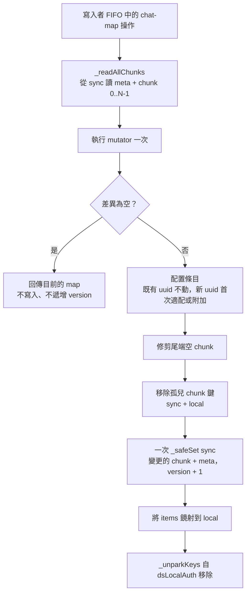
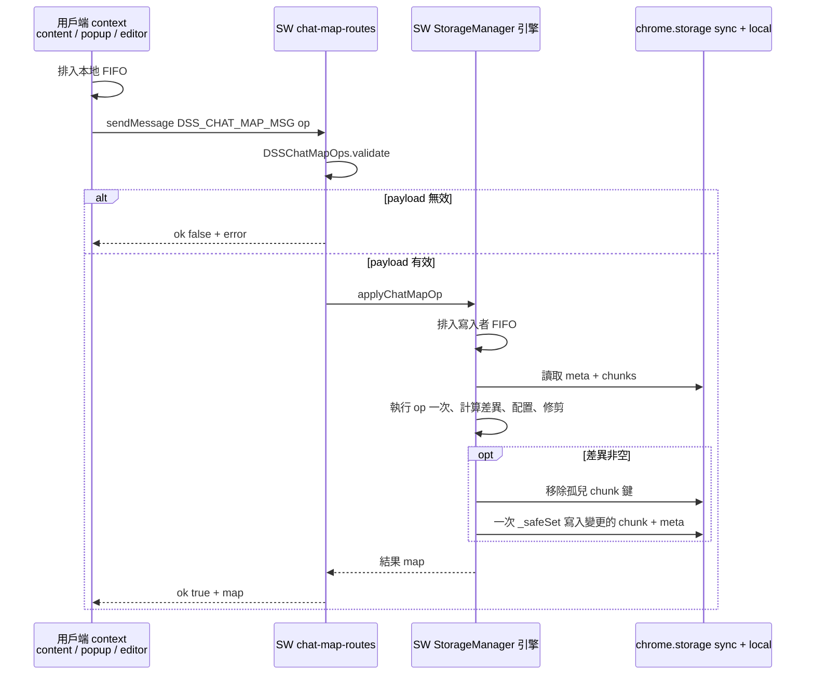

# 儲存與狀態管理架構

> 📂 [DS studio 文件](../) › [架構文件](../ARCHITECTURE.md) › 儲存與狀態管理
>
> **相關規格**：[資料儲存規格](../spec/05-data-storage.md) · [提示詞系統規格](../spec/01-prompt-system.md)
>
> **入口檔與方法包**（v4.0.0）：`StorageManager` 由入口檔 `utils/storage-manager.js` 加多個方法包組成，入口檔以 `Object.assign` 合併方法包，對外提供單一 API；各方法包的現行職責以下方版圖為準。
>
> **統一同步進入點**（v4.7.0）：`StorageManager.syncNow()`（`utils/storage-manager.sync.js`）在 popup 開啟與 `chat.deepseek.com` 頁面載入時呼叫，內部先呼叫 `retrySync()` 再呼叫 `getSettings()`。`_get()` 判定 remote 較新時，`_reconcileRemoteWins()` 會透過 `_safeSet('local', ...)` 把勝出值寫回 `chrome.storage.local`，確保回傳值與本機持久化狀態一致，裝置重新開啟後不會讀到舊的本機殘留值。
>
> **本地專用設定**（v4.7.3）：`isEnabled`／`globalPromptEnabled` 為本地專用（見下表），其讀寫方法位於 `utils/storage-manager.local.js`（`saveEnabledState`／`getEnabledState`／`saveGlobalPromptEnabled`／`getGlobalPromptEnabled`／`getRestoredMessages`／`saveRestoredMessages`），`initialize()` 位於 `utils/storage-manager.init.js`。
>
> **刪除墓碑（Tombstone）機制**（v4.8.3）：墓碑防止被刪除的提示詞組在跨裝置同步時復活。墓碑方法包（`utils/storage-manager.tombstone.js`）提供 `_mergeTombstones`／`_pruneTombstones`（30 天保留期）／`_isTombstonedAway` 與 `recordPresetTombstones()`，資料存於儲存鍵 `dsPresetTombstones`（見下表）。`savePromptPresets()` 刪除提示詞組時會同時寫入墓碑（本地與同步兩端）。`mergePresets()` 接受可選的 `tombstones` 參數：合併時若某 id 帶有 `deleted: true` 的墓碑，且該 id 於該側的 `updatedAt` 不晚於墓碑的 `ts`，該 id 會被排除、不會復活；若該 id 之後有更新的編輯（`updatedAt` 較墓碑更新），仍會保留。`resolveSyncConflict()` 會讀取並合併雙邊墓碑再傳入 `mergePresets()`，並將合併後的墓碑寫回兩端。`_get()` 中 sync 端 `dsPresetIndex`／`dsPresetOrderMeta` 因較新而勝出時，比照 `dsPreset_*` 一併寫回 `chrome.storage.local`，避免 `retrySync()`／`resolveSyncConflict()` 讀到含已刪除 id 的陳舊本機索引而使其復活。
>
> **墓碑條目形狀**（v4.10.2）：墓碑條目為物件 `{ ts: number, deleted: boolean }`（`dsPresetTombstones` 型別見下表）。`recordPresetTombstones()`（實際刪除）寫入 `{ ts, deleted: true }`；`clearPresetTombstones()`（JSON 匯入還原）寫入 `{ ts, deleted: false }` 並保留該鍵——鍵不存在時沒有時間戳可供 `_mergeTombstones()` 判定勝負，任一側仍持有的舊墓碑條目便會在下次合併時勝出，使已還原的提示詞組再次遭刪除。`_mergeTombstones()` 依 `entry.ts` 比較，`ts` 較新的一側整組（含 `deleted` 值）勝出，因此「清除」與「刪除」是同一時間軸上的兩次普通寫入，較新的一次必定勝出。`_isTombstonedAway()` 檢查 `entry.deleted === true`（而非鍵是否存在）。`_pruneTombstones()` 比較 `entry.ts`，`deleted:true`／`deleted:false` 兩種狀態均依相同保留期（30 天）過期。舊版裸數字條目在讀取時正規化為 `{ ts: <該數字>, deleted: true }`，可與物件形狀條目正確合併。

> **現行方法包版圖（讀本文件前務必先看這段）**：上面幾條描述各機制的行為，現行檔案落點以下列清單為準。
>
> **方法包共十七個**（載入順序：`keys`／`rw`／`sync`／`sync.retry`／`restore`／`tombstone`／`preset-merge`／`preset-recency`／`presets`／`chatmap.diff`／`chatmap.ops`／`chatmap`／`chatmap.client`／`local`／`init`／`setters`／`settings-read`）：
> - `keys`：儲存鍵名（`KEYS`）、預設值（`DEFAULTS`）、錯誤類別（`errors.ChatMapDispatchError`）與純輔助函式（`_buildNextMeta`）。
> - `rw`：`chrome.storage` 安全讀寫包裝（`_safeGet`／`_safeSet`／`_safeRemove`）與雙層 sync/local 讀取（`_get`，含將遠端勝出值回寫本機的 `_reconcileRemoteWins`）、寫入（`_set`）、位元組長度計算（`_byteLen`）。
> - `sync`：同步衝突偵測與解決（`_detectSyncConflict`／`checkSyncConflictPending`／`resolveSyncConflict`）、同步狀態查詢（`isSyncedWithCloud`／`hasOversizedItems`）與統一進入點 `syncNow`。
> - `sync.retry`：`retrySync()`，逐鍵守衛重推 `dsLocalAuth` 中擱置的金鑰；擱置的 chat-map 金鑰合併為一個 `REPUBLISH_PARKED` 操作交給 service worker（`_republishParkedChatMapKeys`）。
> - `restore`：備份還原邏輯（`restoreSettings`）；匯入的 `chatPresetMap` 經 `mergeChatPresetBindings()` 交由 service worker 合併。
> - `tombstone`：提示詞組刪除墓碑管理（`_mergeTombstones`／`_pruneTombstones`／`_isTombstonedAway`／`recordPresetTombstones`／`clearPresetTombstones`、`TOMBSTONE_RETENTION_MS`）。
> - `preset-merge`：雙側 preset 陣列的 Map-based 合併邏輯（`mergePresets`），含順序元資料決策與 tombstone 過濾。
> - `preset-recency`：preset 新舊判定（`_pickPresetOrderByRecency`／`_pickNewerPreset`）、`retrySync` 推送守衛輔助、`resolveGlobalPromptEnabled()`。
> - `presets`：提示詞 CRUD（`savePromptPresets`／`saveOnePromptPreset`）。
> - `chatmap.diff`：chatPresetMap 純函式差異計算與 chunk 配置（`_computeChatPresetMapDiff`／`_applyChatPresetMapDiff`），定義 `CHUNK_SOFT_LIMIT_BYTES`（7168）。
> - `chatmap.ops`：`DSSChatMapOps`，`DSS_CHAT_MAP_MSG` 操作的純函式驗證（`validate`）與 map 轉換（`apply`），不存取 `chrome.*`。
> - `chatmap`：單一寫入者引擎——`applyChatMapOp`／`mutateChatPresetMap`（僅寫入者可呼叫）、`_runChatMapMutation`（分塊提交）、`_readAllChunks`、`_migrateLegacyTask`／`_republishParkedTask`，以及各 context 皆可呼叫的 `getChatPresetMap`。
> - `chatmap.client`：公開綁定 API（`bindChatToPreset`／`unbindChat`／`unbindChatsForPresets`／`mergeChatPresetBindings`／`pruneOrphanChatBindings`／`migrateLegacyChatPresetMap`）、依模式分派的 `_dispatchChatMapOp`（寫入者直呼引擎，其他 context 經 `chrome.runtime.sendMessage` 送往 service worker）與 `_isChatMapKey`。
> - `local`：本地專用設定（`saveEnabledState`／`getEnabledState`／`saveGlobalPromptEnabled`／`getGlobalPromptEnabled`／`getRestoredMessages`／`saveRestoredMessages`）。
> - `init`：`initialize()`——預設值補齊、`promptPresets` 遷移、首次同步衝突偵測，並分派 legacy chatPresetMap 遷移（`migrateLegacyChatPresetMap`）與孤兒綁定修剪（`pruneOrphanChatBindings`）。
> - `setters`：15 個單鍵 `save<X>` 一行式 setter（`saveActivePresetId`／`savePinnedPresetId`／`saveIncludeThinking`／`saveIncludeReferences`／`saveGlobalDefaultPrompt`／`saveSidebarAutoHide`／`saveHideThinking`／`saveAutoExpandMessages`／`savePreventAutoScroll`／`saveWebsearchToggle`／`saveShowSystemTime`／`saveChatWidth`／`saveChatWidthEnabled`／`saveInputWidth`／`saveInputWidthEnabled`）。注意 `storage-manager.local.js` 的 `saveEnabledState`／`saveGlobalPromptEnabled` 是本地專用設定，位於 `local`。
> - `settings-read`：整條設定讀取路徑——白名單常數 `SYNCED_SETTINGS_KEYS`（18 個同步鍵）與 `LOCAL_ONLY_SETTINGS_KEYS`（`isEnabled`／`globalPromptEnabled` 兩個本機鍵），以及 `getSettings()` 與 `getActivePromptContent()`。**白名單是唯一的收錄依據**——未列入的 `KEYS` 成員（同步重試簿記、分塊佈局元資料、金鑰前綴常數等）一律視為內部細節，不得出現在 `getSettings()` 的回傳物件。`getSettings()` 因此固定回傳 22 個欄位：18 個同步鍵 + 2 個本機鍵 + 執行期組合的 `promptPresets` 與 `chatPresetMap`。
>
> **入口檔 `utils/storage-manager.js`**：宣告 `StorageManager` 物件，持有 chat-map 寫入者旗標（`_isChatMapWriter`／`enableChatMapWriterMode()`）、同 context 的 FIFO 佇列（`_chatPresetMapChainTail`／`_enqueueChatPresetMapWrite`）、`normalizeWebsearchToggle` 與 `subscribeToSettingChanges`，並以 `Object.assign` 合併上列方法包。
>
> **載入順序不變式（五個載入端，任一漏列即缺方法）**：`manifest.json` 的 `content_scripts`、`popup/popup.html`、`popup/editor/editor.html`、`background/service-worker.js` 的 `importScripts`、`test/setup/vitest.setup.js`。十七個方法包一律排在入口檔 `utils/storage-manager.js` 之前，且 `chatmap.diff` 必須先於 `chatmap`（後者於載入時讀取 diff 方法包）。`DSS_CHAT_MAP_MSG`（`utils/message-constants.js`）於呼叫時才解析。service worker 另以 `importScripts` 載入 `background/chat-map-routes.js`，並於頂層呼叫 `DSSChatMapRoutes.install({ storageManager: StorageManager })`。
>
> v4.11.x 稽核瘦身同時修復了一個潛伏的生產缺陷：`background/service-worker.js` 的 `importScripts` 從未載入墓碑方法包 `storage-manager.tombstone.js`，但 `resolveSyncConflict()` 會呼叫 `_mergeTombstones()`，因此背景同步重試（`onStartup`／`onInstalled`／alarm）在衝突可自動解決時一直靜默失效——錯誤被一個標註「best-effort，全部吞掉」的空 `catch` 吃掉。詳見 `docs/changelog/v4.md`（4.11.3）與 `docs/architecture/POPUP.md`「模組載入順序 (Module Loading Order)」一節中的「載入順序不變式（Load-order invariant）」段落。

## 狀態管理

使用者設定與提示詞組分別存放於 `chrome.storage.sync`（主要）與 `chrome.storage.local`（備援 + 本機權威追蹤）。

| 鍵 | 型別 | 預設值 | 說明 |
|-|-|-|-|
| `dsPresetIndex` | `string[]` | `[]` | 提示詞組 ID 的有序陣列。 |
| `dsPreset_<id>` | `PromptPreset` | — | 單一提示詞組物件，各自存於獨立的鍵，以避開同步每項 8KB 的上限。形狀：`{ id, name, content, createdAt, updatedAt, globalPromptEnabled }`。（v4.20.0）`globalPromptEnabled` 是該提示詞組自身的全域提示詞注入開關——建立時明確寫入 `true`，v4.20.0 以前的資料缺少此欄位時視為 `true`，並隨提示詞組本身跨裝置同步。 |
| `activePresetId` | string | `""` | 目前啟用中提示詞組的 ID。 |
| `pinnedPresetId` | string | `""` | （v4.18.0）釘選為預設的提示詞組 ID；`""` 表示沒有預設。這是單一純量值，因此唯一性由結構保證——不可能同時釘選兩個提示詞組。僅在開啟新對話（URL 中沒有 chat id）時讀取，用以預選該提示詞組；既有對話一律不受影響。經 `savePinnedPresetId()` 寫入，與 `saveActivePresetId()` 共用 `_set` 路徑（同步為主、本機備援），並納入備份匯出與匯入。 |
| `isEnabled` | boolean | `false` | 提示詞注入是否啟用（主開關）。（v4.7.3）本地專用、以裝置為範圍——不參與同步、`resolveSyncConflict()` 與 `restoreSettings()` 匯入。 |
| `includeThinking` | boolean | `true` | 匯出的 MD 是否包含 AI 思考過程。 |
| `includeReferences` | boolean | `true` | 匯出的 MD 是否包含引用來源連結。 |
| `globalDefaultPrompt` | string | `''` | 在每個對話中置於各提示詞組提示詞之前的全域提示詞。 |
| `globalPromptEnabled` | boolean | `true` | 是否注入全域提示詞（v3.0.0）。從屬於主開關——`isEnabled` 為 false 時，不論此旗標為何，全域提示詞一律不注入。（v4.7.3）本地專用、以裝置為範圍，排除範圍同 `isEnabled`——注意 `globalDefaultPrompt`（提示詞*內容*）仍正常同步，只有這個開關是本地專用。（v4.20.0）降級為**舊版備援**：僅在沒有啟用中的提示詞組時才會參考。有啟用中的提示詞組時，以該提示詞組自身的 `globalPromptEnabled` 欄位為準。判定邏輯集中於 `StorageManager.resolveGlobalPromptEnabled(activePreset, legacyGlobalFlag)`。 |
| `chatPresetMap` | object | `{}` | 將對話 UUID（`/a/chat/s/{uuid}`）對應到提示詞組 ID，實現逐對話的提示詞組綁定。*v2.4.0 起由分塊鍵取代（見「實體分塊」一節）。* |
| `chatPresetMapMeta` | `{ version, chunkCount, chunkSizes[] }` | `{ version:0, chunkCount:0, chunkSizes:[] }` | 用於探索 chunk 與選擇寫入目標的索引鍵（v2.4.0+）。僅由 service worker 寫入（見 *Service Worker 單一寫入者*）。 |
| `chatPresetMap_0`, `chatPresetMap_1`, ... | `{ [uuid]: presetId }` | — | 實體 chunk，每塊 <= 7KB，存放 chatPresetMap 條目的子集（v2.4.0+）。僅由 service worker 寫入（見 *Service Worker 單一寫入者*）。 |
| `dsSidebarAutoHide` | boolean | `false` | 是否啟用側邊欄自動隱藏功能。 |
| `dsHideThinking` | boolean | `false` | 是否啟用隱藏思考過程功能。 |
| `dsAutoExpandMessages` | boolean | `false` | （v4.32.0）是否啟用自動展開訊息。為 true 時，由 MutationObserver 自動點擊收合狀態的展開按鈕，使所有訊息以展開狀態顯示。受主開關控制。 |
| `isAutoRetryEnabled` | boolean | `false` | （v4.35.0）是否啟用自動重試。為 true 時，`content/auto-retry.js` 的共用輪次迴圈在每輪隨機延遲後點擊頁面上的重試按鈕。受主開關控制；鍵未儲存時，`DSS_GET_SETTINGS` 以 `DEFAULTS` 補為 `false`。 |
| `isAutoContinueEnabled` | boolean | `false` | （v4.35.0）是否啟用自動繼續生成。為 true 時，同一輪次迴圈在每輪隨機延遲後點擊頁面上的「繼續生成」按鈕。受主開關控制；鍵未儲存時，`DSS_GET_SETTINGS` 以 `DEFAULTS` 補為 `false`。 |
| `dsPreventAutoScroll` | boolean | `false` | （v4.12.0）防回捲保護是否常駐啟用。為 true 時，`PreventAutoScroll` 隨時抑制向下的自動捲動，而非僅在回到頂部（go-top）與 Markdown 匯出期間。受主開關控制。 |
| `dsShowSystemTime` | boolean | `false` | 是否在使用者訊息前注入系統時間（v2.7.0 新增）。 |
| `dsWebSearchToggle` | string | `'on'` | （v4.13.0；v4.17.0 精簡為兩種狀態）進入頁面時聯網搜尋開關的預設值：`'on'` 使頁面的智慧搜尋按鈕以 `aria-pressed="true"` 起始，`'off'` 則以 `"false"` 起始。每個啟用事件最多套用一次——進入頁面、此鍵變更，或主開關開啟（v4.17.1）——之後使用者手動切換的狀態會保留到下一次啟用事件。僅在狀態不符時才點擊。已移除的 `'default'` 值在讀取時正規化為 `'on'`（不會寫回）。受主開關控制。 |
| `dsChatWidth` | number | `70` | 對話寬度百分比（30–100）。 |
| `dsChatWidthEnabled` | boolean | `false` | 是否啟用對話寬度調整。 |
| `dsInputWidth` | number | `70` | 輸入框寬度百分比（30–100）。 |
| `dsInputWidthEnabled` | boolean | `false` | 是否啟用輸入框寬度調整。 |
| `syncInitialized` | boolean | `false` | 是否已執行初次同步（本地專用）。 |
| `syncConflictPending` | boolean | `false` | 是否有待使用者解決的同步衝突（本地專用）。 |
| `restored_messages` | object | `{}` | 以訊息 ID 為鍵，儲存經審查還原的訊息（本地專用，不參與同步）。 |
| `dss-temporary-chat-enabled` | boolean | `false` | 是否開啟臨時對話模式。本地專用、以裝置為範圍，且不在 `StorageManager.KEYS` 之內——由 `content/temporary-chat-enabled-flag.js` 完全透過 `DSS_GET_SETTINGS`/`DSS_SET_SETTINGS` 讀寫，並列於 `background/settings-routes.js` 的 `EXTRA_WATCHED_LOCAL_KEYS`，使其變更仍以 `DSS_SETTINGS_CHANGED` 廣播。嚴格布林值：只有 `true` 視為開啟。目前正追蹤待刪除之對話的 UUID 存於各分頁的 `sessionStorage`（由 `content/temporary-chat-delete.tracking.js` 管理），從不存入 `chrome.storage`。 |
| `dsLocalAuth` | `string[]` | `[]` | （v4.7.2）同步寫入失敗而退回本機之鍵的待重試佇列。`_get()` 忽略它；由 `retrySync()` 清空。（v4.11.18）`retrySync()` 透過**逐鍵推送守衛**清空它，而非無條件重推——見下方 *同步寫入配額策略*。（v4.8.2）絕不包含永久超過大小上限的鍵——這類鍵在進入此佇列前已被 8KB 守衛濾除。 |
| `dsOversizedKeys` | `string[]` | `[]` | （v4.8.2）本地專用的追蹤清單，記錄序列化後超過 `QUOTA_BYTES_PER_ITEM`（8192 位元組）、因此永遠無法同步的鍵。可自我修復：某鍵下次以不超過上限的大小寫入時即從清單移除。 |
| `dsPresetTombstones` | `Object<id, { ts: number, deleted: boolean }>` | `{}` | （v4.8.3）提示詞組的刪除墓碑對照表，同時同步至 `local` 與 `sync`。由 `mergePresets()` 參考，使在某裝置刪除的提示詞組，不會在衝突解決合併時被另一裝置上仍存在的陳舊副本復活。在 `resolveSyncConflict()` 中合併（每個 id 保留 `ts` 較新的條目）並修剪（保留 30 天）。（v4.10.1）`restoreSettings()` 在 JSON 匯入後呼叫 `clearPresetTombstones(ids)`，移除重新匯入之提示詞組 ID 的條目，避免陳舊墓碑使下次同步再次刪除剛還原的提示詞組。（v4.10.2）條目形狀由裸 `deletedAt` 數字改為 `{ ts, deleted }`——`recordPresetTombstones()` 寫入 `{ ts: now, deleted: true }`；`clearPresetTombstones()` 改為寫入 `{ ts: now, deleted: false }` 而非刪除該鍵，讓「清除」帶有時間戳，得以在合併仲裁中勝過另一端陳舊的「刪除」。`_isTombstonedAway()` 檢查 `entry.deleted === true`。舊版裸數字條目在讀取時正規化為 `{ ts: <該數字>, deleted: true }`，以維持向下相容。（v4.11.18）此鍵也會在 `resolveSyncConflict()` 之外合併：當它位於 `dsLocalAuth` 中時，`retrySync()` 會先經 `_mergeTombstones()` 逐 id 合併再推送，而非整包推送本機值，因為整包推送會靜默復活另一裝置已刪除的項目，而空的本機集合更會把雲端集合整個清空。 |
| `dsPresetOrderMeta` | `{ order: string[], orderUpdatedAt: number }` | `{ order:[], orderUpdatedAt:0 }` | （v4.6.2）提示詞組排序的新舊時間戳。**三個彼此獨立的使用端，各有各的規則**——請勿假設它們共用同一條程式路徑：<br>**讀取路徑**——`_pickPresetOrderByRecency()`（`utils/storage-manager.presets.js:269`，由 `utils/storage-manager.js:315` 的 `_get()` 呼叫，*而非*由衝突解決呼叫）選擇 `orderUpdatedAt` 嚴格較大的一側；完全相等時回傳 `null`，由 `_get()` 的 `{ ...lData, ...sData }` 展開保留 sync 的值。<br>**合併路徑**——`mergePresets()` 有自己的排序選擇區塊（`utils/storage-manager.presets.js:188-193`），從不呼叫 `_pickPresetOrderByRecency()`。（v4.11.19）僅在 `baseTs > incTs` 時採用本機的 `order`；其餘所有情況，**包括完全相等，都採用雲端側的 `order`**（平手時雲端勝出）。若平手時退回合併 Map 的插入順序，會把本機已快取的提示詞組浮到最前面，並丟棄已儲存的順序。<br>**推送路徑**——（v4.11.18）`retrySync()` 僅在本機 `orderUpdatedAt >= ` 雲端值時推送此鍵，透過專屬的 `key === dsPresetOrderMeta` 守衛分支——`'dsPresetOrderMeta'.startsWith('dsPreset_')` 為 `false`，因此 `dsPreset_<id>` 前綴守衛涵蓋不到它。 |
| `promptPresets` | `PromptPreset[]` | — | *v1.7.0 起不再作為儲存鍵*：由 `dsPresetIndex` + `dsPreset_<id>` 逐鍵格式取代。仍作為執行期屬性組合進 `getSettings()` 的回傳值。 |

### PromptPreset 介面

```typescript
interface PromptPreset {
  id: string;
  name: string;
  content: string;
  createdAt: number;
  updatedAt: number;
  globalPromptEnabled?: boolean;  // v4.20.0 — absent means true
}
```

`globalPromptEnabled`（v4.20.0）讓全域提示詞注入開關成為各提示詞組自身的屬性。新建立的提示詞組會明確設為 `true`；缺少此欄位的提示詞組視為 `true`。由於它存在提示詞組上，會隨提示詞組一起同步與合併——不同於同名的裝置層級鍵，後者為本地專用，只作為「沒有啟用中的提示詞組」時的備援。判定規則集中於 `resolveGlobalPromptEnabled()`（`utils/storage-manager.preset-recency.js`），使 popup 與內容腳本不會各自分歧：

```javascript
resolveGlobalPromptEnabled(activePreset, legacyGlobalFlag) {
    if (!activePreset) return legacyGlobalFlag;
    return activePreset.globalPromptEnabled ?? true;
}
```

### 雙儲存架構

`StorageManager` 採用雙儲存策略，搭配逐提示詞組的鍵隔離與本機權威追蹤：

- **逐提示詞組鍵隔離**：為避開 `chrome.storage.sync` 的 `QUOTA_BYTES_PER_ITEM`（8KB）上限，每個提示詞組存於各自的鍵（`dsPreset_<id>`）。索引鍵（`dsPresetIndex`）維護有效提示詞組的順序與清單。
- **讀取路徑**（`_get()`）：先嘗試 `chrome.storage.sync.get()`，再嘗試 `chrome.storage.local.get()`。預設以同步資料覆蓋本機資料；`dsPreset_*` 鍵與提示詞組排序元資料則不論寫入失敗歷史，一律以純粹的 `updatedAt` 新舊逐項調和（`_pickNewerPreset` / `_pickPresetOrderByRecency`）。衝突待解期間（`syncConflictPending === true`）嚴格只回傳本機資料。（v4.7.1）遠端／同步側在逐項新舊比較中勝出時，勝出值也會經 `_safeSet('local', ...)` 寫回 `chrome.storage.local`——不只是在記憶體中回傳——因此 `syncNow()` 執行後不會殘留陳舊的本機副本。（v4.7.2）`_get()` 忽略 `dsLocalAuth`：擱置鍵的本機值在讀取時絕不覆蓋較新的同步值，因為這種「讀取時釘住」的覆蓋，會讓一筆曾同步失敗的陳舊本機編輯永久遮蔽真正較新的雲端資料。`dsLocalAuth` 純粹是寫入失敗的重試佇列，由 `retrySync()` 清空。
- **遠端勝出回寫**（`_reconcileRemoteWins()`）：以內容（`JSON.stringify`）而非物件參照比較本機與同步的 `dsPreset_*` 值，因此內容已與本機相同的遠端勝出值不會觸發回寫。
- **寫入路徑**（`_set()`）：（v4.8.2）在嘗試任何動作之前，先依序列化位元組大小逐鍵拆分傳入的 `items` 批次（`_byteLen()`，現為 `new TextEncoder().encode(JSON.stringify(obj)).length`——精確計算 UTF-8，修正先前使用原生 JS 字串 `.length` 而低估中文等多位元組內容的問題）。`{ [key]: value }` payload 超過 `QUOTA_BYTES_PER_ITEM`（8192 位元組）的鍵會在同步呼叫前被分流：只寫入 `chrome.storage.local`（值不會遺失）並記錄於 `dsOversizedKeys`，但排除於 `dsLocalAuth` 之外，也絕不傳給 `chrome.storage.sync.set()`——重試本質上就超過大小的 payload 永遠不會成功，因此不得進入暫時性重試佇列（見 report.md §4.2）。此清單可自我修復：已在 `dsOversizedKeys` 中的鍵，只要之後任一次寫入不超過上限即會移除。其餘（大小正常的）鍵照舊經 `chrome.storage.sync.set()` 寫入：
  - **成功時**：從本機儲存的 `dsLocalAuth` 移除這些鍵，並在本機寫入一份備份。
  - **失敗時**（例如超過配額）：將這些鍵加入本機儲存的 `dsLocalAuth`，並把資料寫入本機儲存。確保即使達到同步上限，擴充功能仍可正常運作。
- **`hasOversizedItems()`**（`utils/storage-manager.sync.js`，v4.8.2）：讀取 `dsOversizedKeys`，僅當陣列非空時回傳 `true`。`popup.js` 的 `refreshSyncStatus()` 會連同 `isSyncedWithCloud()` 一起檢查，並顯示獨立的「內容過大，僅存本機」狀態（`dsI18n.t('syncStatusOversized')`，`.unsynced` 樣式），優先於一般的已同步／未同步文字——使永久無法同步的項目絕不會與一般的暫時待同步狀態混淆。

### ChatPresetMap 寫入佇列（v2.3.0）

`StorageManager` 透過定義於 `utils/storage-manager.js` 中 `StorageManager` 物件上的**記憶體內 promise 鏈 FIFO 佇列**，在單一 JS context 內將 chatPresetMap 的工作序列化：

- `_chatPresetMapChainTail`（`Promise.resolve()`）——promise 鏈的尾端。
- `_enqueueChatPresetMapWrite(taskFn)`——將 `taskFn` 接到鏈尾；回傳該任務結果的 promise。單一任務被拒絕**不會**阻擋後續任務（僅在鏈尾加上 `.catch(() => {})`）。

此佇列依 context 不同扮演兩種角色：

- **Service worker（寫入者）**：所有 chat-map 操作——每個 `DSS_CHAT_MAP_MSG` op、`mutateChatPresetMap`、舊版遷移、擱置鍵重新發布，以及 `getChatPresetMap`——都經過這一個 FIFO，因此來自所有分頁、popup 與編輯器的操作嚴格依序套用。寫入者端的分派直接呼叫引擎，而不再包進第二個佇列任務，因為引擎會自行排入佇列，外層任務會等待自己。
- **用戶端（內容腳本、popup、編輯器）**：`_dispatchChatMapOp` 將 `chrome.runtime.sendMessage` 的往返排入佇列，`getChatPresetMap()` 也經過同一個本地佇列，因此該 context 中的讀取能看到該 context 自己先前的寫入。

`mutateChatPresetMap(mutator)` 僅限寫入者呼叫，在其他任何 context 中都會拋出錯誤。mutator 針對一份全新快照恰好執行一次；它可以原地修改 `map`（回傳 `undefined`），或回傳新的 map。service worker 以外的呼叫端使用下方 *Service Worker 單一寫入者* 所述的宣告式綁定 API。

### ChatPresetMap 實體分塊（v2.4.0）

為避開 Chrome 同步每項 8KB 的配額（`chatPresetMap` 約在 170 筆 UUID 綁定時達到此上限），此 map 被拆分到 N 個實體儲存鍵，每個 <= 7KB，並以一個小型 meta 索引鍵供探索。

**資料模型：**

| 鍵 | 形狀 | 用途 |
|-|-|-|
| `chatPresetMapMeta` | `{ version, chunkCount, chunkSizes[] }` | 探索用索引 + 提交計數器（`version`） |
| `chatPresetMap_0..N-1` | `{ [uuid]: presetId }` | 實體 chunk，每塊 <= `CHUNK_SOFT_LIMIT_BYTES`（7168） |

**不變式：**
- 一個 uuid **至多出現在一個** chunk 中。
- `chunkCount >= 0`。為 0 時，邏輯 map 為空，且不存在任何 `chatPresetMap_*` 鍵。
- `chunkSizes[i] = this._byteLen(chunk_i)`（透過 TextEncoder 精確計算 UTF-8 位元組，`_byteLen()` 細節見「雙儲存架構」一節）。
- 空 map `{}` 的 JSON.stringify 長度為 2。
- `version` 嚴格單調遞增：每次提交寫入時，`_buildNextMeta()` 都將其恰好加 1。無實際變更的操作（相同值的綁定、解除未知 uuid 的綁定、空差異）不寫入任何內容，也不遞增 version。

**每次操作皆取全新快照：** 每個操作都從 `_readAllChunks()` 開始，它先從 `chrome.storage.sync` 讀取 `chatPresetMapMeta`，再經 `_get()` 讀取 chunk `0..chunkCount-1`；meta 已宣告但儲存中缺少的 chunk 讀作 `{}`，並在下次提交時重寫。引擎不在記憶體中保存任何索引或 meta 快取。

**配置（`utils/storage-manager.chatmap.diff.js` 中的 `_applyChatPresetMapDiff`）：** `_computeChatPresetMapDiff()` 執行 mutator 一次，並將 uuid 分類為已刪除、已變更或新增。

- 已刪除的 uuid 從所有持有它的 chunk 中刪除。
- 已變更的 uuid 在原本持有它的 chunk 中就地更新——既有 uuid 永不搬移。
- 新增的 uuid 放進第一個符合 `_byteLen(chunk) + entrySize < 7168` 的 chunk（以 chunk 的實際內容量測）；沒有任何 chunk 有空間時，附加一個新 chunk。

**寫入流程（`_runChatMapMutation`，於寫入者佇列內）：**

1. 讀取快照、執行 mutator 一次、計算差異。差異為空時回傳目前的 map，不寫入。
2. 修剪尾端的空 chunk，並使 `chunkCount` / `chunkSizes` 與之相符。
3. **先**從 sync 與 local 移除孤兒 chunk 鍵（索引大於或等於新 `chunkCount` 者），使持有舊 meta 或新 meta 的讀取端都不會讀到已刪除的綁定。
4. 以**一次** `_safeSet('sync', items)` 寫入變更的 chunk 與 meta（以及舊 meta 已宣告但儲存中缺少的 chunk），再將相同的 items 鏡射到 local。配額耗盡等同步失敗會拋出錯誤——寫入者絕不退回寫入 local，因此呼叫端絕不會對未抵達 sync 的提交看到成功。
5. `_unparkKeys()` 將已提交的鍵從 `dsLocalAuth` 移除。

因此，對既有 uuid 的 `BIND` 只重寫其所在 chunk 與 meta；對新 uuid 的 `BIND` 採首次適配（first-fit）或附加；使尾端 chunk 變空的 `UNBIND` 會修剪該 chunk、刪除其 `chunkSizes` 條目並移除其鍵；`UNBIND_PRESETS`、`MERGE` 與 `PRUNE_ORPHANS` 是整份 map 的轉換，走相同路徑。`getChatPresetMap()` 讀取 meta 與所有 chunk，並合併為 `{ [uuid]: presetId }`。

**舊版遷移（`MIGRATE_LEGACY`）：** `initialize()` 僅在任一儲存區存在舊版扁平 `chatPresetMap` 鍵時，才呼叫 `migrateLegacyChatPresetMap()`。在 service worker 中，`_migrateLegacyTask()` 於 meta 不存在且舊版 map 非空時，經 `_runChatMapMutation()` 提交舊版條目，然後從 sync 與 local 移除舊版鍵。重複執行是安全的：舊版鍵消失後，它只會回傳目前的 map。


```mermaid
flowchart TB
    Op[寫入者 FIFO 中的 chat-map 操作] --> Snap[_readAllChunks<br/>從 sync 讀 meta + chunk 0..N-1]
    Snap --> Mut[執行 mutator 一次]
    Mut --> Diff{差異為空？}
    Diff -->|是| NoWrite[回傳目前的 map<br/>不寫入、不遞增 version]
    Diff -->|否| Place[配置條目<br/>既有 uuid 不動，新 uuid 首次適配或附加]
    Place --> Trim[修剪尾端空 chunk]
    Trim --> Orphan[移除孤兒 chunk 鍵<br/>sync + local]
    Orphan --> Set[一次 _safeSet sync<br/>變更的 chunk + meta，version + 1]
    Set --> Mirror[將 items 鏡射到 local]
    Mirror --> Unpark[_unparkKeys 自 dsLocalAuth 移除]
```

### Service Worker 單一寫入者（v4.34.3）

對話→提示詞組綁定 map（`chatPresetMap_<n>` chunk、`chatPresetMapMeta` 與舊版 `chatPresetMap` 鍵）只有一個寫入者：service worker。`background/service-worker.js` 經 `importScripts` 載入 `background/chat-map-routes.js`，並於頂層呼叫 `DSSChatMapRoutes.install({ storageManager: StorageManager })`，使監聽器在 worker 重啟後依然存在。

- **`install({ storageManager })`** 呼叫 `storageManager.enableChatMapWriterMode()`（設定 `_isChatMapWriter`），並註冊一個 `chrome.runtime.onMessage` 監聽器。未知類型回傳 `false` 且不回應，讓 worker 的其他監聽器可自由處理。已知類型由 `DSSChatMapOps.validate`（`utils/storage-manager.chatmap.ops.js`）檢查；被拒絕的 payload 回應 `{ ok: false, error }`。有效的 op 交給 `applyChatMapOp(message)`，監聽器以 `{ ok: true, map }` 回應結果 map，或在 op 拋出錯誤時回應 `{ ok: false, error }`。
- **`DSSChatMapOps`** 為純函式：`validate(msg)` 檢查類型與 payload，`apply(map, msg, ctx)` 回傳新 map，不觸及 `chrome.*`，也不修改其輸入。
- **僅限寫入者守衛**：`applyChatMapOp` 與 `mutateChatPresetMap` 在 `_isChatMapWriter` 為 false 的任何 context 中都會拋出錯誤。

| 訊息類型 | Payload | 在 service worker 中的效果 |
|-|-|-|
| `DSS_CHAT_MAP_BIND` | `{ uuid, presetId }`（非空字串） | 設定 `uuid → presetId` |
| `DSS_CHAT_MAP_UNBIND` | `{ uuid }` | 刪除該 uuid 的綁定 |
| `DSS_CHAT_MAP_UNBIND_PRESETS` | `{ presetIds: string[] }` | 刪除所有指向 `presetIds` 其中之一的綁定 |
| `DSS_CHAT_MAP_PRUNE_ORPHANS` | 無 | 刪除提示詞組 id 不在 `dsPresetIndex` 中的綁定（索引於排入佇列的 mutator 內讀取）；索引為空或不存在時不修剪任何綁定 |
| `DSS_CHAT_MAP_MERGE` | `{ entries }`（純物件，值為字串） | 將 `entries` 展開覆蓋到 map 上；同一 uuid 以 `entries` 為準 |
| `DSS_CHAT_MAP_MIGRATE_LEGACY` | 無 | 舊版扁平鍵遷移（見 *實體分塊*） |
| `DSS_CHAT_MAP_REPUBLISH_PARKED` | `{ keys: string[] }` | 對每個 chat-map 鍵：將其目前的本機值推送到 sync，若本機沒有值則從 sync 移除；接著從 `dsLocalAuth` 移除該鍵。其他鍵一律忽略 |

**用戶端 API**（`utils/storage-manager.chatmap.client.js`）：`bindChatToPreset(uuid, presetId)` 與 `unbindChat(uuid)` 解析為 `true`；`unbindChatsForPresets(presetIds)`、`mergeChatPresetBindings(entries)`、`pruneOrphanChatBindings()` 與 `migrateLegacyChatPresetMap()` 解析為結果 map。每個方法建立一個 `DSS_CHAT_MAP_MSG` op 並交給 `_dispatchChatMapOp`：在寫入者中直接呼叫 `applyChatMapOp`；其他地方則將 `_sendChatMapMessage` 排入本地佇列。呼叫端：`content/chat-binding-controller.js` 與 `content/preset-overlay.controller.js`（bind / unbind）、`popup/popup.preset-manager.js`（bind / unbind / unbind-presets）、`restoreSettings()`（merge）、`initialize()`（prune / migrate）。讀取留在本地：`getChatPresetMap()` 在每個 context 中都直接讀取儲存，不經快取。

**失敗處理原則：**

- 收到 `{ ok: false }` 回應或沒有回應時，以 `StorageManager.errors.ChatMapDispatchError` 拒絕。
- `chrome.runtime.sendMessage` 的同步拋出會轉為拒絕。
- 「Receiving end does not exist」（訊息未送達，因為 worker 當時尚無監聽器）會在約 100 ms 後恰好重試一次（`NO_RECEIVER_RETRY_DELAY_MS`）。其他任何傳輸錯誤（例如 port 已關閉）直接拒絕、不重試，因為該訊息可能已被套用。
- 每次傳送在 10 秒（`SEND_TIMEOUT_MS`）後逾時並拒絕。
- 頁面覆蓋層（`preset-overlay.controller.js`）先樂觀更新其記憶體內的 map，待寫入完成後再以 `getChatPresetMap()` 覆寫；被拒絕時會重新讀取 map、重新渲染所選提示詞組並重新計算注入前綴，藉此回滾樂觀變更。
- migrate 或 prune 分派失敗時，`initialize()` 記錄警告（`init:migrate-legacy-failed`、`init:prune-orphans-failed`）並繼續執行。
- `content/content-script.js` 會記錄初始 `ChatBinding.handleChatChange()` 的失敗，並仍接上導航偵測與 body 觀察器。
- republish 分派失敗時，`retrySync()` 記錄 `sync:republish-parked-failed`；這些鍵保持擱置，等待下一次重試。

**變更傳播：** 已提交的 chunk 與 meta 鍵會觸發 `chrome.storage.onChanged`；`background/settings-routes.js` 將 `chatPresetMap_*` 的變更以 `DSS_SETTINGS_CHANGED` 轉發給 DeepSeek 分頁，內容腳本在重新計算綁定前會重新讀取 `getChatPresetMap()`。


```mermaid
sequenceDiagram
    participant Client as 用戶端 context<br/>content / popup / editor
    participant Routes as SW chat-map-routes
    participant Engine as SW StorageManager 引擎
    participant Storage as chrome.storage sync + local

    Client->>Client: 排入本地 FIFO
    Client->>Routes: sendMessage DSS_CHAT_MAP_MSG op
    Routes->>Routes: DSSChatMapOps.validate
    alt payload 無效
        Routes-->>Client: ok false + error
    else payload 有效
        Routes->>Engine: applyChatMapOp
        Engine->>Engine: 排入寫入者 FIFO
        Engine->>Storage: 讀取 meta + chunks
        Engine->>Engine: 執行 op 一次、計算差異、配置、修剪
        opt 差異非空
            Engine->>Storage: 移除孤兒 chunk 鍵
            Engine->>Storage: 一次 _safeSet 寫入變更的 chunk + meta
        end
        Engine-->>Routes: 結果 map
        Routes-->>Client: ok true + map
    end
```

### 同步寫入配額策略（v2.0.0）

Chrome 強制限制 `MAX_WRITE_OPERATIONS_PER_MINUTE = 120`。為避免在輸入期間耗盡此配額：

- **內容編輯熱路徑**：`saveCurrentPresetContent()` 呼叫 `saveOnePromptPreset(preset)`——單次 `_set({ dsPreset_<id>: preset })` 寫入。內容編輯從不觸及 `dsPresetIndex` 鍵。
- **結構性操作**（新增／重新命名／刪除／重新排序）：仍呼叫 `savePromptPresets(presets)`，有條件地寫入索引（僅當 `JSON.stringify(oldIds) !== JSON.stringify(newIds)`，或 `dsPresetIndex` 位於 `dsLocalAuth` 中待復原時）。
- **編輯器視窗儲存**（v3.0.0，取代舊的 popup 失焦觸發儲存；v4.8.1 將防抖縮短為 500 ms）：提示詞內容在獨立的編輯器視窗中編輯。`input` 事件設定 dirty 旗標並排程一次防抖寫入（500 ms）；`blur`、`visibilitychange` 與 `pagehide` 立即寫出（fire-and-forget）。僅在 dirty 時才寫入，使同步寫入配額壓力維持在低水準。
- **Popup 滑桿儲存**（v4.8.1）：`chatWidthSlider`/`inputWidthSlider` 的 `change` 事件經 500 ms 防抖包裝後，才將 `dsChatWidth`/`dsInputWidth` 寫入儲存，與編輯器的防抖節奏一致。`input` 事件的即時標籤更新從不觸及儲存。
- **同步狀態 API**：`isSyncedWithCloud()` 讀取 `dsLocalAuth`，為空時回傳 `true`。`retrySync()` 逐一處理 `dsLocalAuth` 並回傳 `{ success, remainingUnsyncedCount }`，但**不會**一律重推——每個鍵都要先通過守衛（見下一項）。
- **`retrySync()` 逐鍵推送守衛**（v4.11.18）：陳舊的本機值絕不能蓋掉較新的雲端值，因此推送迴圈依鍵分支：

  | 鍵 | 守衛 |
  |-|-|
  | `dsPresetIndex` | 僅在本機 `orderUpdatedAt >= ` 雲端值時推送 |
  | `dsPresetOrderMeta` | 僅在本機 `orderUpdatedAt >= ` 雲端值時推送 |
  | `dsPreset_<id>` | 僅在 `_pickNewerPreset()` 選中本機副本時推送 |
  | `dsPresetTombstones` | 絕不取代雲端——經 `_mergeTombstones()` 逐 id 合併（聯集；每個 id 以較新的 `ts` 勝出），再推送合併結果 |
  | `chatPresetMap`, `chatPresetMapMeta`, `chatPresetMap_<n>` | 絕不由呼叫端 context 推送——`retrySync()`（`utils/storage-manager.sync.retry.js`）將所有擱置的 chat-map 鍵合併為一個 `REPUBLISH_PARKED` op 送出；service worker 推送每個鍵目前的本機值（本機無值時則從 sync 移除），並解除其擱置。分派失敗時記錄警告，鍵保持擱置 |
  | 其他所有鍵 | 無條件推送 |

  `dsPresetOrderMeta` 與 `dsPresetTombstones` 各需專屬的守衛分支：`'dsPresetOrderMeta'.startsWith('dsPreset_')` 為 `false`（第 8 個字元是 `O` 而非 `_`），這是一個差點命中的前綴碰撞，看似已被 `dsPreset_<id>` 守衛涵蓋，實際上卻落入無條件推送。
- **UI 回饋**：popup.js 中的 `refreshSyncStatus()` 在每次寫入後與初始化時呼叫 `isSyncedWithCloud()`，更新標題列的 `#syncStatus`。**同步完全自動**（v4.8.5），由 `syncNow()` 在 popup 開啟時（`popup/popup.js:170`）與 DeepSeek 頁面載入時（`content/content-script.js:96`，位於 `initSettings()` 內）觸發，也由 service worker 的週期性 alarm 觸發。

### 資料遷移

- **v1.6.x 至 v1.7.0**：首次載入時，`StorageManager` 偵測到舊版 `promptPresets` 陣列，會自動將每個提示詞組遷移為新的逐鍵格式、填入 `dsPresetIndex`，並從 sync 與 local 儲存中移除已停用的 `promptPresets` 鍵。
- **v1.2.x 至 v1.7.0**：若沒有任何提示詞組，但在本機儲存中找到舊版 `promptPrefix` 字串，會將其遷移至名為「我的提示詞」的新提示詞組。

### 同步衝突邏輯

升級後首次執行時，擴充功能會比較 local 與 sync 的 `promptPresets`。若兩者不同，設定 `syncConflictPending = true`（本地專用）。在此狀態下，`StorageManager._get()` 嚴格只回傳本機資料，以避免靜默覆寫。popup 接著顯示解決對話框，使用者可選擇透過 `StorageManager.mergePresets()` 將雲端提示詞組與本機合併。解決後更新 `syncInitialized` 與 `syncConflictPending`。（v4.8.3）合併前，`resolveSyncConflict()` 也會從 local 與 sync 讀取、合併並修剪 `dsPresetTombstones`，並將合併後的墓碑對照表傳入 `mergePresets()`，使已刪除的提示詞組不會被衝突解決合併復活；合併後的墓碑會寫回兩個儲存區。（v4.10.2）合併比較 `entry.ts` 並取勝出的整筆條目（含其 `deleted` 旗標），因此較新的「清除」（來自 JSON 還原）能正確覆蓋另一端較舊的「刪除」墓碑，還原後再次刪除的情況則反之亦然。`resolveSyncConflict()` 從 `StorageManager` 擁有的鍵建立寫回集合，但略過所有 chat-map 鍵（`_isChatMapKey()`：舊版 `chatPresetMap`、`chatPresetMapMeta`、`chatPresetMap_*`），因為寫回快照會覆蓋 service worker 在此期間提交的綁定；`initialize()` 的遷移推送（本機存在但 sync 缺少的鍵）基於同樣理由也略過它們。

### 提示詞組合併（`mergePresets`）

同步衝突解決與 JSON 匯入都使用 `mergePresets(basePresets, newPresets, baseOrderMeta, incOrderMeta, tombstones)`：以 `id` 為鍵、基於 Map 的去重。兩個陣列中的每個提示詞組，同 id 時保留 `updatedAt` 時間戳較新者。帶有新 ID（不在 base 陣列中）的提示詞組附加於後。這可防止從多個來源合併時遺失資料。（v4.8.3）在依新舊合併之前，任何「被墓碑排除」的 id（`_isTombstonedAway`：該 id 有一筆 `deleted: true` 墓碑，且其 `ts` 不早於該側的 `updatedAt`）會從兩側剔除——正是這一步防止某裝置刪除的提示詞組，被另一裝置上或 JSON 匯入／備份中仍存在的陳舊副本靜默復活。（v4.10.1）`restoreSettings()` 在 JSON 匯入時**不會**傳 `tombstones` 對照表給 `mergePresets()`，因此匯入的提示詞組在匯入當下絕不會被墓碑擋下——但其 ID 仍可能帶有先前刪除留下、尚未過期的陳舊墓碑，下一次 `resolveSyncConflict()` 便會據此再次刪除它。為防止此情況，`restoreSettings()` 在 `savePromptPresets()` 之後立即呼叫 `clearPresetTombstones(ids)`（位於 `utils/storage-manager.tombstone.js`），在 `local` 與 `sync` 兩端清除恰好為匯入提示詞組清單中所含 ID 的墓碑。（v4.10.2）`_isTombstonedAway` 改為檢查 `entry.deleted === true`（墓碑條目為 `{ ts, deleted }` 物件）而非鍵是否存在，`clearPresetTombstones()` 則保留該鍵並寫入 `{ ts: now, deleted: false }`，讓「清除」帶有時間戳，得以在合併仲裁中正確勝過另一端陳舊的「刪除」條目。

**輸出順序**（v4.11.19）：`mergePresets()` 也決定其回傳陣列的順序，依據 `baseOrderMeta`/`incOrderMeta`——這套機制與 `_pickPresetOrderByRecency()` 完全分開，也從不呼叫後者。僅當 `baseOrderMeta.orderUpdatedAt > incOrderMeta.orderUpdatedAt` 時採用本機的 `order` 陣列；其餘所有情況，**包括時間戳完全相等，都採用雲端側（`incOrderMeta`）的 `order` 陣列**。兩個 `order` 陣列中都沒有的 id，依 Map 插入順序附加於後。

平手時雲端勝出之所以重要，是因為平手是日常的正常路徑，而非邊界狀況：單次 `_set()` 先寫入 `chrome.storage.sync`，再將同一個物件鏡射到 `chrome.storage.local`，因此任何一次成功儲存後，兩個儲存區的 `orderUpdatedAt` 逐位元相同。雲端勝出也是唯一能自我收斂的選擇——讀取路徑從不把合併決定寫回雲端（`_get()` 只把勝出值寫回 `local`），若改為本機勝出，兩台裝置會無限期維持不同的順序。保護真正較新的本機編輯是 `dsLocalAuth` 重試佇列的職責，而非平手規則的職責。

平手必須落在已儲存的 `order` 陣列，而非合併 Map 的插入順序（「本機已快取的提示詞組在前，其餘依雲端在後」）：插入順序取決於**哪些提示詞組物件剛好快取在 `chrome.storage.local` 中**，而非已儲存的順序陣列，因此拖曳重新排序會在下次合併時被靜默丟棄。

### 內容腳本執行期狀態

`content/content-script.js` 透過 `StorageManager.syncNow()` 取得啟動值，並交給 `content/chat-binding-controller.js` 中的對話綁定狀態機，由它擁有所有可變的執行期欄位（`promptPrefix`、`globalDefaultPrompt`、`isGlobalPromptEnabled`、`isShowSystemTime`、`currentChatUuid`、`chatPresetMap`、`isEnabled`、`pendingPresetId`、`isInjecting`）。後續更新以 `background/settings-routes.js` 廣播的 `DSS_SETTINGS_CHANGED` 訊息送達，該模組是設定唯一的 `chrome.storage.onChanged` 監聽器；內容腳本在 `applySettingsChanged()` 中回應這些訊息，無需重新載入頁面。`buildInjectionPrefix()` 僅在 `isGlobalPromptEnabled` 為 true 時納入 `globalDefaultPrompt`（v3.0.0）；主開關經由 `injectPrefix()` 在 `!isEnabled` 時提前返回，維持最高優先權。當 `dsPresetIndex`、任何 `dsPreset_<id>` 鍵，或 `chatPresetMap` 的 chunk／meta 鍵變更時，它透過 `updatePromptPrefixFromBinding()` 依目前對話的 UUID 綁定重新計算 `promptPrefix`，而非讀取全域的 `activePresetId`。popup 另外會直接向作用中分頁的內容腳本傳送各分頁專屬的 `ACTIVE_PRESET_CHANGED` 訊息，確保跨分頁的提示詞組隔離。

功能模組（SidebarAutoHide、ChatWidth、InputWidth、HideThinking、GoToTop、QuoteReply、PreventAutoScroll、WebsearchToggle、MobileSidebarSwipe、TemporaryChatToggle、AutoRetry——以 `isAutoRetryEnabled` 與 `isAutoContinueEnabled` 兩個 `ownKey` 各註冊一次）透過 `content/feature-toggle.js` 中的共用管線處理開關控制：`registerFeatureToggle({ ownKey, onEnable, onDisable })`。管線以單次 `DSS_GET_SETTINGS` 往返取得初始值，並透過 `DSS_SETTINGS_CHANGED` 廣播保持最新，所有已註冊的功能共用一個 `chrome.runtime.onMessage` 監聽器。當主開關 `isEnabled !== false` **且**其自身鍵 `!== false` 時，功能即為開啟——未設定的自身鍵視為開啟，只有明確的 `false` 才會關閉。未帶 `ownKey` 註冊的模組（例如 GoToTop）僅受主開關控制。初始取得失敗時，管線讓功能保持休眠，而不是猜測為開啟。
