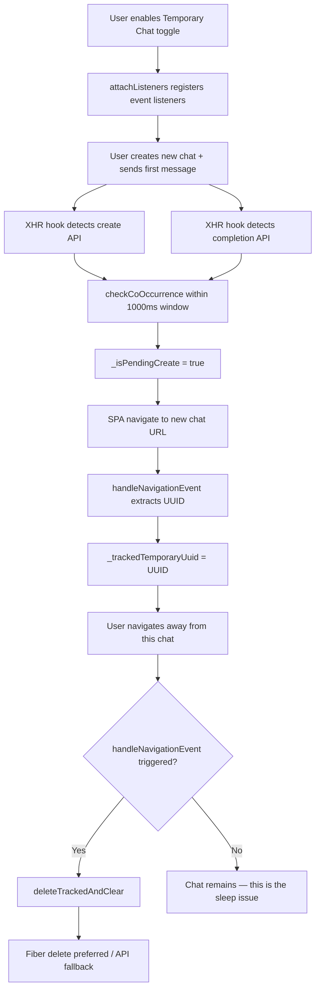
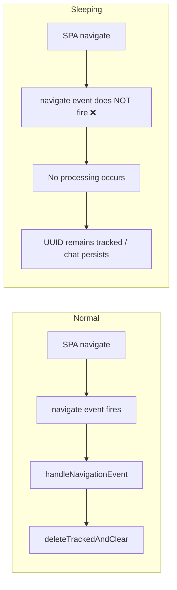
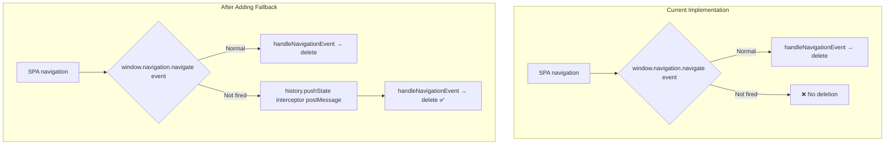

# Bug Report: Temporary Chat Auto-Delete Intermittently Fails ("Sleeping" Issue)

- **Report Date**: 2026-06-22
- **Component**: Temporary Chat
- **Severity**: Medium — intermittent functionality failure
- **Reproduction Rate**: Occasional (non-100%), appears after extended use

---

## Problem Description

When users enable the "Temporary Chat" feature, some temporary chats are not automatically deleted after leaving them, instead remaining in the sidebar.

**Key Behavioral Pattern:**
1. Works fine on first use (chats are correctly deleted)
2. After extended use, some chats are not deleted after leaving
3. After clicking "Try a new chat," old temporary chats may be deleted together
4. The issue recurs after a while

---

## System Architecture Overview

| Layer | Module | Responsibility |
|-|-|-|
| MAIN world (injected) | `censor-xhr-hook.js` | Intercepts XHR/fetch, detects create/completion APIs and posts messages |
| MAIN world (injected) | `temporary-chat-fiber-delete.js` | Receives delete requests, traverses React Fiber tree to call `onDeleteSession` |
| ISOLATED world (content script) | `temporary-chat-delete.js` | Core coordination: co-occurrence detection, UUID tracking, navigation listening, delete dispatch |
| ISOLATED world (content script) | `temporary-chat-delete-api.js` | API fetch deletion + retry logic + failure toast |
| ISOLATED world (content script) | `temporary-chat-toggle.js` | Toggle switch UI injection and storage sync |
| Service Worker | `service-worker.js` | Keepalive deletion fetch, pending retry queue, alarm retry |

---

## Lifecycle Flow



---

## Root Cause Analysis

### Primary Cause: Navigation API `navigate` event is unreliable

`temporary-chat-delete.js:388` uses `window.navigation.addEventListener('navigate', handleNavigationEvent)` as the **sole SPA navigation detection mechanism**.

`window.navigation` (Navigation API) was introduced in Chrome 105+, but in complex React SPAs (such as DeepSeek), **the `navigate` event intermittently stops firing after extensive SPA navigation**. This is a known Chrome implementation issue.

**Why this causes the "sleeping" behavior:**



**Key Problem:** SPA page transitions (`history.pushState`/`replaceState`) **do NOT trigger `beforeunload`**, so when the `navigate` event fails, **there is absolutely no fallback mechanism** to initiate deletion.

**Why creating a new chat may temporarily fix it:**
- Creating a new chat triggers DOM updates or React re-renders
- The Navigation API's internal state may be refreshed as a result
- `handleNavigationEvent` fires for this navigation
- However, `_trackedTemporaryUuid` still points to the "sleeping" old chat
- This causes the old chat to be deleted as well, making it appear "fixed"

---

### Secondary Issue: `_capturedAuthToken` Initialization Race Condition

In `temporary-chat-delete.js:418-428`:

```javascript
async function init() {
    // ...
    await initEnabledFlagFromStorage();  // ← async
    _trackedTemporaryUuid = loadTrackedUuid();
    if (_enabledFlagCache || _trackedTemporaryUuid) {
        attachListeners();  // ← handleAuthMessage registered here
    }
}
```

The auth token is passed via `window.postMessage({ type: 'DSS_AUTH_CAPTURED', authorization })` from the MAIN world. If the page's API request already sends the token during the `await` in `init()`, the postMessage **may be consumed before the listener is registered**, causing `_capturedAuthToken` to be `null` forever.

This causes `deleteTrackedAndClear:182` (`if (!_capturedAuthToken) return;`) to silently return, **neither deleting nor reporting an error**.

---

## Code Weakness Inventory

| Weakness | Location | Impact |
|-|-|-|
| `navigate` event is the sole SPA navigation detection | `temporary-chat-delete.js:388` | No fallback when event fails |
| `_isPendingCreate` has no timeout cleanup mechanism | `temporary-chat-delete.js:35` | State leak under extreme conditions |
| `_capturedAuthToken` depends on postMessage timing | `temporary-chat-delete.js:22` | Race condition on init may lose token |
| Fiber delete failure silently falls back to API | `temporary-chat-delete.js:209` | User unaware of deletion failure |
| `sessionStorage` has no cleanup mechanism | `temporary-chat-delete.js:55-78` | Reopening tab may load stale UUID |
| `detachListeners` may have timing issues after `handleToggleChanged` | `temporary-chat-delete.js:361-373` | Double firing from `chrome.storage.onChanged` and CustomEvent |

---

## Proposed Fixes

### Option A: Add `history.pushState`/`replaceState` Interception Fallback (Recommended)

Inject a `history.pushState` / `replaceState` interceptor in the MAIN world. When the URL changes, send a `postMessage` from the MAIN world to notify the ISOLATED world's `handleNavigationEvent`.



### Option B: Add Polling Mechanism for `_capturedAuthToken`

In `deleteTrackedAndClear`, if `_capturedAuthToken` is null, request the token from `chrome.storage.local` or via `chrome.runtime.sendMessage` to the background script, rather than returning immediately.

---

## Testing Strategy

| Test Type | Scope |
|-|-|
| Unit Tests | `history.pushState` interceptor message format and delivery |
| Unit Tests | `handleNavigationEvent` behavior consistency upon receiving fallback messages |
| Integration Tests | Simulate `window.navigation` missing or failing, verify fallback takes over |
| Manual Tests | Verify deletion still triggers after extended use |

---

## Related Files

| File | Description |
|-|-|
| `content/temporary-chat-delete.js` | Core coordination logic (problem location) |
| `content/temporary-chat-delete-api.js` | API deletion and retry |
| `content/temporary-chat-fiber-delete.js` | React Fiber tree deletion (MAIN world) |
| `content/censor-xhr-hook.js` | XHR/fetch interceptor (MAIN world) |
| `content/censor-reply-restore.js` | MAIN world script injection entry point |
| `background/service-worker.js` | Keepalive deletion and retry queue |
