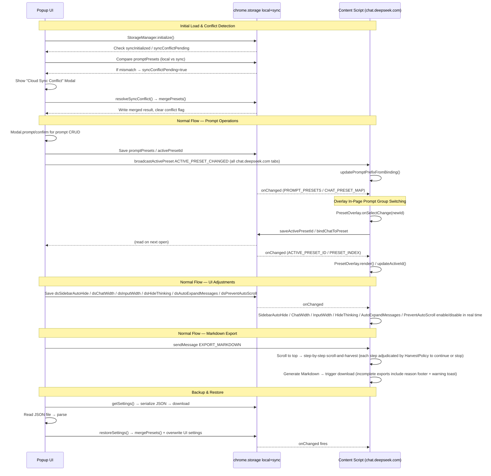

# Architecture

DS studio follows a standard Manifest V3 Chrome Extension architecture, focused on DOM interaction and content injection. The extension operates via content scripts injected into `chat.deepseek.com`, a popup UI, and a background service worker that handles periodic background tasks such as retrying failed temporary-chat deletions and cloud-sync scheduling.

## Directory Structure

```
ds-studio/
├── assets/icons/            ─  Extension icons (16px, 48px, 128px)
├── content/                 ─  Content scripts & web-accessible resources
│   ├── content-script.js    ─  Entry: event interception, init, prefix injection (v4.0.0 split)
│   ├── content-script.export.js       ─  Markdown export pipeline (HTML→MD, download)
│   ├── content-script.export.markdown.js ─  Export Markdown formatting bundle
│   ├── content-script.export.time.js  ─  Export timestamp formatting bundle
│   ├── ds-selectors.js      ─  Shared DOM selector constants for obfuscated DeepSeek class names
│   ├── feature-toggle.js    ─  Shared master-switch + per-feature toggle pipeline (registerFeatureToggle)
│   ├── retry-until.js       ─  Polling-until-ready utility (fixed-interval retry with cap)
│   ├── mobile-device.js     ─  Mobile device detection shared utility
│   ├── width-feature.js     ─  Shared factory for vw-percentage CSS injection width features
│   ├── main-world-injector.js ─  One-shot injector for all MAIN-world scripts from isolated world
│   ├── prompt-injector.controller.js ─  Prefix assembly, textarea injection, Enter & send-button interception
│   ├── prompt-injector.send-button.js ─  Send-button identification, enabled-state check, textarea resolution
│   ├── chat-binding-controller.js ─  Current-conversation ↔ preset binding state machine, SPA navigation detection
│   ├── edit-message-cleanup.pure.js   ─  Pure logic for edit-message wrapper stripping
│   ├── edit-message-cleanup.js        ─  Strip injected wrapper from edit textarea (v3.2.1)
│   ├── preset-overlay.controller.js ─  PresetOverlay lifecycle, mount/unmount, observer setup, placement writes
│   ├── preset-overlay.resolvers.js  ─  Semantic DOM resolvers for title & new-chat button
│   ├── preset-overlay.styles.js     ─  Overlay CSS inject/remove
│   ├── preset-viewport-sync.js      ─  ResizeObserver / window-resize / settle-loop wiring (v4.18.1)
│   ├── preset-id.resolver.js        ─  Pure resolveOverlayPresetId(input) — which preset id to display (v4.18.1)
│   ├── preset-dropdown.component.js ─  Custom `<select>`-like dropdown component
│   ├── preset-dropdown.position.js  ─  Pure computePlacement / pickNaturalWidth — no DOM access
│   ├── preset-dropdown.menu-position.js ─  Open-menu placement (v4.18.1)
│   ├── preset-dropdown.width.js     ─  Per-instance natural-width measurer with cache (v4.18.1)
│   ├── preset-dropdown.options.js   ─  Option rendering, label & aria-selected sync (v4.18.1)
│   ├── preset-dropdown.keyboard.js  ─  Keyboard navigation for the dropdown (v4.18.1)
│   ├── preset-settle.scheduler.js   ─  Bounded settle retry loop (mobile position race condition)
│   ├── sidebar-auto-hide.js         ─  Entry: sidebar idle collapse / hover expand
│   ├── sidebar-auto-hide.observers.js ─  MutationObserver / ResizeObserver wiring for sidebar auto-hide
│   ├── sidebar-auto-hide.styles.js  ─  CSS inject/remove for sidebar auto-hide
│   ├── temporary-chat-toggle.js     ─  Homepage toggle UI for temporary chat (v4.5.0)
│   ├── temporary-chat-toggle.css    ─  Temporary chat toggle styles
│   ├── temporary-chat-delete.js     ─  Entry: delete logic for temporary conversations (v4.5.0)
│   ├── temporary-chat-delete.tracking.js   ─  Shared state, UUID sessionStorage persistence, create+completion co-occurrence detection
│   ├── temporary-chat-delete.coordinator.js ─  Delete coordination (Fiber → API retry → SW alarm fallback)
│   ├── temporary-chat-delete.handlers.js    ─  Event handlers for temporary-chat deletion
│   ├── temporary-chat-delete-api.js ─  Delete API fetch wrapper for temporary chat
│   ├── temporary-chat-enabled-flag.js ─  Master-switch-independent temporary-chat enabled flag via settings pipeline
│   ├── temporary-chat-history-hook.js * ─  MAIN-world history navigation interception (v4.9.0)
│   ├── temporary-chat-fiber-delete.js * ─  React Fiber-based conversation deletion integration (web accessible)
│   ├── temporary-chat-heartbeat.js      ─  Lease heartbeat for the tracked temporary conversation (v4.31.1)
│   ├── temporary-chat-sidebar-hide.js   ─  Hides queued temporary conversations from the DeepSeek sidebar (v4.31.1)
│   ├── chat-width.js        ─  Conversation area width via CSS injection
│   ├── input-width.js       ─  Input box width (independent toggle & clamping)
│   ├── hide-thinking.js     ─  Auto-collapse thinking blocks via MutationObserver
│   ├── websearch-toggle.js  ─  One-shot per-activation default for web-search button (v4.13.0; language-independent two-tier locator v4.20.1)
│   ├── quote-reply.js       ─  Entry: floating "Quote Reply" button on text selection
│   ├── quote-reply.geometry.js ─  Selection geometry calculation bundle
│   ├── quote-reply.button.js   ─  Quote-reply button rendering bundle
│   ├── quote-reply.css      ─  Quote-reply button styles
│   ├── censor-reply-restore.js  ─  Entry: SSE intercept, observer, detection (v4.0.0 split)
│   ├── censor-reply-restore.keymap.js    ─  Key mapping for censor-reply-restore
│   ├── censor-reply-restore.markdown.js  ─  Markdown → HTML renderer bundle
│   ├── censor-reply-restore.dom.js       ─  DOM orchestration entry bundle
│   ├── censor-reply-restore.dom.extract.js ─  Fragment extraction from DOM
│   ├── censor-reply-restore.dom.resolve.js ─  DOM element resolution for restored content
│   ├── censor-reply-restore.dom.inject.js  ─  Restored-content DOM injection
│   ├── censor-reply-restore.dom.scan.js    ─  DOM scanning for censor events
│   ├── censor-reply-restore.thinkblock.js  ─  Think-block handling for restored content
│   ├── censor-reply-restore.detection.js   ─  Censor event detection logic
│   ├── censor-reply-restore.observer.js    ─  MutationObserver wiring for censor detection
│   ├── censor-reply-restore.storage.js     ─  Restored-message persistence bundle
│   ├── censor-reply-restore.css ─  Restored-content display styles
│   ├── harvest.js           ─  Entry: scroll-and-harvest full-conversation Markdown export
│   ├── harvest.toast.js     ─  Export progress / cancel / incomplete-warning toast UI (v4.11.9 split)
│   ├── harvest.policy.js    ─  Pure loop-termination & scroll-step decisions, DOM-free (v4.19.0 split)
│   ├── harvest.dom.js       ─  DOM probing: container lookup, message harvest, stability observer, mount measurement (v4.19.1 split)
│   ├── go-top.js            ─  Entry: "Go to Top" button lifecycle (v4.0.0 split)
│   ├── go-top.locate.js     ─  DOM query / locator / visibility orchestration bundle
│   ├── go-top.locate.scroll.js  ─  Scroll-container locator bundle
│   ├── go-top.locate.anchor.js  ─  Anchor-element locator bundle
│   ├── go-top.render.js     ─  Button render orchestration bundle
│   ├── go-top.render.button.js  ─  Button element creation bundle
│   ├── go-top.render.inject.js  ─  Button DOM injection bundle
│   ├── go-top.render.observer.js ─  Render-related observer bundle
│   ├── go-top.scroll.js     ─  scrollToTopAndWait animation engine bundle
│   ├── go-top.observers.js  ─  GoToTop observer setup bundle
│   ├── go-top.lifecycle.js  ─  GoToTop enable/disable lifecycle bundle
│   ├── mobile-sidebar-swipe.js ─  Entry: mobile right-swipe gesture for sidebar toggle
│   ├── mobile-sidebar-swipe.button.js    ─  Swipe-trigger button rendering
│   ├── mobile-sidebar-swipe.gesture.js   ─  Touch gesture recognition
│   ├── mobile-sidebar-swipe.bind.js      ─  Event binding for swipe gesture
│   ├── mobile-sidebar-swipe.lifecycle.js ─  Enable/disable lifecycle for mobile swipe
│   ├── mobile-homepage-cleanup.js ─  Mobile homepage DOM cleanup (v4.1.0)
│   ├── auto-expand-messages.js ─  MutationObserver-based auto-click of collapsed expand buttons (v4.32.0)
│   ├── auto-retry.js          ─  1s-interval auto-click of the retry button (v4.11.0)
│   ├── editor-window-autoclose.js ─  window focus → DSS_CLOSE_EDITOR_WINDOWS message, closing any open editor window (v4.29.0)
│   ├── go-top.css           ─  GoToTop & export-toast styles
│   ├── prevent-auto-scroll-bridge.js  ─  Isolated-world bridge for auto-scroll suppression (+ persistent mode, v4.12.0)
│   ├── preset-dropdown.css  ─  Overlay dropdown component styles
│   ├── sse-parser.js *      ─  SSE stream parser (web accessible)
│   ├── censor-xhr-hook.js * ─  XHR monkey-patch for SSE interception (web accessible)
│   └── prevent-auto-scroll.js *       ─  Main-world auto-scroll patch (web accessible)
├── background/                 ─  Service worker
│   ├── service-worker.js       ─  Background service worker: startup remediation, alarm-based retry, sync scheduling (v4.9.0)
│   ├── service-worker-constants.js ─  Service worker shared constants
│   ├── pending-store.js        ─  Pending-delete queue storage layer (importScripts only, not a content script)
│   ├── settings-routes.js      ─  DSS_GET_SETTINGS / DSS_SET_SETTINGS routes + DSS_SETTINGS_CHANGED broadcast to DeepSeek tabs
│   ├── pending-store-routes.js ─  DSS_TRACK_FOR_DELETION / DSS_REMOVE_PENDING_DELETE / DSS_REMOVE_OPEN_UUID / DSS_SET_LAST_AUTH_TOKEN routes
│   └── editor-window-routes.js ─  DSS_CLOSE_EDITOR_WINDOWS route: closes the tracked editor windows and clears their session keys (v4.29.0)
├── popup/                   ─  Extension action UI
│   ├── popup.html           ─  Two-column config UI (v3.0.0: header, presets, editor, etc.)
│   ├── popup.css            ─  Theme vars, layout grid, typography/inputs base (v4.0.0 split)
│   ├── popup-button.css     ─  Button component styles
│   ├── popup-card.css       ─  Card component styles
│   ├── popup-controls.css   ─  Switch, button, icon-button, range slider, toast styles
│   ├── popup-form.css       ─  Form element styles
│   ├── popup-layout.css     ─  Page layout styles
│   ├── popup-locale.css     ─  Locale switcher styles
│   ├── popup-modal.css      ─  Modal overlay styles
│   ├── popup-preset-controls.css ─  Preset control styles
│   ├── popup-select.css     ─  Custom select component styles
│   ├── popup-slider.css     ─  Slider component styles
│   ├── popup-status.css     ─  Status indicator styles
│   ├── popup-switch.css     ─  Switch toggle styles
│   ├── popup-theme.css      ─  Theme variable definitions
│   ├── popup-toast.css      ─  Toast notification styles
│   ├── popup.js             ─  Entry: UI init & inline event wiring (v4.0.0 split)
│   ├── popup.modal.js       ─  Modal + Toast components
│   ├── popup.toast.js       ─  Toast notification component
│   ├── popup.preset-manager.js  ─  Preset CRUD helpers (createPresetManager ctx factory)
│   ├── popup.pin-manager.js ─  Pinned default preset toggle / clear-on-delete (createPinManager ctx factory, v4.18.0)
│   ├── popup.backup-manager.js  ─  Backup / restore / sync UI (createBackupManager ctx factory)
│   ├── popup.live-sync.js   ─  chrome.storage.onChanged reactivity for the open popup (createLiveSyncListener ctx factory, v4.8.0)
│   ├── popup.toggles.js     ─  Feature-toggle change listeners, nine of them (createToggleManager ctx factory)
│   ├── popup.settings-view.js  ─  applySettingsToDom: one-way settings → control mapping, no storage access
│   ├── popup.preset-domain.js  ─  Pure preset rules: createPreset / validatePresetName (shared with the editor window)
│   ├── popup.i18n-apply.js     ─  data-i18n DOM applier (shared with the editor window)
│   ├── popup.editor-window.js  ─  Editor window lifecycle management
│   ├── popup.markdown-export.js ─  Markdown export trigger from popup
│   ├── popup.width-sliders.js  ─  Width slider UI controls
│   ├── popup.locale.js         ─  Language switcher UI (v4.3.3)
│   ├── custom-select.js        ─  Custom ARIA combobox component for preset selection (v1.9.0)
│   ├── custom-select.drag.js   ─  Pointer-Events drag-reorder subsystem: createDragReorder / reorderPresets
│   ├── preset-item-renderer.js ─  Preset list item rendering
│   └── editor/              ─  Standalone 1280×720 prompt editor (v3.0.0)
│       ├── editor.html      ─  Editor page markup
│       ├── editor.css       ─  Editor page styles
│       ├── editor.js        ─  Query-string target, auto-save, dirty-flag broadcast
│       ├── editor.parse.js  ─  Prompt text parsing bundle
│       ├── editor.render.js ─  Editor UI rendering bundle
│       └── editor.storage.js ─  Editor storage read/write bundle
├── utils/                   ─  Shared utilities loaded by both popup and content scripts
│   ├── storage-manager.js   ─  Entry: storage API, getSettings (v4.0.0 split; initialize() moved out in v4.7.3)
│   ├── storage-manager.keys.js          ─  Storage key names, defaults, error classes, pure helpers
│   ├── storage-manager.chunk-lock.js    ─  ChatPresetMap chunked read/write + cross-context advisory lock bundle (v4.11.3 merge of chunking.js + lock.js)
│   ├── storage-manager.rw.js            ─  Safe wrappers, sync/local dual-layer read/write logic
│   ├── storage-manager.sync.js          ─  Cloud sync / conflict / restore bundle, incl. syncNow() entry point (absorbed syncnow.js in v4.11.3)
│   ├── storage-manager.tombstone.js     ─  Deletion tombstone management bundle
│   ├── storage-manager.preset-merge.js  ─  Dual-side preset array merge logic bundle
│   ├── storage-manager.preset-recency.js ─  Preset recency determination, push guard, global prompt enabled resolution bundle
│   ├── storage-manager.presets.js       ─  Preset CRUD & chat-binding bundle, incl. deletion-tombstone merge/prune (absorbed tombstones.js in v4.11.3)
│   ├── storage-manager.chatmap.diff.js  ─  ChatPresetMap diff computation & application bundle
│   ├── storage-manager.chatmap.js       ─  ChatPresetMap chunk operations bundle (v4.6.2 split)
│   ├── storage-manager.local.js         ─  Local-only device settings bundle: isEnabled, legacy globalPromptEnabled fallback, restored_messages (v4.7.3 split)
│   ├── storage-manager.init.js          ─  initialize() & chunk-cache-invalidator bundle (v4.7.3 split)
│   ├── storage-manager.setters.js       ─  Single-key save<X> writer bundle: the 14 one-line setters split out of the entry file
│   ├── storage-manager.settings-read.js ─  Settings read bundle: allowlist-driven getSettings() + getActivePromptContent()
│   ├── settings-message-constants.js ─  DSS_SETTINGS_MSG: GET_SETTINGS / SET_SETTINGS / SETTINGS_CHANGED type constants
│   ├── editor-window-constants.js ─  DSS_EDITOR_WINDOW: DSS_CLOSE_EDITOR_WINDOWS type + the two editor-window session storage keys (v4.29.0)
│   ├── temporary-chat-constants.js ─  Shared constants for the temporary-chat feature, loaded by content scripts and the service worker (moved from content/ in v4.29.2)
│   ├── deepseek-api.js         ─  DSSDeepSeekApi.performDeleteFetch: the single chat_session/delete fetch, shared by the service worker and content delete flow (v4.29.2 merge)
│   ├── debounce.js             ─  The single trailing-edge debounce (globalThis.DSSDebounce)
│   ├── tab-control.js          ─  DeepSeek tab query / send helpers, incl. ACTIVE_PRESET_CHANGED broadcast (DSSTabControl)
│   ├── window-control.js       ─  openSingletonWindow: chrome.storage.session-backed single-window guarantee (DSSWindowControl)
│   ├── chat-session-id.js      ─  Conversation session ID extraction shared utility
│   ├── url-constants.js        ─  URL pattern matching constants
│   ├── i18n.js                 ─  Internationalization engine: setLocale / t / onLocaleChanged, DOM-free (v4.3.3)
│   ├── i18n.locales.zhTW.js    ─  zh_TW string dictionary, pure data
│   ├── i18n.locales.en.js      ─  en string dictionary, pure data
│   ├── i18n.locales.js         ─  Locale aggregator: imports and registers the per-language dictionaries (v4.11.14 split)
│   └── logger.js               ─  Diagnostic logger, .warn() only after v4.8.4 cleanup
└── test/                    ─  Unit tests (Vitest only)
    ├── vitest.config.js     ─  Vitest configuration
    ├── setup/               ─  Test setup and preload
    ├── unit/                ─  Unit test specs
    ├── fixtures/            ─  Test data fixtures
    └── helpers/             ─  Test helper utilities
```

> `*` = Marked entries are web_accessible_resources, injected into the page MAIN world, not subject to the content script's isolated world CSP restrictions.
>
> `†` = File is **not** in the `manifest.json` `content_scripts` list; loaded only by `background/service-worker.js` via `importScripts`, executing in the service worker context.

### Modular Load Order (v4.0.0)

Several large files were split into smaller modules using a **dual-load pattern** that works for both classic-script production loading and the Vitest test runner:

- **Bundle files** define a method group / helper and attach it to a global key (e.g., `globalThis.__DS_GoToTop_render`), guarded by `if (typeof module !== 'undefined' && module.exports)` for the test runner.
- **Entry files** (keeping the original filename) declare the state-bearing singleton, then run `Object.assign(Singleton, globalThis.__DS_* )` to merge the bundles before attaching to `window` / `module.exports`. Helpers that close over mutable state (`popup.preset-manager.js`, `popup.backup-manager.js`, and the overlay modules via `preset-overlay.controller.js`) use a `createX(ctx)` factory with live getter/setter callbacks instead.
- **Load order is mandatory**: every bundle MUST load before its entry file. Five loaders must stay in agreement: `manifest.json` (`content_scripts[0].js`), `popup/popup.html`, `popup/editor/editor.html`, `background/service-worker.js` (`importScripts`), and — replicated for tests via preload imports — `test/setup/vitest.setup.js`. `test/unit/storage-manager.loader-contract.spec.js` enforces this for the storage-manager bundle set automatically.
- Runtime behavior and public APIs are **unchanged**; the split is purely structural.

## Key Mechanisms

### Event Interception Strategy
DeepSeek's chat interface relies on a frontend framework (likely React) which tracks state internally rather than just reading from the DOM. To inject text, the content script must not only alter `textarea.value` but also dispatch a bubbling `input` event so the framework recognizes the change before it processes the final `Enter` keystroke or mouse click.

- **Keyboard interception**: Listens for `keydown` at capture phase. When `Enter` (without Shift) is detected on a textarea, the prefix is injected via the native HTMLTextAreaElement value setter (bypassing React's overridden setter), then an `input` event is dispatched. The original event is suppressed, and a programmatic `Enter` is re-dispatched inside a `requestAnimationFrame` callback to allow React state to commit.
- **Send button interception**: Listens for `pointerdown`, `mousedown`, and `click` at capture phase. The send button is identified by CSS class `div.ds-icon-button[role="button"]` (desktop) or `div.ds-button[role="button"]` (mobile), or by specific parent class selectors. After injection, the user's intended click is programmatically re-triggered via `requestAnimationFrame`.
- **Attachment-only sends (v4.21.1)**: `injectPrefix(textarea, isSendableWithoutText = false)` takes a second parameter so injection can proceed when the textarea is empty/whitespace-only but the message is still sendable (attachment or image only, no text). When `isSendableWithoutText` is true, the output contains the timestamp line (if the system-time toggle is on) plus the prompt-group / global-prompt prefix, deliberately omitting the `<user-input>` wrapper — there is no user text to wrap. Empty textarea with the flag false/omitted still returns false, and the extension-disabled early return still takes priority.
  - **Send-button-state signal**: whether "empty is still sendable" is derived from DeepSeek's own send button rather than any text heuristic. New helpers in `content/prompt-injector.controller.js`: `SEND_BUTTON_SELECTOR`, `isSendButtonCandidate`, `isSendButtonEnabled(button)` (disabled when the button carries `ds-button--disabled`, `aria-disabled="true"`, or a truthy `disabled` property), and `findSendButtonForTextarea(textarea)`. `ds-button--disabled` is a semantic BEM class rather than a build-hashed CSS-module class name, so it is preferred as a locator.
  - **Click path**: no longer bails out when the resolved textarea is empty — it now injects if the clicked send button is not disabled, keeping the existing `preventDefault` / `stopPropagation` / `requestAnimationFrame` synthetic re-click flow and the `isInjecting` re-entrancy guard unchanged.
  - **Textarea-resolution priority (click path, revised in the v4.21.1 follow-up fix)**: resolution is now a strict three-tier order, not a plain empty-textarea fallback:
    1. A **non-empty** textarea found while walking up the DOM from the clicked send button wins.
    2. Otherwise, the global `document.querySelector('textarea')` fallback is used when it is **non-empty** — this is the original, pre-feature behavior and is preserved unchanged.
    3. Only when no non-empty textarea exists anywhere is an **empty** textarea selected: the nearest one found during the walk-up takes priority, falling back to the global query's result otherwise. This tier is what serves the attachment-only send case.
  - **Enter-keydown path**: locates the send button for the active textarea via `findSendButtonForTextarea` and passes the resulting flag into `injectPrefix()`; no button found → flag is false, identical to pre-v4.21.1 behavior.
  - `markChatCreationAttempt()` also fires for an attachment-only send that actually got injected.

### Master Switch (`isEnabled`)

The `isEnabled` key acts as a master switch for all extension features:

- **Popup UI**: When the master toggle is turned off, `applyMasterSwitchUI()` disables all sub-controls (sidebar auto-hide checkbox, hide-thinking checkbox, system time toggle, chat width toggle + slider, input width toggle + slider) via `el.disabled = true`.
- **Content modules**: All modules (SidebarAutoHide, ChatWidth, InputWidth, HideThinking, AutoExpandMessages, WebSearchToggle, GoToTop, MobileSidebarSwipe) listen for `isEnabled` changes. When set to false, each module calls its `disable()` method. When set back to true, each module re-reads its own toggle from storage and enables if true. **Exception — WebSearchToggle (v4.17.0, revised in v4.17.1)**: its setting is a per-activation-event default rather than an enforced state. Turning the master switch back on IS an activation event and does re-apply the default exactly once, as is a change to `dsWebSearchToggle` itself. After each application the module releases control via its `_isSpent` flag, so the user's own manual toggling of the page button is never overridden until the next activation event.
- **System time injection**: When `isEnabled` is false, `isShowSystemTime` is ignored and no timestamp is prepended (`injectPrefix()` returns false before reaching the system-time logic).
- **Overlay preset selector**: The `PresetOverlay` module hides its wrapper (`display: none`) and removes injected CSS (`removeOverlayStyles()`) when `isEnabled` is false. When re-enabled, CSS is re-injected and the overlay is shown.
- **Prompt injection**: When `isEnabled` is false, `injectPrefix()` returns false immediately — no injection occurs.
- **Global prompt toggle subordination** (v3.0.0): The dedicated `globalPromptEnabled` toggle only takes effect when the master switch is on. With the master off, the global prompt is never injected regardless of the toggle; with the master on, `buildInjectionPrefix()` includes the global prompt only when `isGlobalPromptEnabled` is true. (v4.20.0) `isGlobalPromptEnabled` is no longer a straight mirror of one storage key — it is resolved per navigation from the active preset's own `globalPromptEnabled` field, falling back to the legacy device-level key when no preset is active. Subordination to the master switch is unchanged.

### WebSearch Toggle Locator (v4.20.1)

`content/websearch-toggle.js` locates the web-search button with a two-tier, language-independent locator — label text is deliberately not consulted, because the extension must work on every DeepSeek UI language:

- **Tier 1 — icon geometry**: the first candidate whose descendant `path[d]`, trimmed, starts with `M7.9995999336` (named constant `SEARCH_ICON_PATH_PREFIX`). Verified identical across zh-CN / zh-TW / en DOM snapshots and across toggle states. Candidates come from `.ds-toggle-button[aria-pressed]` plus the generic `[aria-pressed="true"], [aria-pressed="false"]` selector, merged and deduped — the icon check alone disambiguates against the deep-thinking toggle, so the generic selector is safe here.
- **Tier 2 — positional fallback**: the second `.ds-toggle-button[aria-pressed]` candidate (index 1; search sits after deep-thinking in the toggle group). Restricted to the toggle group — positional guessing among generic candidates is forbidden.
- **Total failure**: `null` plus exactly one `console.warn('[DSS] websearch-toggle: failed to locate the web-search button')`, so a future DeepSeek redesign is diagnosable from a user's console paste. No warning on success.

The two tiers have mutually exclusive failure modes (icon redesign vs. toolbar reorder); both would have to change in one release for the feature to fail. Recovery procedure: capture fresh `input-bar-*.html` DOM snapshots from the updated DeepSeek build and update the icon-path constant accordingly.

**Rejected signals — do NOT reintroduce:** label text (`智能搜索` / `智慧搜尋` / `Search`) — the original bug, and a multi-language keyword list is unbounded; hashed classes (`f79352dc`, `_58b31c9`, `_46d2264`, `_6dbc175`, `ec4f5d61`) — CSS-module build hashes that rotate on every DeepSeek redeploy; `clipPath id="__lottie_element_*"` — assigned sequentially by the lottie-web runtime at parse time, so it shifts if any other animation renders first.

### Overlay Settlement Mechanism (v4.2.2)

On mobile viewports (< 768 px), the preset-overlay dropdown is positioned in "gap mode" — centered between the chat title and the new-chat/share buttons. However, these buttons are rendered asynchronously by DeepSeek's framework during page load: their `getBoundingClientRect().left` starts at ~160 px (before sibling elements finish layout) and shifts right to ~189 px once settled. Since the button's border-box width (84 px) never changes, neither `ResizeObserver` (watching the container) nor `MutationObserver` fires when the button moves — the button's *position* changes without its *size* changing.

**Solution — bounded settle loop**: The `preset-settle.scheduler.js` module implements a generic settlement detection loop:

```
per-frame: apply(reposition) → measure(buttonRect.left) → compare(epsilon) → stop | schedule next
```

- **Triggered once at mount time** in `preset-overlay.controller.js` (`startSettle('initial-settle')`), called from `mountTo()` after all observers are set up.
- **Convergence**: When the measured metric stays within `epsilon` (0.5 px) for `stableK` (3) consecutive frames, the loop stops with reason `'converged'`.
- **Safety valve**: A `maxFrames` (30) hard limit prevents infinite loops. Stops with `'maxFrames'`.
- **Detach detection**: If `measure()` returns `null` after having returned a non-null value, the target element was removed mid-settle — stops with `'detached'`.
- **Cancellation**: `unmount()` calls `cancel()` on the handle; the `_cancelled` guard prevents any already-scheduled frames from executing.
- **Design**: Pure control logic — no DOM access. All interaction is injected via callbacks (`measure`, `apply`, `schedule`), keeping the module testable with a controlled frame queue.

### Temporary Chat Deletion Architecture (v4.9.0)

Temporary conversation deletion uses a two-layer architecture for reliability:

- **Layer 1 (real-time, content script)**: `beforeunload` calls `fetch(..., { keepalive: true })` directly. SPA navigation uses Fiber/API deletion.
- **Layer 2 (remediation, Service Worker)**: `chrome.runtime.onStartup`, the `dss-delete-retry` alarm, and the sync-area `chrome.storage.onChanged` listener each call `remediatePendingDeletes()`, which reads the shared pending-delete queue from `chrome.storage.sync` and retries every lease-expired entry with the device's own locally-cached auth token. The function takes no argument and applies the same lease gate on all three paths.
- **Cross-device source of truth**: The pending-delete queue (`dss-pending-deletes-sync`, containing `{ chatUuid, attemptCount, lastActiveAt }`) lives only in `chrome.storage.sync`. Any device signed into the same Chrome account can remediate any expired queue entry.
- **Privacy**: `authToken` (`dss-last-auth-token`) is stored in `chrome.storage.local` only — never synced.
- **Storage ownership sits in the service worker**: the content layer no longer loads `background/pending-store.js`; that file is absent from `manifest.json`'s `content_scripts` list and is pulled in only by `background/service-worker.js` via `importScripts`, so `TemporaryChatPendingStore` — and every `chrome.storage.*` call it makes — exists solely in the worker. Content modules request writes by message instead. The four request types are declared in `utils/temporary-chat-constants.js` (also re-exported on `DSS_TEMP_CHAT_CONSTANTS` and assigned onto `globalThis`):

| Message type | Payload | Effect in the service worker |
|-|-|-|
| `DSS_TRACK_FOR_DELETION` | `{ uuid }` | `trackForDeletion(uuid)` — enqueue for deletion and add to the local open-UUID set |
| `DSS_REMOVE_PENDING_DELETE` | `{ uuid }` | `removePendingDelete(uuid)` — drop from the cross-device queue |
| `DSS_REMOVE_OPEN_UUID` | `{ uuid }` | `removeOpenUuid(uuid)` — drop from the local open-UUID set |
| `DSS_SET_LAST_AUTH_TOKEN` | `{ token }` | `setLastAuthToken(token)` — refresh the local bearer-token cache |
| `DSS_HEARTBEAT` | `{ uuid }` | `refreshLease(uuid)` — stamp `lastActiveAt` with the current epoch ms |
| `DSS_RELEASE_LEASE` | `{ uuid }` | `releaseLease(uuid)` — zero `lastActiveAt` so any device may take the entry immediately |
| `DSS_GET_PENDING_UUIDS` | none | Replies with the uuids currently in the sync queue, used to seed a tab's sidebar-hide set |
| `DSS_PENDING_UUIDS_CHANGED` | `{ uuids }` | Pushed *to* tabs on every sync-queue change so their sidebar-hide set stays current |

  `background/pending-store-routes.js` owns this side. Its `install()` — called at service-worker top level so it survives worker restarts — registers one `chrome.runtime.onMessage` listener holding a `type` → store-operation table. Unknown types return `false` without responding, leaving the worker's other `onMessage` listeners free to handle them; known types return `true` and reply `{ ok: true }` or `{ ok: false, error }` once the awaited operation settles. Senders: `temporary-chat-delete.tracking.js` (track), `temporary-chat-delete.coordinator.js` (both removals), `temporary-chat-delete.handlers.js` (token).

#### Delete Lease & Heartbeat (v4.31.1)

Ownership of a queued conversation is expressed as a lease that lives in the synced queue itself, so every device sees it. `lastActiveAt` is an epoch-ms timestamp on the entry, and `utils/temporary-chat-constants.js` publishes the two knobs: `LEASE_TTL_MS = 600000` (10 minutes) and `HEARTBEAT_INTERVAL_MS = 60000` (1 minute). The TTL is deliberately generous — it has to absorb `chrome.storage.sync` propagation delay, background-tab timer throttling, and cross-device clock skew all at once.

- **`background/pending-store.js`** exposes `refreshLease(chatUuid)`, `releaseLease(chatUuid)` (which zeroes `lastActiveAt`), and the pure predicate `isLeaseExpired(entry, now)`. An entry counts as expired when `lastActiveAt` is not a finite number, or when `now - lastActiveAt > LEASE_TTL_MS`; a value exactly at the TTL is still live. Every read-modify-write over the sync queue runs through a promise-chain mutex, so messages arriving concurrently from several tabs cannot interleave their `get`/`set` pairs and lose an update.
- **`content/temporary-chat-heartbeat.js`** publishes `{ start, stop }`. While a tab is tracking a temporary conversation it sends `{ type: 'DSS_HEARTBEAT', uuid }` once immediately and then every `HEARTBEAT_INTERVAL_MS`. It starts from `trackUuid()` and from the restore-from-`sessionStorage` path, and stops when tracking ends or the listeners detach. Being bound to the content-script/tab lifecycle is the whole design: a crashed or force-killed tab simply stops renewing, and the lease expires on its own — no device identifier or liveness protocol is needed.
- **Fast-restart recovery**: on `chrome.runtime.onStartup` the worker first releases the lease of every locally-open uuid that is also queued, then clears the local open set, then runs remediation. A conversation this device had open at shutdown is therefore deleted immediately on the next start rather than waiting out the TTL.
- **Explicit release**: when the leave flow's immediate delete fails outright — the Fiber delete fails *and* the API fallback exhausts its retries — the coordinator sends `DSS_RELEASE_LEASE`, zeroing the lease so another device can take over instantly.

#### Sidebar Hiding of Queued Conversations (v4.31.1)

A conversation sitting in the pending-delete queue is hidden from the DeepSeek sidebar on every device, including the one that queued it and still has it open. That last part is a deliberate product decision: in a live chat, letting the sidebar navigate to a conversation that is being torn down is not useful.

- `background/service-worker.js` broadcasts the queue's uuids to all DeepSeek tabs on every sync-queue change. `content/temporary-chat-sidebar-hide.js` publishes `{ init, stop }` and is bootstrapped from `content/content-script.js`; it holds an in-memory uuid set seeded via `DSS_GET_PENDING_UUIDS` and refreshed by `DSS_PENDING_UUIDS_CHANGED` pushes.
- **Group-collapse rule**: the sidebar nests conversation anchors inside date-group containers, each holding a date label plus one or more row anchors. Evaluation is per container — if *every* anchor inside is queued, the container itself is hidden so the date label disappears with it; if at least one anchor is not queued, only the individual queued anchors are hidden. A single-anchor group whose one anchor is queued counts as fully queued.
- **Hiding mechanism**: the `ds-` prefixed class `ds-temp-chat-hidden` plus an injected `display: none !important` rule. Nodes stay in the page. Each application clears the class everywhere and re-derives it from the current set, so a group reappears — and an individual anchor unhides — as soon as its entry leaves the queue.
- A `MutationObserver` on the sidebar wrapper coalesces bursts into a single application per animation frame.
- **Selectors** live in `content/ds-selectors.js`: `SIDEBAR_DATE_GROUP_SELECTOR` (the obfuscated date-group container class) and `SIDEBAR_CHAT_LINK_SELECTOR` (anchors matched by their `/a/chat/s/` href). If a DeepSeek markup change breaks the group selector, the feature degrades to individual-anchor hiding, which locates anchors by href and is independent of obfuscated class names.

### Content Settings Access (content → background)

Content modules likewise stopped reading and writing settings storage themselves. `utils/settings-message-constants.js` publishes `globalThis.DSS_SETTINGS_MSG` with three types — `DSS_GET_SETTINGS`, `DSS_SET_SETTINGS`, `DSS_SETTINGS_CHANGED` — and both the content scripts and the service worker load that same file, so neither side hardcodes the strings.

- **`background/settings-routes.js`** installs the counterpart at worker top level. `DSS_GET_SETTINGS` takes `{ keys: string[] }`, reads them from `chrome.storage.local`, fills gaps from `StorageManager.DEFAULTS`, routes `dsWebSearchToggle` through the shared `normalizeWebsearchToggle()`, and replies `{ ok: true, values }`. `DSS_SET_SETTINGS` takes `{ values: object }` and writes it to `chrome.storage.local`. Both reject empty or malformed payloads with `{ ok: false, error }`.
- **Change broadcast**: the same `install()` registers `chrome.storage.onChanged` and forwards watched changes to every `*://chat.deepseek.com/*` tab as `{ type: DSS_SETTINGS_CHANGED, area, changes }`, preserving the original `changes` shape. Watched = any `StorageManager.KEYS` value in the `local` area, plus the extra local key `dss-temporary-chat-enabled`, plus anything under the `dsPreset_` / `chatPresetMap_` prefixes in either area. Per-tab send failures are swallowed so one unloaded tab cannot starve the rest.
- **`content/feature-toggle.js`** is the shared consumer. `registerFeatureToggle({ ownKey, onEnable, onDisable })` records a feature, asks background for `isEnabled` plus the feature's own key, and computes effective state as "master is not `false` AND own key is not `false`" — an unset key counts as on. All registered features share **one** `chrome.runtime.onMessage` listener, attached on first registration. Callbacks fire only on an actual state transition, and a throwing callback is caught so it cannot block the other features. A failed initial read pins `masterValue` to `false`, leaving the feature dormant rather than enabling it under unknown settings. The returned `unregister()` is idempotent. Current registrants with `ownKey: null` (master-switch-only) include `content/go-top.js` and `content/quote-reply.js`.
- **`content/temporary-chat-enabled-flag.js`** uses the same pipeline directly rather than through `registerFeatureToggle`, since its flag is independent of the master switch: `initFromStorage()` fetches `dss-temporary-chat-enabled` via `DSS_GET_SETTINGS`, `write()` persists via `DSS_SET_SETTINGS` (updating the in-memory cache first, so callers read the new value before the await resolves), and `startSync()` converges on `DSS_SETTINGS_CHANGED`. Only a boolean `true` counts as enabled; truthy strings such as `'true'` are coerced to disabled.

### Editor Window Auto-Close (v4.29.0)

The standalone prompt editor opens as its own OS window, so it can end up buried behind the DeepSeek tab the user just went back to. Returning focus to `chat.deepseek.com` is treated as "done editing" and closes it.

| Message type | Payload | Effect in the service worker |
|-|-|-|
| `DSS_CLOSE_EDITOR_WINDOWS` | none | Reads both editor-window ids from `chrome.storage.session`, `chrome.windows.remove()` each one that is present, removes the corresponding keys, and replies `{ ok: true }` |

- **`utils/editor-window-constants.js`** publishes `globalThis.DSS_EDITOR_WINDOW` with `CLOSE_MESSAGE_TYPE` (`'DSS_CLOSE_EDITOR_WINDOWS'`) and `STORAGE_KEYS` (`global: 'dss-editor-window-id-global'`, `preset: 'dss-editor-window-id-preset'`). It is a plain `globalThis` assignment rather than a top-level `const`, because a top-level `const` does not become a `globalThis` property. All three consumers — `content/editor-window-autoclose.js`, `background/editor-window-routes.js`, `popup/popup.editor-window.js` — read the same file, so the storage keys have one definition; each throws a named load-order error when the constants file is absent.
- **`content/editor-window-autoclose.js`** is the sender: a `focus` listener on `window` posts `{ type: CLOSE_MESSAGE_TYPE }` and swallows the rejection, since a sleeping service worker with no receiver is expected rather than exceptional. It forwards the event and nothing more — window removal and session-storage access both belong to the background layer.
- **`background/editor-window-routes.js`** owns that side. `DSSEditorWindowRoutes.install()` — called at service-worker top level so it survives worker restarts — registers one `chrome.runtime.onMessage` listener; unknown types return `false` without responding, leaving the worker's other listeners free to handle them. Each id is handled independently: a `chrome.windows.remove()` rejection (the user already closed that window) is logged via `console.error` and the storage key is removed in a `finally` regardless, so one stale id cannot leave the other tracked window open or its key behind.
- **No data loss**: the editor's own auto-save pipeline — 500 ms debounced on `input`, immediate flush on `blur` / `visibilitychange` / `pagehide` — writes dirty content before the window goes away, the same guarantee that already covered the `Esc` shortcut.

### Data Flow



## Module Reference Index

| Module | Coverage | Detailed Architecture Document |
|-|-|-|
| **Storage & State Management** | Storage schema, dual-storage, ChatPresetMap chunking, concurrency control, sync conflict | [→ architecture/STORAGE.md](architecture/STORAGE.md) |
| **Content Script Modules** | Sidebar auto-hide, chat/input width, SPA navigation, GoToTop, mobile sidebar swipe, quote reply, hide thinking, censor restore, etc. | [→ architecture/CONTENT_SCRIPTS.md](architecture/CONTENT_SCRIPTS.md) |
| **Popup & Editor** | Popup UI, custom dropdown component, modal system, standalone editor window | [→ architecture/POPUP.md](architecture/POPUP.md) |
| **Export Architecture** | Markdown export strategy, JSON backup & restore, harvest module | [→ architecture/EXPORT.md](architecture/EXPORT.md) |

## Related Documents

- Feature Specification: [SPEC.md](SPEC.md)
- Changelog: [CHANGELOG.md](CHANGELOG.md)
