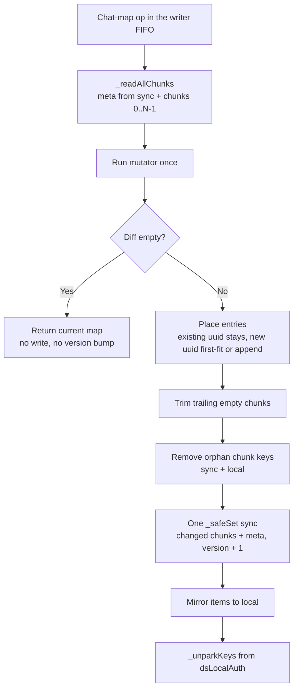
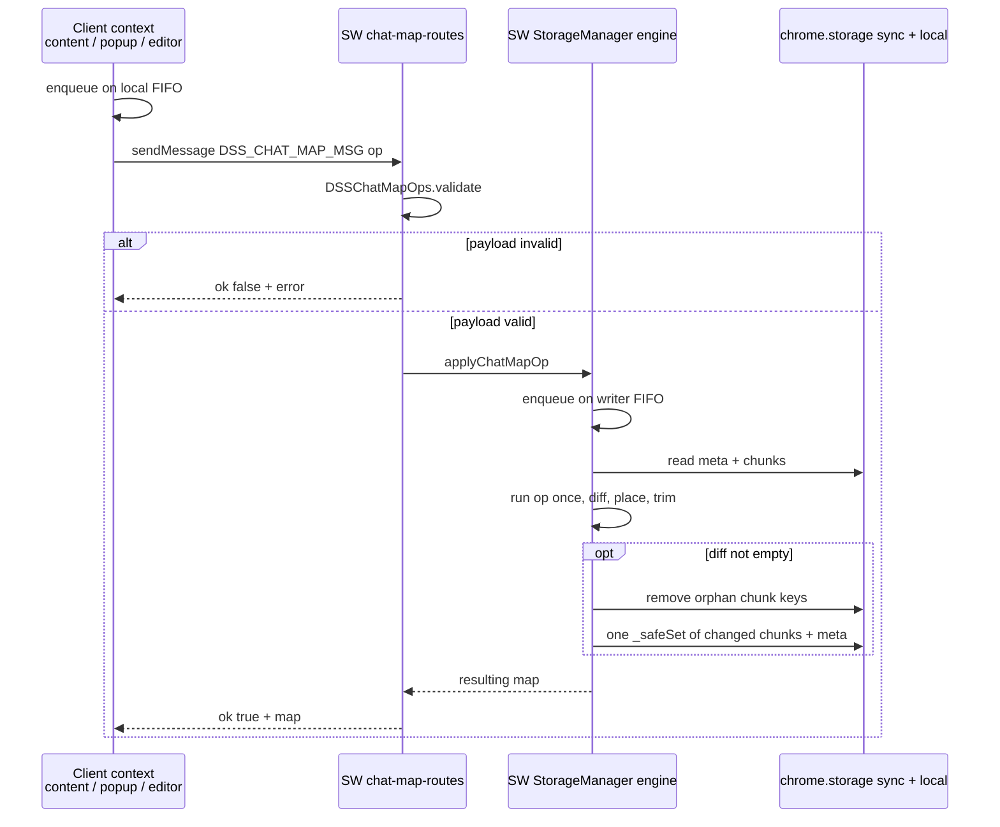

# Storage and State Management Architecture

> 📂 [DS studio Docs](../) › [Architecture](../ARCHITECTURE.md) › Storage and State Management
>
> **Related specs**: [Data Storage Spec](../spec/05-data-storage.md) · [Prompt System Spec](../spec/01-prompt-system.md)
>
> **Entry file and method bundles** (v4.0.0): `StorageManager` consists of an entry file `utils/storage-manager.js` plus multiple method bundles; the entry file merges the method bundles via `Object.assign` and exposes a single API. The landscape below is the authority for each bundle's current responsibilities.
>
> **Unified sync entry point** (v4.7.0): `StorageManager.syncNow()` (`utils/storage-manager.sync.js`) is called when the popup opens and when a `chat.deepseek.com` page loads; it calls `retrySync()` followed by `getSettings()`. When `_get()` determines that remote is newer, `_reconcileRemoteWins()` writes the winning value back to `chrome.storage.local` via `_safeSet('local', ...)`, so the returned value matches the persisted local state and the device does not read stale local residual values after reopening.
>
> **Local-only settings** (v4.7.3): `isEnabled`/`globalPromptEnabled` are local-only (see table below); their read/write methods live in `utils/storage-manager.local.js` (`saveEnabledState`/`getEnabledState`/`saveGlobalPromptEnabled`/`getGlobalPromptEnabled`/`getRestoredMessages`/`saveRestoredMessages`), and `initialize()` lives in `utils/storage-manager.init.js`.
>
> **Deletion tombstone mechanism** (v4.8.3): Tombstones keep a deleted prompt preset from resurrecting on cross-device sync. The tombstone bundle (`utils/storage-manager.tombstone.js`) provides `_mergeTombstones`/`_pruneTombstones` (30-day retention)/`_isTombstonedAway` and `recordPresetTombstones()`, with data stored under the `dsPresetTombstones` key (see table below). `savePromptPresets()` records tombstones (both local and sync) when deleting presets. `mergePresets()` takes an optional `tombstones` parameter: during merge, if an id has a `deleted: true` tombstone and its `updatedAt` on that side is not later than the tombstone's `ts`, that id is excluded and will not be resurrected; if the id has a later edit (`updatedAt` newer than the tombstone), it is kept. `resolveSyncConflict()` reads and merges tombstones from both sides before passing them to `mergePresets()`, and persists the merged tombstones back to both sides. In `_get()`, when `dsPresetIndex`/`dsPresetOrderMeta` on the sync side wins due to being newer, it is written back to `chrome.storage.local` the same way as `dsPreset_*`, so `retrySync()`/`resolveSyncConflict()` never read a stale local index containing deleted ids and resurrect them.
>
> **Tombstone entry shape** (v4.10.2): A tombstone entry is an object `{ ts: number, deleted: boolean }` (`dsPresetTombstones` type, see table below). `recordPresetTombstones()` (actual deletion) writes `{ ts, deleted: true }`; `clearPresetTombstones()` (JSON import restore) writes `{ ts, deleted: false }` and keeps the key — an absent key carries no timestamp for `_mergeTombstones()` to arbitrate with, so whichever side still holds a stale tombstone entry would win on the next merge and re-delete the just-restored preset. `_mergeTombstones()` compares by `entry.ts`, with the side having the newer `ts` winning entirely (including its `deleted` value), so "clear" and "delete" are two ordinary writes on the same timeline and the newer one always wins. `_isTombstonedAway()` checks `entry.deleted === true` (rather than key presence). `_pruneTombstones()` compares `entry.ts`, with both `deleted:true` and `deleted:false` states expiring under the same retention period (30 days). Legacy bare-number entries are normalized on read to `{ ts: <that number>, deleted: true }`, so they merge correctly with object-shaped entries.

> **Current method bundle landscape (read this before the rest of the document)**: The notes above describe each mechanism's behavior; the list below is the authority for current file locations.
>
> **There are seventeen method bundles** (load order: `keys`/`rw`/`sync`/`sync.retry`/`restore`/`tombstone`/`preset-merge`/`preset-recency`/`presets`/`chatmap.diff`/`chatmap.ops`/`chatmap`/`chatmap.client`/`local`/`init`/`setters`/`settings-read`):
> - `keys`: Storage key names (`KEYS`), defaults (`DEFAULTS`), error classes (`errors.ChatMapDispatchError`), and pure helper functions (`_buildNextMeta`).
> - `rw`: `chrome.storage` safe read/write wrappers (`_safeGet`/`_safeSet`/`_safeRemove`) and dual-layer sync/local reading (`_get`, including `_reconcileRemoteWins`, which writes remote winners back to local), writing (`_set`), byte-length calculation (`_byteLen`).
> - `sync`: Sync conflict detection and resolution (`_detectSyncConflict`/`checkSyncConflictPending`/`resolveSyncConflict`), sync status queries (`isSyncedWithCloud`/`hasOversizedItems`), and the unified entry point `syncNow`.
> - `sync.retry`: `retrySync()`, which re-pushes keys parked in `dsLocalAuth` through per-key guards; parked chat-map keys are combined into one `REPUBLISH_PARKED` op for the service worker (`_republishParkedChatMapKeys`).
> - `restore`: Backup restore logic (`restoreSettings`); an imported `chatPresetMap` is merged by the service worker via `mergeChatPresetBindings()`.
> - `tombstone`: Prompt preset deletion tombstone management (`_mergeTombstones`/`_pruneTombstones`/`_isTombstonedAway`/`recordPresetTombstones`/`clearPresetTombstones`, `TOMBSTONE_RETENTION_MS`).
> - `preset-merge`: Map-based merge logic for dual-side preset arrays (`mergePresets`), including order metadata decisions and tombstone filtering.
> - `preset-recency`: Preset recency determination (`_pickPresetOrderByRecency`/`_pickNewerPreset`), `retrySync` push guard helpers, `resolveGlobalPromptEnabled()`.
> - `presets`: Prompt CRUD (`savePromptPresets`/`saveOnePromptPreset`).
> - `chatmap.diff`: Pure chatPresetMap diff computation and chunk placement (`_computeChatPresetMapDiff`/`_applyChatPresetMapDiff`), defines `CHUNK_SOFT_LIMIT_BYTES` (7168).
> - `chatmap.ops`: `DSSChatMapOps`, pure validation (`validate`) and map transformation (`apply`) for `DSS_CHAT_MAP_MSG` ops, with no `chrome.*` access.
> - `chatmap`: The single-writer engine — `applyChatMapOp`/`mutateChatPresetMap` (writer only), `_runChatMapMutation` (chunked commit), `_readAllChunks`, `_migrateLegacyTask`/`_republishParkedTask`, plus `getChatPresetMap`, callable from every context.
> - `chatmap.client`: The public binding API (`bindChatToPreset`/`unbindChat`/`unbindChatsForPresets`/`mergeChatPresetBindings`/`pruneOrphanChatBindings`/`migrateLegacyChatPresetMap`), the mode-aware `_dispatchChatMapOp` (the writer calls the engine directly; other contexts send to the service worker via `chrome.runtime.sendMessage`), and `_isChatMapKey`.
> - `local`: Local-only settings (`saveEnabledState`/`getEnabledState`/`saveGlobalPromptEnabled`/`getGlobalPromptEnabled`/`getRestoredMessages`/`saveRestoredMessages`).
> - `init`: `initialize()` — default filling, `promptPresets` migration, first-sync conflict detection, and dispatch of the legacy chatPresetMap migration (`migrateLegacyChatPresetMap`) and orphan-binding prune (`pruneOrphanChatBindings`).
> - `setters`: 15 single-key `save<X>` one-liner setters (`saveActivePresetId`/`savePinnedPresetId`/`saveIncludeThinking`/`saveIncludeReferences`/`saveGlobalDefaultPrompt`/`saveSidebarAutoHide`/`saveHideThinking`/`saveAutoExpandMessages`/`savePreventAutoScroll`/`saveWebsearchToggle`/`saveShowSystemTime`/`saveChatWidth`/`saveChatWidthEnabled`/`saveInputWidth`/`saveInputWidthEnabled`). Note that `saveEnabledState`/`saveGlobalPromptEnabled` are local-only settings and live in `local`.
> - `settings-read`: The entire settings read path — allowlist constants `SYNCED_SETTINGS_KEYS` (18 synced keys) and `LOCAL_ONLY_SETTINGS_KEYS` (`isEnabled`/`globalPromptEnabled`, two local keys), plus `getSettings()` and `getActivePromptContent()`. **The allowlist is the sole inclusion criterion** — `KEYS` members not listed (sync retry bookkeeping, chunk layout metadata, key-prefix constants, etc.) are treated as internal details and must not appear in the `getSettings()` return object. `getSettings()` therefore returns a fixed 22 fields: 18 synced keys + 2 local keys + runtime-composed `promptPresets` and `chatPresetMap`.
>
> **Entry file `utils/storage-manager.js`**: declares the `StorageManager` object, holding the chat-map writer flag (`_isChatMapWriter`/`enableChatMapWriterMode()`), the per-context FIFO queue (`_chatPresetMapChainTail`/`_enqueueChatPresetMapWrite`), `normalizeWebsearchToggle`, and `subscribeToSettingChanges`, and merges the bundles above via `Object.assign`.
>
> **Load-order invariant (five loaders; a missing bundle means missing methods)**: `manifest.json`'s `content_scripts`, `popup/popup.html`, `popup/editor/editor.html`, `background/service-worker.js`'s `importScripts`, `test/setup/vitest.setup.js`. All seventeen method bundles must be placed before the entry file `utils/storage-manager.js`, and `chatmap.diff` must precede `chatmap` (the latter reads the diff bundle at load time). `DSS_CHAT_MAP_MSG` (`utils/message-constants.js`) is resolved at call time. The service worker additionally loads `background/chat-map-routes.js` via `importScripts` and calls `DSSChatMapRoutes.install({ storageManager: StorageManager })` at top level.
>
> The v4.11.x audit slimdown also fixed a latent production defect: `background/service-worker.js`'s `importScripts` had never loaded the tombstone bundle `storage-manager.tombstone.js`, but `resolveSyncConflict()` calls `_mergeTombstones()`, so background sync retry (`onStartup`/`onInstalled`/alarm) had been silently failing whenever conflicts were auto-resolvable — the error was swallowed by a `catch` annotated "best-effort, swallow everything". See `docs/changelog/v4.md` (4.11.3) and `docs/architecture/POPUP.md`'s "Load-order invariant" section.

## State Management

User settings and prompt presets are managed across `chrome.storage.sync` (primary) and `chrome.storage.local` (fallback + local-authoritative tracking).

| Key | Type | Default | Description |
|-|-|-|-|
| `dsPresetIndex` | `string[]` | `[]` | Ordered array of prompt preset IDs. |
| `dsPreset_<id>` | `PromptPreset` | — | Individual prompt preset object, stored under its own key to bypass the 8KB per-item sync limit. Shape: `{ id, name, content, createdAt, updatedAt, globalPromptEnabled }`. (v4.20.0) `globalPromptEnabled` is the preset's own global-prompt injection toggle — written explicitly as `true` on creation, treated as `true` when the field is absent on pre-v4.20.0 data, and synced across devices with the preset itself. |
| `activePresetId` | string | `""` | The ID of the currently active preset. |
| `pinnedPresetId` | string | `""` | (v4.18.0) The ID of the preset pinned as the default; `""` means no default. A single scalar, so uniqueness is structural — two presets can never be pinned at once. Read only when a NEW conversation is opened (no chat id in the URL) to preselect that preset; existing conversations are never touched. Written via `savePinnedPresetId()`, which shares `saveActivePresetId()`'s `_set` path (sync primary, local fallback), and included in both backup export and import. |
| `isEnabled` | boolean | `false` | Whether prompt injection is active (master switch). (v4.7.3) Local-only, device-scoped — excluded from sync, `resolveSyncConflict()`, and `restoreSettings()` import. |
| `includeThinking` | boolean | `true` | Include AI thinking process in exported MD. |
| `includeReferences` | boolean | `true` | Include citation reference links in exported MD. |
| `globalDefaultPrompt` | string | `''` | A global prompt prepended before the per-preset prompt in every conversation. |
| `globalPromptEnabled` | boolean | `true` | Whether the global prompt is injected (v3.0.0). Subordinate to the master switch — when `isEnabled` is false, the global prompt is never injected regardless of this flag. (v4.7.3) Local-only, device-scoped, same exclusions as `isEnabled` — note `globalDefaultPrompt` (the prompt *content*) still syncs normally; only this toggle is local-only. (v4.20.0) Demoted to a **legacy fallback**: it is consulted only when there is no active preset. When a preset IS active, that preset's own `globalPromptEnabled` field wins. Resolution is centralized in `StorageManager.resolveGlobalPromptEnabled(activePreset, legacyGlobalFlag)`. |
| `chatPresetMap` | object | `{}` | Maps chat UUIDs (`/a/chat/s/{uuid}`) to preset IDs, enabling per-conversation preset binding. *Replaced in v2.4.0 by chunked keys (see Physical Chunking section).* |
| `chatPresetMapMeta` | `{ version, chunkCount, chunkSizes[] }` | `{ version:0, chunkCount:0, chunkSizes:[] }` | Index key for chunk discovery and write-target selection (v2.4.0+). Written only by the service worker (see *Service-Worker Single Writer*). |
| `chatPresetMap_0`, `chatPresetMap_1`, ... | `{ [uuid]: presetId }` | — | Physical chunks, each <= 7KB, holding a subset of the chatPresetMap entries (v2.4.0+). Written only by the service worker (see *Service-Worker Single Writer*). |
| `dsSidebarAutoHide` | boolean | `false` | Whether the sidebar auto-hide feature is enabled. |
| `dsHideThinking` | boolean | `false` | Whether the hide-thinking-process feature is enabled. |
| `dsAutoExpandMessages` | boolean | `false` | (v4.32.0) Whether auto-expand-messages is active. When true, a MutationObserver auto-clicks collapsed expand buttons so all messages are shown expanded. Gated by the master switch. |
| `dsPreventAutoScroll` | boolean | `false` | (v4.12.0) Whether anti-scroll-back protection is permanently active. When true, `PreventAutoScroll` suppresses downward auto-scroll at all times instead of only during go-top and Markdown export. Gated by the master switch. |
| `dsShowSystemTime` | boolean | `false` | Whether system time injection before user messages is active (added in v2.7.0). |
| `dsWebSearchToggle` | string | `'on'` | (v4.13.0; reduced to two states in v4.17.0) Page-entry default for the web-search toggle: `'on'` starts the page's smart-search button at `aria-pressed="true"`, `'off'` starts it at `"false"`. Applied at most once per activation event — page entry, a change to this key, or the master switch turning on (v4.17.1) — after which the user's later manual toggling is preserved until the next activation event. Clicks only on state mismatch. The removed `'default'` value is normalized to `'on'` on read (never written back). Gated by the master switch. |
| `dsChatWidth` | number | `70` | Chat width percentage (30–100). |
| `dsChatWidthEnabled` | boolean | `false` | Whether the chat width adjustment is active. |
| `dsInputWidth` | number | `70` | Input width percentage (30–100). |
| `dsInputWidthEnabled` | boolean | `false` | Whether the input width adjustment is active. |
| `syncInitialized` | boolean | `false` | Whether initial sync has been performed (local-only). |
| `syncConflictPending` | boolean | `false` | Whether a sync conflict needs user resolution (local-only). |
| `restored_messages` | object | `{}` | Stores censor-restored messages keyed by message ID (local-only, excluded from sync). |
| `dss-temporary-chat-enabled` | boolean | `false` | Whether temporary-conversation mode is on. Local-only, device-scoped, and outside `StorageManager.KEYS` — it is read/written by `content/temporary-chat-enabled-flag.js` purely through `DSS_GET_SETTINGS`/`DSS_SET_SETTINGS`, and is listed in `background/settings-routes.js`'s `EXTRA_WATCHED_LOCAL_KEYS` so its changes still broadcast as `DSS_SETTINGS_CHANGED`. Strict boolean: only `true` counts as on. The UUID of the conversation currently being tracked for deletion lives in per-tab `sessionStorage` (owned by `content/temporary-chat-delete.tracking.js`), never in `chrome.storage`. |
| `dsLocalAuth` | `string[]` | `[]` | (v4.7.2) Pending-retry queue of keys whose sync write failed and fell back to local. `_get()` ignores it; `retrySync()` drains it. (v4.11.18) `retrySync()` drains it through a **per-key push guard**, not an unconditional re-push — see *Sync Write Quota Strategy* below. (v4.8.2) Never contains a permanently-oversized key — those are filtered out by the 8KB guard before reaching this queue. |
| `dsOversizedKeys` | `string[]` | `[]` | (v4.8.2) Local-only tracking list of keys whose serialized value exceeds `QUOTA_BYTES_PER_ITEM` (8192 bytes) and can therefore never sync. Self-healing: a key is removed the next time it's written at a size at or under the limit. |
| `dsPresetTombstones` | `Object<id, { ts: number, deleted: boolean }>` | `{}` | (v4.8.3) Deletion tombstone map for prompt presets, synced to both `local` and `sync`. Consulted by `mergePresets()` so a preset deleted on one device is not resurrected by a stale copy still present on another device during conflict-resolution merge. Merged (keeping the entry with the newer `ts` per id) and pruned (30-day retention) inside `resolveSyncConflict()`. (v4.10.1) `restoreSettings()` calls `clearPresetTombstones(ids)` after a JSON import to remove entries for re-imported preset IDs, so a stale tombstone can't cause the next sync to delete the just-restored preset again. (v4.10.2) Entry shape changed from a bare `deletedAt` number to `{ ts, deleted }` — `recordPresetTombstones()` writes `{ ts: now, deleted: true }`; `clearPresetTombstones()` now writes `{ ts: now, deleted: false }` instead of deleting the key, so a "clear" has a timestamp to win merge arbitration against a stale "delete" from the other side. `_isTombstonedAway()` checks `entry.deleted === true`. Legacy bare-number entries are normalized to `{ ts: <that number>, deleted: true }` on read for backward compatibility. (v4.11.18) The key is also merged outside `resolveSyncConflict()`: when it is in `dsLocalAuth`, `retrySync()` merges it per-id via `_mergeTombstones()` before pushing rather than pushing the local value wholesale, because a wholesale push would silently resurrect whatever the other device had deleted, and an empty local set would wipe the cloud set entirely. |
| `dsPresetOrderMeta` | `{ order: string[], orderUpdatedAt: number }` | `{ order:[], orderUpdatedAt:0 }` | (v4.6.2) Recency timestamp for preset ordering. **Three independent consumers, each with its own rule** — do not assume they share one code path:<br>**Read path** — `_pickPresetOrderByRecency()` (`utils/storage-manager.presets.js:269`, called from `_get()` at `utils/storage-manager.js:315`, *not* from conflict resolution) picks the side with the strictly larger `orderUpdatedAt`; on an exact tie it returns `null` and `_get()`'s `{ ...lData, ...sData }` spread leaves sync's value in place.<br>**Merge path** — `mergePresets()` has its own order-selection block (`utils/storage-manager.presets.js:188-193`) that never calls `_pickPresetOrderByRecency()`. (v4.11.19) Local's `order` is used only when `baseTs > incTs`; every other case, **including an exact tie, uses the cloud side's `order`** (cloud-wins-on-tie). Falling back to the merged Map's insertion order on a tie would float locally-cached presets to the front and discard the stored order.<br>**Push path** — (v4.11.18) `retrySync()` pushes this key only when local's `orderUpdatedAt >= ` cloud's, via its own `key === dsPresetOrderMeta` guard branch — `'dsPresetOrderMeta'.startsWith('dsPreset_')` is `false`, so the `dsPreset_<id>` prefix guard does not cover it. |
| `promptPresets` | `PromptPreset[]` | — | *Retired as a storage key in v1.7.0*: Replaced by `dsPresetIndex` + `dsPreset_<id>` per-key format. Still composed as a runtime property in `getSettings()` return value. |

### PromptPreset Interface

```typescript
interface PromptPreset {
  id: string;
  name: string;
  content: string;
  createdAt: number;
  updatedAt: number;
  globalPromptEnabled?: boolean;  // v4.20.0 — absent means true
}
```

`globalPromptEnabled` (v4.20.0) makes the global-prompt injection toggle a per-preset property. New presets are created with it explicitly set to `true`; a preset without the field is treated as `true`. Because it lives on the preset, it syncs and merges with the preset — unlike the same-named device-level key, which is local-only and serves only as the fallback for "no active preset". The resolution rule is centralized in `resolveGlobalPromptEnabled()` (`utils/storage-manager.preset-recency.js`) so the popup and the content script cannot drift apart:

```javascript
resolveGlobalPromptEnabled(activePreset, legacyGlobalFlag) {
    if (!activePreset) return legacyGlobalFlag;
    return activePreset.globalPromptEnabled ?? true;
}
```

### Dual-Storage Architecture

`StorageManager` uses a dual-storage strategy with per-preset key isolation and local-authoritative tracking:

- **Per-Preset Key Isolation**: To bypass the `QUOTA_BYTES_PER_ITEM` (8KB) limit of `chrome.storage.sync`, each prompt preset is stored under its own key (`dsPreset_<id>`). An index key (`dsPresetIndex`) maintains the order and list of active presets.
- **Read path** (`_get()`): Attempts `chrome.storage.sync.get()` first, then `chrome.storage.local.get()`. Sync data overrides local data by default; `dsPreset_*` keys and the preset order meta are reconciled per-item via pure `updatedAt` recency (`_pickNewerPreset` / `_pickPresetOrderByRecency`) regardless of write-failure history. During a pending conflict (`syncConflictPending === true`), it strictly returns local data. (v4.7.1) When the remote/sync side wins the per-item recency comparison, the winning value is also persisted back to `chrome.storage.local` via `_safeSet('local', ...)` — not just returned in-memory — so a stale local copy doesn't linger after a `syncNow()` pass. (v4.7.2) `_get()` ignores `dsLocalAuth`: a parked key's local value never overrides a newer sync value on read, since such a "pin-on-read" override would let a stale local edit that once failed to sync permanently shadow genuinely newer cloud data. `dsLocalAuth` is exclusively a write-failure retry queue, drained by `retrySync()`.
- **Remote-wins write-back** (`_reconcileRemoteWins()`): compares the local and sync `dsPreset_*` values by content (`JSON.stringify`), not by object reference, so a remote winner whose content already matches local triggers no write-back.
- **Write path** (`_set()`): (v4.8.2) Before attempting anything, splits the incoming `items` batch per-key by serialized byte size (`_byteLen()`, now `new TextEncoder().encode(JSON.stringify(obj)).length` — UTF-8-accurate, fixing an earlier undercount of multi-byte content like Chinese text that used raw JS string `.length`). Keys whose `{ [key]: value }` payload exceeds `QUOTA_BYTES_PER_ITEM` (8192 bytes) are diverted before the sync call: they are written to `chrome.storage.local` only (value never lost) and tracked in `dsOversizedKeys`, but are excluded from `dsLocalAuth` and never passed to `chrome.storage.sync.set()` — retrying an inherently-oversized payload can never succeed, so it must not enter the transient-retry queue (see report.md §4.2). The list is self-healing: a key already in `dsOversizedKeys` is removed on any subsequent write where it's at or under the limit. The remaining (normal-sized) keys proceed through `chrome.storage.sync.set()` exactly as before:
  - **On Success**: The keys are removed from `dsLocalAuth` in local storage, and a backup is written to local.
  - **On Failure** (e.g., quota exceeded): The keys are added to `dsLocalAuth` in local storage, and the data is written to local storage. This ensures the extension remains functional even when sync limits are reached.
- **`hasOversizedItems()`** (`utils/storage-manager.sync.js`, v4.8.2): Reads `dsOversizedKeys` and returns `true` iff the array is non-empty. `popup.js`'s `refreshSyncStatus()` checks this alongside `isSyncedWithCloud()` and shows a distinct "Too Large — Local Only" status (`dsI18n.t('syncStatusOversized')`, `.unsynced` styling) that takes precedence over the normal synced/unsynced text — so a permanently-unsyncable item is never confused with a normal transient-pending state.

### ChatPresetMap Write Queue (v2.3.0)

`StorageManager` serializes chatPresetMap work inside one JS context through an **in-memory promise-chain FIFO queue** defined on the `StorageManager` object in `utils/storage-manager.js`:

- `_chatPresetMapChainTail` (`Promise.resolve()`) — the tail of the promise chain.
- `_enqueueChatPresetMapWrite(taskFn)` — appends `taskFn` to the chain; returns a promise for the task's result. One task's rejection does NOT block subsequent tasks (`.catch(() => {})` on the tail only).

The queue plays two roles depending on the context:

- **Service worker (writer)**: every chat-map operation — each `DSS_CHAT_MAP_MSG` op, `mutateChatPresetMap`, legacy migration, parked-key republish, and `getChatPresetMap` — runs through this one FIFO, so ops from all tabs, the popup, and the editor apply strictly one after another. Writer-side dispatch calls the engine directly rather than wrapping it in a second queue task, because the engine enqueues itself and an outer task would wait on itself.
- **Clients (content script, popup, editor)**: `_dispatchChatMapOp` enqueues the `chrome.runtime.sendMessage` round-trip, and `getChatPresetMap()` runs through the same local queue, so a read in that context observes the context's own earlier writes.

`mutateChatPresetMap(mutator)` is writer-only and throws in any other context. The mutator runs exactly once against a fresh snapshot; it may mutate `map` in place (return `undefined`) or return a new map. Callers outside the service worker use the declarative binding API described in *Service-Worker Single Writer* below.

### ChatPresetMap Physical Chunking (v2.4.0)

To bypass Chrome's 8KB per-item sync quota (which `chatPresetMap` reached at ~170 UUID bindings), the map is split across N physical storage keys, each <= 7KB, with a small meta index key for discovery.

**Data model:**

| Key | Shape | Purpose |
|-|-|-|
| `chatPresetMapMeta` | `{ version, chunkCount, chunkSizes[] }` | Index for discovery + commit counter (`version`) |
| `chatPresetMap_0..N-1` | `{ [uuid]: presetId }` | Physical chunks, each <= `CHUNK_SOFT_LIMIT_BYTES` (7168) |

**Invariants:**
- A uuid appears in **at most one** chunk.
- `chunkCount >= 0`. When 0, the logical map is empty and no `chatPresetMap_*` keys exist.
- `chunkSizes[i] = this._byteLen(chunk_i)` (UTF-8 byte accurate via TextEncoder, see Dual-Storage Architecture section for `_byteLen()` details).
- The empty map `{}` has JSON.stringify length 2.
- `version` is strictly monotonic: `_buildNextMeta()` increments it by exactly 1 on every committed write. No-op operations (same-value bind, unknown-uuid unbind, empty diff) write nothing and do not bump version.

**Fresh snapshot per operation:** Each operation starts from `_readAllChunks()`, which reads `chatPresetMapMeta` from `chrome.storage.sync`, then chunks `0..chunkCount-1` through `_get()`; a chunk the meta declares but storage lacks reads as `{}` and is rewritten on the next commit. The engine holds no in-memory index or meta cache.

**Placement (`_applyChatPresetMapDiff` in `utils/storage-manager.chatmap.diff.js`):** `_computeChatPresetMapDiff()` runs the mutator once and classifies uuids as deleted, changed, or added.

- Deleted uuids are deleted from every chunk that holds them.
- Changed uuids are updated in place in the chunk that already holds them — an existing uuid never moves.
- Added uuids go into the first chunk where `_byteLen(chunk) + entrySize < 7168`, measured from the chunk's actual content; when no chunk has room, a new chunk is appended.

**Write flow (`_runChatMapMutation`, inside the writer queue):**

1. Read the snapshot, run the mutator once, compute the diff. An empty diff returns the current map with no write.
2. Trim trailing empty chunks and set `chunkCount` / `chunkSizes` to match.
3. Remove orphan chunk keys (indices at or beyond the new `chunkCount`) from sync and local **first**, so a reader holding either the old or the new meta never reads a deleted binding.
4. Write the changed chunks plus meta (and any chunk the old meta declared but storage lacked) in **one** `_safeSet('sync', items)`, then mirror the same items to local. A sync failure such as quota exhaustion throws — the writer never falls back to local, so a caller never sees success for a commit that did not reach sync.
5. `_unparkKeys()` removes the committed keys from `dsLocalAuth`.

So `BIND` of an existing uuid rewrites only its chunk plus meta; `BIND` of a new uuid first-fits or appends; `UNBIND` that empties the trailing chunk trims that chunk, drops its `chunkSizes` entry, and removes its key; `UNBIND_PRESETS`, `MERGE`, and `PRUNE_ORPHANS` are full-map transforms that go through the same path. `getChatPresetMap()` reads meta plus all chunks and merges them into `{ [uuid]: presetId }`.

**Legacy migration (`MIGRATE_LEGACY`):** `initialize()` calls `migrateLegacyChatPresetMap()` only when the legacy flat `chatPresetMap` key exists in either storage area. In the service worker, `_migrateLegacyTask()` commits the legacy entries through `_runChatMapMutation()` when no meta exists and the legacy map is non-empty, then removes the legacy key from both sync and local. Re-running it is safe: once the legacy key is gone it just returns the current map.



### Service-Worker Single Writer (v4.34.3)

The chat→preset binding map (`chatPresetMap_<n>` chunks, `chatPresetMapMeta`, and the legacy `chatPresetMap` key) has exactly one writer: the service worker. `background/service-worker.js` loads `background/chat-map-routes.js` via `importScripts` and calls `DSSChatMapRoutes.install({ storageManager: StorageManager })` at top level, so the listener survives worker restarts.

- **`install({ storageManager })`** calls `storageManager.enableChatMapWriterMode()` (sets `_isChatMapWriter`) and registers one `chrome.runtime.onMessage` listener. Unknown types return `false` without responding, leaving the worker's other listeners free to handle them. Known types are checked by `DSSChatMapOps.validate` (`utils/storage-manager.chatmap.ops.js`); a rejected payload is answered `{ ok: false, error }`. A valid op goes to `applyChatMapOp(message)`, and the listener replies `{ ok: true, map }` with the resulting map or `{ ok: false, error }` when the op throws.
- **`DSSChatMapOps`** is pure: `validate(msg)` checks the type and payload, `apply(map, msg, ctx)` returns a new map without touching `chrome.*` or mutating its input.
- **Writer-only guard**: `applyChatMapOp` and `mutateChatPresetMap` throw in any context where `_isChatMapWriter` is false.

| Message type | Payload | Effect in the service worker |
|-|-|-|
| `DSS_CHAT_MAP_BIND` | `{ uuid, presetId }` (non-empty strings) | Set `uuid → presetId` |
| `DSS_CHAT_MAP_UNBIND` | `{ uuid }` | Delete the uuid's binding |
| `DSS_CHAT_MAP_UNBIND_PRESETS` | `{ presetIds: string[] }` | Delete every binding that points to one of `presetIds` |
| `DSS_CHAT_MAP_PRUNE_ORPHANS` | none | Delete bindings whose preset id is absent from `dsPresetIndex`, read inside the queued mutator; an empty or missing index prunes nothing |
| `DSS_CHAT_MAP_MERGE` | `{ entries }` (plain object, string values) | Spread `entries` over the map; `entries` wins per uuid |
| `DSS_CHAT_MAP_MIGRATE_LEGACY` | none | Legacy flat-key migration (see *Physical Chunking*) |
| `DSS_CHAT_MAP_REPUBLISH_PARKED` | `{ keys: string[] }` | For each chat-map key: push its current local value to sync, or remove it from sync when local has none; then remove it from `dsLocalAuth`. Other keys are ignored |

**Client API** (`utils/storage-manager.chatmap.client.js`): `bindChatToPreset(uuid, presetId)` and `unbindChat(uuid)` resolve `true`; `unbindChatsForPresets(presetIds)`, `mergeChatPresetBindings(entries)`, `pruneOrphanChatBindings()`, and `migrateLegacyChatPresetMap()` resolve with the resulting map. Each builds one `DSS_CHAT_MAP_MSG` op and hands it to `_dispatchChatMapOp`: in the writer it calls `applyChatMapOp` directly; everywhere else it enqueues `_sendChatMapMessage` on the local queue. Callers: `content/chat-binding-controller.js` and `content/preset-overlay.controller.js` (bind / unbind), `popup/popup.preset-manager.js` (bind / unbind / unbind-presets), `restoreSettings()` (merge), `initialize()` (prune / migrate). Reads stay local: `getChatPresetMap()` reads storage directly in every context, with no cache.

**Failure policy:**

- A `{ ok: false }` reply or no response rejects with `StorageManager.errors.ChatMapDispatchError`.
- A synchronous throw from `chrome.runtime.sendMessage` is converted into a rejection.
- "Receiving end does not exist" (the message was not delivered because the worker had no listener yet) is retried exactly once after ~100 ms (`NO_RECEIVER_RETRY_DELAY_MS`). Any other transport error, such as a closed port, rejects without retry, because the message may already have been applied.
- Each send times out after 10 s (`SEND_TIMEOUT_MS`) and rejects.
- The page overlay (`preset-overlay.controller.js`) updates its in-memory map optimistically, then overwrites it with `getChatPresetMap()` after the write settles; on rejection it re-reads the map, re-renders the selected preset, and recomputes the injection prefix, rolling the optimistic change back.
- `initialize()` logs a warning (`init:migrate-legacy-failed`, `init:prune-orphans-failed`) and continues when the migrate or prune dispatch fails.
- `content/content-script.js` logs a failed initial `ChatBinding.handleChatChange()` and still wires navigation detection and the body observer.
- `retrySync()` logs `sync:republish-parked-failed` when the republish dispatch fails; the keys stay parked for the next retry.

**Change propagation:** committed chunk and meta keys fire `chrome.storage.onChanged`; `background/settings-routes.js` forwards `chatPresetMap_*` changes to DeepSeek tabs as `DSS_SETTINGS_CHANGED`, and the content script re-reads `getChatPresetMap()` before recomputing its binding.



### Sync Write Quota Strategy (v2.0.0)

Chrome enforces `MAX_WRITE_OPERATIONS_PER_MINUTE = 120`. To avoid exhausting this quota during typing:

- **Content-edit hot path**: `saveCurrentPresetContent()` calls `saveOnePromptPreset(preset)` — a single `_set({ dsPreset_<id>: preset })` write. The `dsPresetIndex` key is never touched for content edits.
- **Structural operations** (add/rename/delete/reorder): Still call `savePromptPresets(presets)`, which writes the index conditionally (only when `JSON.stringify(oldIds) !== JSON.stringify(newIds)` OR when `dsPresetIndex` is in `dsLocalAuth` pending recovery).
- **Editor-window saves** (v3.0.0, replacing the old popup blur-triggered saves; debounce shortened to 500 ms in v4.8.1): Prompt content is edited in the standalone editor window. The `input` event sets a dirty flag and schedules a debounced write (500 ms); `blur`, `visibilitychange`, and `pagehide` flush immediately (fire-and-forget). Writes only fire when dirty, keeping sync write-quota pressure low.
- **Popup slider saves** (v4.8.1): `chatWidthSlider`/`inputWidthSlider` `change` events go through a 500 ms debounced wrapper before writing `dsChatWidth`/`dsInputWidth` to storage, matching the editor's debounce cadence. The `input` event's live label update never touches storage.
- **Sync status API**: `isSyncedWithCloud()` reads `dsLocalAuth` and returns `true` when empty. `retrySync()` iterates `dsLocalAuth` and returns `{ success, remainingUnsyncedCount }`, but does **not** re-push uniformly — each key passes a guard first (see next bullet).
- **`retrySync()` per-key push guards** (v4.11.18): a stale local value must never clobber a newer cloud value, so the push loop branches per key:

  | Key | Guard |
  |-|-|
  | `dsPresetIndex` | Pushes only when local `orderUpdatedAt >= ` cloud's |
  | `dsPresetOrderMeta` | Pushes only when local `orderUpdatedAt >= ` cloud's |
  | `dsPreset_<id>` | Pushes only when `_pickNewerPreset()` picks the local copy |
  | `dsPresetTombstones` | Never replaces cloud — merged per-id via `_mergeTombstones()` (union; newer `ts` wins per id) and the merged result is pushed |
  | `chatPresetMap`, `chatPresetMapMeta`, `chatPresetMap_<n>` | Never pushed by the calling context — `retrySync()` (`utils/storage-manager.sync.retry.js`) sends all parked chat-map keys as one `REPUBLISH_PARKED` op; the service worker pushes each key's current local value (or removes it from sync when local has none) and unparks it. A failed dispatch logs a warning and leaves the keys parked |
  | everything else | Unconditional push |

  `dsPresetOrderMeta` and `dsPresetTombstones` each need their own guard branch: `'dsPresetOrderMeta'.startsWith('dsPreset_')` is `false` (character 8 is `O`, not `_`), a near-miss prefix collision that reads as already-covered by the `dsPreset_<id>` guard but falls through to the unconditional push.
- **UI feedback**: `refreshSyncStatus()` in popup.js calls `isSyncedWithCloud()` after every write and on initialization, updating `#syncStatus` in the header. **Sync is fully automatic** (v4.8.5), triggered by `syncNow()` on popup open (`popup/popup.js:170`), on DeepSeek page load (`content/content-script.js:96`, inside `initSettings()`), and by the service worker's periodic alarm.

### Data Migration

- **v1.6.x to v1.7.0**: On first load, `StorageManager` detects the legacy `promptPresets` array. It automatically migrates each preset to the new per-key format, populates `dsPresetIndex`, and removes the retired `promptPresets` key from both sync and local storage.
- **v1.2.x to v1.7.0**: If no presets exist but the legacy `promptPrefix` string is found in local storage, it is migrated into a new preset named "My Prompt" (我的提示詞).

### Sync Conflict Logic

On the first run after upgrade, the extension compares `promptPresets` between local and sync. If they differ, it sets `syncConflictPending = true` (local-only). In this state, `StorageManager._get()` strictly returns local data to avoid silent overwrite. The popup then shows a resolution modal where the user can choose to merge cloud presets with local ones via `StorageManager.mergePresets()`. Once resolved, `syncInitialized` and `syncConflictPending` are updated. (v4.8.3) Before merging, `resolveSyncConflict()` also reads, merges, and prunes `dsPresetTombstones` from both local and sync, and passes the merged tombstone map into `mergePresets()` so deleted presets are not resurrected by the conflict-resolution merge; the merged tombstones are persisted back to both storage areas. (v4.10.2) The merge compares `entry.ts` and takes the entire winning entry (including its `deleted` flag), so a newer "clear" (from a JSON restore) correctly overrides an older "delete" tombstone from the other side, and vice versa for a re-delete after restore. `resolveSyncConflict()` builds its write-back set from `StorageManager`-owned keys but skips every chat-map key (`_isChatMapKey()`: legacy `chatPresetMap`, `chatPresetMapMeta`, `chatPresetMap_*`), because writing back a snapshot would overwrite bindings the service worker committed in between; the `initialize()` migration push (keys present locally but missing from sync) skips them for the same reason.

### Preset Merging (`mergePresets`)

Both sync conflict resolution and JSON import use `mergePresets(basePresets, newPresets, baseOrderMeta, incOrderMeta, tombstones)`: a Map-based deduplication by `id`. For each preset in both arrays, the one with the newer `updatedAt` timestamp is kept. Presets with new IDs (not in the base array) are appended. This prevents data loss when merging from multiple sources. (v4.8.3) Before the recency-based merge runs, any id that is "tombstoned away" (`_isTombstonedAway`: the id has a `deleted: true` tombstone whose `ts` is not older than that side's `updatedAt`) is dropped from both sides — this is what prevents a preset deleted on one device from being silently resurrected by a stale copy still present on another device or in a JSON import/backup. (v4.10.1) `restoreSettings()` does NOT pass a `tombstones` map to `mergePresets()` for JSON import, so an imported preset is never blocked by a tombstone at import time — but its ID could still carry a stale, unexpired tombstone from an earlier deletion, which the next `resolveSyncConflict()` would then use to delete it again. To prevent this, `restoreSettings()` calls `clearPresetTombstones(ids)` (in `utils/storage-manager.tombstone.js`) right after `savePromptPresets()`, clearing the tombstones for exactly the IDs present in the imported preset list in both `local` and `sync` storage. (v4.10.2) `_isTombstonedAway` checks `entry.deleted === true` (tombstone entries are `{ ts, deleted }` objects) instead of key-presence, and `clearPresetTombstones()` keeps the key and writes `{ ts: now, deleted: false }`, giving the "clear" a timestamp that can correctly win merge arbitration against a stale "delete" entry from the other side.

**Output ordering** (v4.11.19): `mergePresets()` also decides the order of the array it returns, using `baseOrderMeta`/`incOrderMeta` — a mechanism entirely separate from `_pickPresetOrderByRecency()`, which it never calls. Local's `order` array is used only when `baseOrderMeta.orderUpdatedAt > incOrderMeta.orderUpdatedAt`; every other case, **including an exact timestamp tie, uses the cloud side's (`incOrderMeta`) `order` array**. Ids present in neither `order` array are appended in Map insertion order.

Cloud-wins-on-tie matters because the tie is the normal daily path, not an edge case: a single `_set()` writes to `chrome.storage.sync` and then mirrors the identical object to `chrome.storage.local`, so after any successful save both areas hold a bitwise-identical `orderUpdatedAt`. Cloud-wins is also the only self-converging choice — the read path never writes a merge decision back to cloud (`_get()` persists winners to `local` only), so local-wins would let two devices keep divergent orders indefinitely. Protecting a genuinely newer local edit is the `dsLocalAuth` retry queue's job, not the tie rule's.

The tie must resolve to a stored `order` array rather than the merged Map's insertion order ("locally-cached presets first, then the rest from cloud"): insertion order depends on **which preset objects happen to be cached in `chrome.storage.local`** rather than on the stored order array, so a drag-to-reorder would be silently discarded on the next merge.

### Content Script Runtime State

`content/content-script.js` obtains its startup values through `StorageManager.syncNow()` and hands them to the chat-binding state machine in `content/chat-binding-controller.js`, which owns every mutable runtime field (`promptPrefix`, `globalDefaultPrompt`, `isGlobalPromptEnabled`, `isShowSystemTime`, `currentChatUuid`, `chatPresetMap`, `isEnabled`, `pendingPresetId`, `isInjecting`). Subsequent updates arrive as `DSS_SETTINGS_CHANGED` messages broadcast by `background/settings-routes.js`, which is the sole `chrome.storage.onChanged` listener for settings; the content script reacts to them in `applySettingsChanged()` without requiring page reloads. `buildInjectionPrefix()` includes `globalDefaultPrompt` only when `isGlobalPromptEnabled` is true (v3.0.0); the master switch retains highest priority via the `injectPrefix()` early return on `!isEnabled`. When `dsPresetIndex`, any `dsPreset_<id>` key, or a `chatPresetMap` chunk/meta key changes, it recalculates `promptPrefix` from the current chat's UUID binding via `updatePromptPrefixFromBinding()`, rather than reading the global `activePresetId`. The popup additionally sends per-tab `ACTIVE_PRESET_CHANGED` messages directly to the active tab's content script, ensuring cross-tab preset isolation.

Feature modules (SidebarAutoHide, ChatWidth, InputWidth, HideThinking, GoToTop, QuoteReply, PreventAutoScroll, WebsearchToggle, MobileSidebarSwipe, TemporaryChatToggle, AutoRetry) route their on/off gating through the shared pipeline in `content/feature-toggle.js`: `registerFeatureToggle({ ownKey, onEnable, onDisable })`. The pipeline fetches the initial values with a single `DSS_GET_SETTINGS` round-trip and keeps them current from the `DSS_SETTINGS_CHANGED` broadcast, using one shared `chrome.runtime.onMessage` listener for all registered features. A feature is on when the master switch `isEnabled !== false` **and** its own key `!== false` — an unset own key counts as on, and only an explicit `false` turns it off. Modules registered without an `ownKey` (e.g. GoToTop) are gated by the master switch alone. When the initial fetch fails, the pipeline holds the feature dormant rather than guessing it on.
